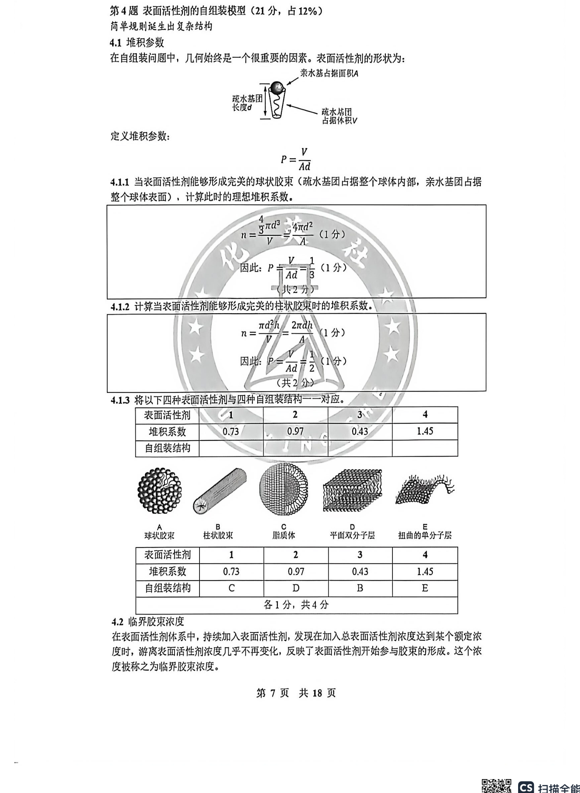
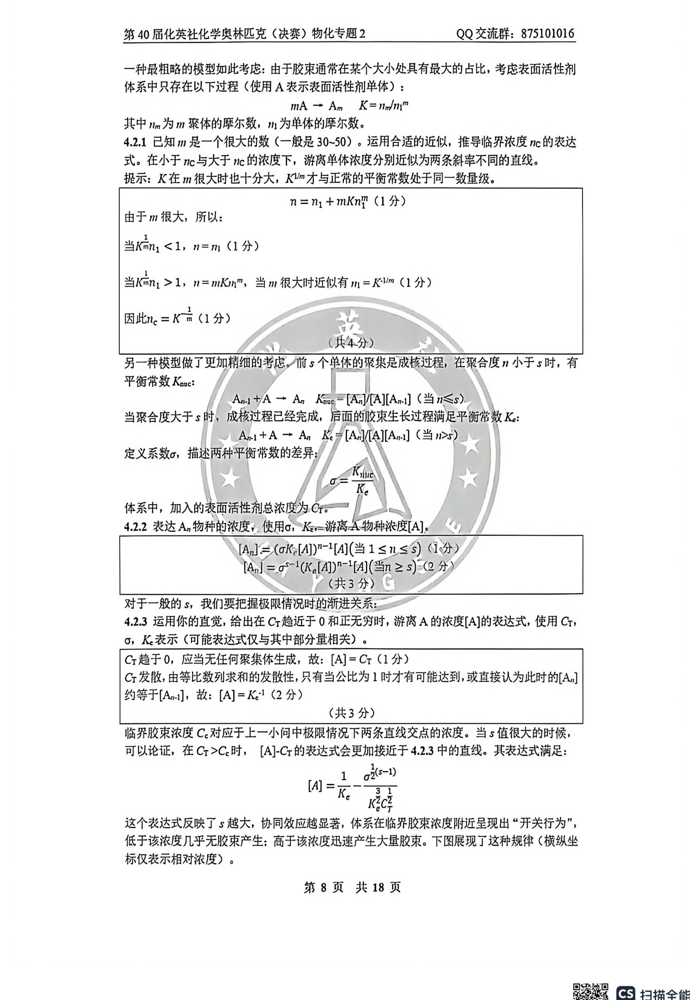
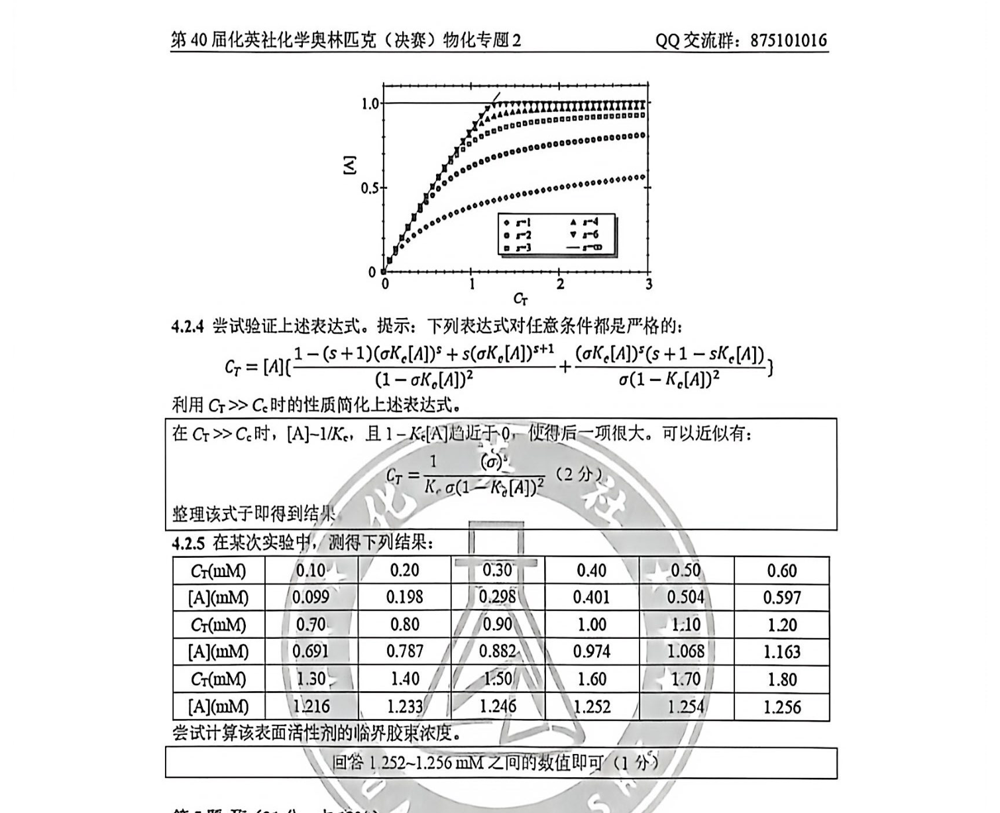

# 题-HYS-02-04-41堆积参数在自组装问题中几

## 题目

### 第 4 题 表面活性剂的自组装模型（21 分，占 12%）

## 4.1堆积参数

在自组装问题中，几何始终是一个很重要的因素。表面活性剂的形状为：

定义堆积参数：

$$
P = \frac {V}{A d}
$$

4.1.1 当表面活性剂能够形成完美的球状胶束（疏水基团占据整个球体内部，亲水基团占据整个球体表面），计算此时的理想堆积系数。

4.1.2 计算当表面活性剂能够形成完美的柱状胶束时的堆积系数。

4.1.3 将以下四种表面活性剂与四种自组装结构一一对应。

B 柱状胶束

<table><tr><td>表面活性剂</td><td>1</td><td>2</td><td>3</td><td>4</td></tr><tr><td>堆积系数</td><td>0.73</td><td>0.97</td><td>0.43</td><td>1.45</td></tr><tr><td>自组装结构</td><td></td><td></td><td></td><td></td></tr></table>

C
脂质体

E
扭曲的单分子层

## 4.2 临界胶束浓度

在表面活性剂体系中，持续加入表面活性剂，发现在加入总表面活性剂浓度达到某个额定浓度时，游离表面活性剂浓度几乎不再变化，反映了表面活性剂开始参与胶束的形成。这个浓度被称之为临界胶束浓度。

一种最粗略的模型如此考虑：由于胶束通常在某个大小处具有最大的占比，考虑表面活性剂体系中只存在以下过程（使用 A 表示表面活性剂单体）：

$$
m \mathrm{A} \rightarrow \mathrm{A} _ {m} \quad K = n _ {m} / n _ {1} ^ {m}
$$

其中 $n_m$ 为 $m$ 聚体的摩尔数， $n_1$ 为单体的摩尔数。

4.2.1 已知 $m$ 是一个很大的数（一般是 30\~50）。运用合适的近似，推导临界浓度 $n_{C}$ 的表达式。在小于 $n_{C}$ 与大于 $n_{C}$ 的浓度下，游离单体浓度分别近似为两条斜率不同的直线。

提示: $K$ 在 $m$ 很大时也十分大, $K^{1 / m}$ 才与正常的平衡常数处于同一数量级。

另一种模型做了更加精细的考虑。前 $s$ 个单体的聚集是成核过程，在聚合度 $n$ 小于 $s$ 时，有平衡常数 $K_{\mathrm{nuc}}$ ：

$$
\mathrm{A} _ {n - 1} + \mathrm{A} \rightarrow \mathrm{A} _ {n}, K _ {\mathrm{nuc}} = [ \mathrm{A} _ {n} ] / [ \mathrm{A} ] [ \mathrm{A} _ {n - 1} ] (\text {当} n \leqslant s)
$$

当聚合度大于 s 时，成核过程已经完成，后面的胶束生长过程满足平衡常数 $K_{o}$ :

$$
\mathrm{A} _ {n - 1} + \mathrm{A} \rightarrow \mathrm{A} _ {n} K _ {\mathrm{c}} = [ \mathrm{A} _ {n} ] / [ \mathrm{A} ] [ \mathrm{A} _ {n - 1} ] (\text {当} n > s)
$$

定义系数 $\sigma$ ，描述两种平衡常数的差异：

$$
\sigma = \frac {K _ {n u c}}{K _ {e}}
$$

体系中，加入的表面活性剂总浓度为 $C_{\mathrm{T}}$ 。

4.2.2 表达 $A_{n}$ 物种的浓度，使用 $\sigma$ ， $K_{c}$ ，游离 A 物种浓度 [A].

对于一般的 $s$ ，我们要把握极限情况时的渐进关系：

4.2.3 运用你的直觉, 给出在 $C_{\mathrm{T}}$ 趋近于 0 和正无穷时, 游离 A 的浓度[A]的表达式, 使用 $C_{\mathrm{T}}$ , $\sigma$ , $K_{e}$ 表示 (可能表达式仅与其中部分量相关)。

临界胶束浓度 $C_{c}$ 对应于上一小问中极限情况下两条直线交点的浓度。当 s 值很大的时候，可以论证，在 $C_{T} > C_{c}$ 时， $[A] - C_{T}$ 的表达式会更加接近于 4.2.3 中的直线。其表达式满足：

$$
[ A ] = \frac {1}{K _ {e}} - \frac {\sigma^ {\frac {1}{2} (s - 1)}}{K _ {e} ^ {\frac {3}{2}} C _ {T} ^ {\frac {1}{2}}}
$$

这个表达式反映了 s 越大，协同效应越显著，体系在临界胶束浓度附近呈现出“开关行为”，低于该浓度几乎无胶束产生；高于该浓度迅速产生大量胶束。右图展现了这种规律（横纵坐标仅表示相对浓度）。

4.2.4 尝试验证上述表达式。提示：下列表达式对任意条件都是严格的：

$$
C _ {T} = [ A ] \left\{\frac {1 - (s + 1) (\sigma K _ {e} [ A ]) ^ {s} + s (\sigma K _ {e} [ A ]) ^ {s + 1}}{(1 - \sigma K _ {e} [ A ]) ^ {2}} + \frac {(\sigma K _ {e} [ A ]) ^ {s} (s + 1 - s K _ {e} [ A ])}{\sigma (1 - K _ {e} [ A ]) ^ {2}} \right\}
$$

利用 $C_{\mathrm{T}} >> C_{\mathrm{c}}$ 时的性质简化上述表达式。

## 4.2.5 在某次实验中，测得下列结果：

<table><tr><td> ${C}_{\mathrm{T}}\left( \mathrm{{mM}}\right)$ </td><td>0.10</td><td>0.20</td><td>0.30</td><td>0.40</td><td>0.50</td><td>0.60</td></tr><tr><td>[A](mM)</td><td>0.099</td><td>0.198</td><td>0.298</td><td>0.401</td><td>0.504</td><td>0.597</td></tr><tr><td> ${C}_{\mathrm{T}}\left( \mathrm{{mM}}\right)$ </td><td>0.70</td><td>0.80</td><td>0.90</td><td>1.00</td><td>1.10</td><td>1.20</td></tr><tr><td>[A](mM)</td><td>0.691</td><td>0.787</td><td>0.882</td><td>0.974</td><td>1.068</td><td>1.163</td></tr><tr><td> ${C}_{\mathrm{T}}\left( \mathrm{{mM}}\right)$ </td><td>1.30</td><td>1.40</td><td>1.50</td><td>1.60</td><td>1.70</td><td>1.80</td></tr><tr><td>[A](mM)</td><td>1.216</td><td>1.233</td><td>1.246</td><td>1.252</td><td>1.254</td><td>1.256</td></tr></table>

尝试计算该表面活性剂的临界胶束浓度。

## 参考答案

（源：化英社《第40届决赛·物化专题2》答案 · 第 4 题；按原册裁区，保留结构图与公式）

> 📌 据源答案册裁区回填（OCR 定位题界）。

## 知识点映射

- （待人工校准）

> ⚠️ **自动拆卡标记**：`subject_module`/`difficulty` 为关键词粗判，答案数值与单位**尚未经人工复核**（OCR 原文逐字转录，可能保留原卷笔误）。