# 题-HYS-07-07-71比较下列化合物的酸性按从

## 题目

### 第 7 题 基础有机化学（17 分，占 8%）

7-1 比较下列化合物的酸性，按从强到弱排序。

(a)

(b)

(c)

(d)

(e)

7-2 比较下列化合物发生亲电反应的速率，按从快到慢排序。

(a)

(b)

(c)

(d)

(e)

(f)

7-3/下列关于硝化反应和磺化反应的说法，选出合理的选项。

在硝基甲烷中用硝酸硝化甲苯，其反应速率与在同条件下把苯硝化的反应速率相同；

(b) 因此,在硝基甲烷中用硝酸硝化甲苯和苯的混合物,甲苯和苯的反应速率相同；

(c) 磺化反应是可逆的, 所以可以利用磺酸基作为占位基团, 保护苯环上的特定位点;

(d) 在不同溶剂中进行磺化反应，如硝基甲烷或发烟硫酸等，进攻苯环的亲电试剂都相同。

7-4 下列关于有机化合物反应的若干说法，选出合理的选项。

(a) 1-苄基-1-甲基环氧乙烷和苯基格氏试剂反应，经水后处理所得产物为一对对映异构体；
(b) -15℃下，萘和乙酰氯在无水氯化铝催化下反应生成1-萘乙酮；

(c)苯甲酰胺经 $\mathrm{P}_{2} \mathrm{O}_{5}$ 处理, 产物为苯甲腈;

(d) 在乙醚中, 环己烯和过氧化氢在 $\mathrm{OsO}_{4}$ 催化下反应, 产物有光学活性。

7-5 判断以下有机化合物的若干反应式是否合理（是/否）。

<table><tr><td></td><td></td><td></td><td></td><td></td><td></td></tr><tr><td></td><td></td><td></td><td colspan="2"></td><td></td></tr></table>

7-6 下图是甾类天然产物基本骨架，画出其最稳定的立体异构体的构象（不要求 R 的立体）。

7-7 判断下列化合物是否具有手性（是/否）。

(a)

(b)

(c)

(d)

7-8 化合物 A $\left(\mathrm{C}_{10} \mathrm{H}_{16}\right)$ 能够和臭氧反应, 经 Zn 单质处理后生成单一有机产物 B。B 在酸性条件下与羟胺反应得到 C。碱性条件下, C 可与 1 分子 MeI 反应得到 D。C 被 LiAlH $_4$ 还原可以得到 E, E 在 Pd 催化下脱氢生成吡啶。写出化合物 A 的结构。

## 参考答案

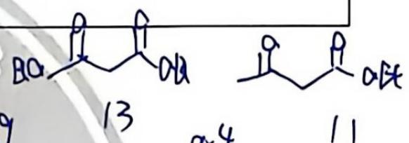

7-1 比较下列化合物的酸性，按从强到弱排序。

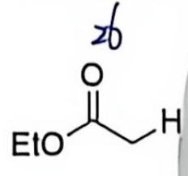

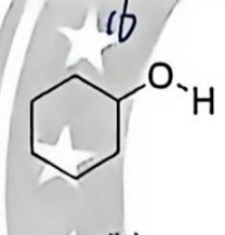

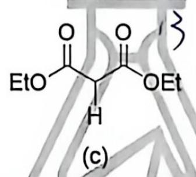

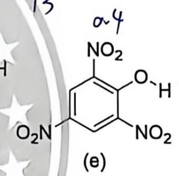

(e)>(c)>(b)>(a)>(d)(2分，有错不得分)

7-2 比较下列化合物发生亲电反应的速率，按从快到慢排序。

(e) > (a) > (f) > (d) > (b) > (c) (2分, 有错不得分)
7-3 下列关于硝化反应和磺化反应的说法，选出合理的选项。
决进步： $NO_{2}^{+}$ 的产生

(a) 在硝基甲烷中用硝酸硝化甲苯，其反应速率与在同条件下把苯硝化的反应速率相同；

(b) 因此, 在硝基甲烷中用硝酸硝化甲苯和苯的混合物, 甲苯和苯的反应速率相同;

(c) 磺化反应是可逆的, 所以可以利用磺酸基作为占位基团, 保护苯环上的特定位点;

(d) 在不同溶剂中进行磺化反应, 如硝基甲烷或发烟硫酸等, 进攻苯环的亲电试剂都相同。 (a)(c)(2分, 错选或漏选一个扣1分, 扣完为止)

7-4 下列关于有机化合物反应的若干说法，选出合理的选项。

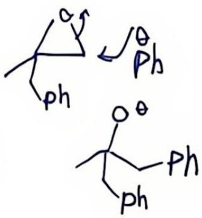

(a) 1-苄基-1-甲基环氧乙烷和苯基格氏试剂反应，经水后处理所得产物为一对对映异构体；

(b) $-15^{\circ} \mathrm{C}$ 下, 萘和乙酰氯在无水氯化铝催化下反应生成 1-萘乙酮;

(c) 苯甲酰胺经 $\mathrm{P}_{2} \mathrm{O}_{5}$ 处理, 产物为苯甲腈:

(d) 在乙醚中, 环己烯和过氧化氢在 $\mathrm{OsO}_{4}$ 催化下反应, 产物有光学活性。 (b)(c)(2分, 错选或漏选一个扣1分, 扣完为止)

会把卡架还原

7-5 判断以下有机化合物的若干反应式是否合理（是/否）。

<table><tr><td></td><td> $BH_3 \cdot SMe_2$ (a)</td><td>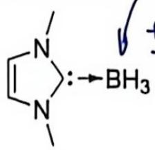</td><td></td><td> $C_2H_5MgBr$ (b)</td><td>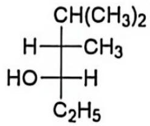</td></tr><tr><td></td><td colspan="2">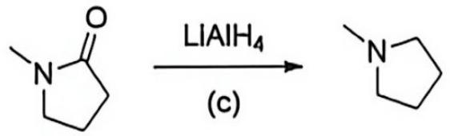</td><td></td><td></td><td></td></tr><tr><td colspan="6">(b) (c) (2分,各1分,错选不得分)</td></tr></table>

7-6 下图是甾类天然产物基本骨架，画出其最稳定的立体异构体的构象（不要求 R 的立体）。

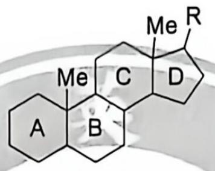

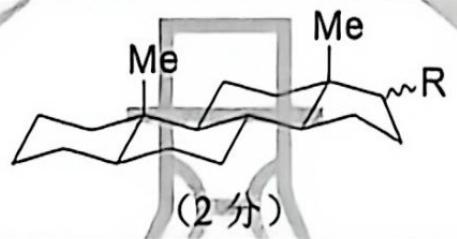

7-7 判断下列化合物是否具有手性（是/否）。

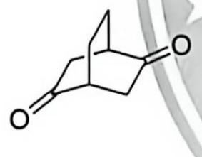

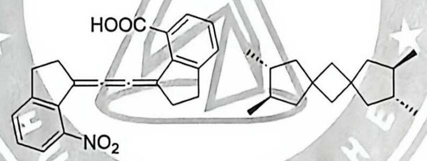

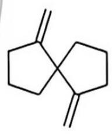

<table><tr><td>(a) (c) (d) (共3分,各1分,错选不得分)</td></tr><tr><td>7-8 化合物A( $C_{10}H_{16}$ )能够和臭氧反应,经Zn单质处理后生成单一有机产物B。B在酸性条件下与羟胺反应得到C。碱性条件下,C可与1分子MeI反应得到D。C被 $LiAlH_4$ 还原可以得到E,E在Pd催化下脱氢生成吡啶。写出化合物A的结构。</td></tr><tr><td>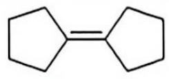 (2分)</td></tr></table>

## 知识点映射

- （待人工校准）

> ⚠️ **自动拆卡标记**：`subject_module`/`difficulty` 为关键词粗判，答案数值与单位**尚未经人工复核**（OCR 原文逐字转录，可能保留原卷笔误）。