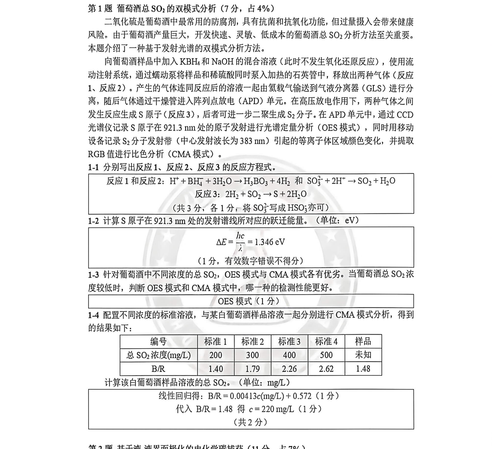

# 题-HYS-14-01-二氧化硫是葡萄酒中最常用的防

## 题目

### 第 1 题 葡萄酒总 $SO_{2}$ 的双模式分析（7 分，占 4%）

二氧化硫是葡萄酒中最常用的防腐剂，具有抗菌和抗氧化功能，但过量摄入会带来健康风险。由于葡萄酒产量巨大，开发快速、灵敏、低成本的葡萄酒总 $SO_{2}$ 分析方法至关重要。本题介绍了一种基于发射光谱的双模式分析方法。

向葡萄酒样品中加入 KBH $_{4}$ 和 NaOH 的混合溶液（此时不发生氧化还原反应），使用流动注射系统，通过蠕动泵将样品和稀硫酸同时泵入加热的石英管中，释放出两种气体（反应 1、反应 2）。产生的气体连同反应后的溶液一起由氦载气输送到气液分离器（GLS）进行分离，随后气体通过干燥管进入阵列点放电（APD）单元。在高压放电作用下，两种气体之间发生反应生成 S 原子（反应 3），后者可进一步二聚生成 S $_{2}$ 分子。在 APD 单元中，通过 CCD 光谱仪记录 S 原子在 921.3 nm 处的原子发射进行光谱定量分析（OES 模式），同时用移动设备记录 S $_{2}$ 分子发射带（中心发射波长为 383 nm）引起的等离子体区域颜色变化，并提取 RGB 值进行比色分析（CMA 模式）。

1-1 分别写出反应 1、反应 2、反应 3 的反应方程式。

1-2 计算 S 原子在 921.3 nm 处的发射谱线所对应的跃迁能量。（单位：eV）

1-3 针对葡萄酒中不同浓度的总 $SO_{2}$ ，OES 模式与 CMA 模式各有优劣。当葡萄酒总 $SO_{2}$ 浓度较低时，判断 OES 模式和 CMA 模式中，哪一种的检测性能更好。

1-4 配置不同浓度的标准溶液，与某白葡萄酒样品溶液一起分别进行 CMA 模式分析，得到的结果如下：

<table><tr><td>编号</td><td>标准1</td><td>标准2</td><td>标准3</td><td>标准4</td><td>样品</td></tr><tr><td>总 $SO_2$ 浓度(mg/L)</td><td>200</td><td>300</td><td>400</td><td>500</td><td>未知</td></tr><tr><td>B/R</td><td>1.40</td><td>1.79</td><td>2.26</td><td>2.62</td><td>1.48</td></tr></table>

计算该白葡萄酒样品溶液的总 $SO_{2}$ 。（单位：mg/L）

## 参考答案

（源：化英社《第40届初赛·模拟14》答案 · 第 1 题；按原册裁区，保留结构图与公式）

> 📌 据源答案册裁区回填（OCR 定位题界）。

## 知识点映射

- （待人工校准）

> ⚠️ **自动拆卡标记**：`subject_module`/`difficulty` 为关键词粗判，答案数值与单位**尚未经人工复核**（OCR 原文逐字转录，可能保留原卷笔误）。