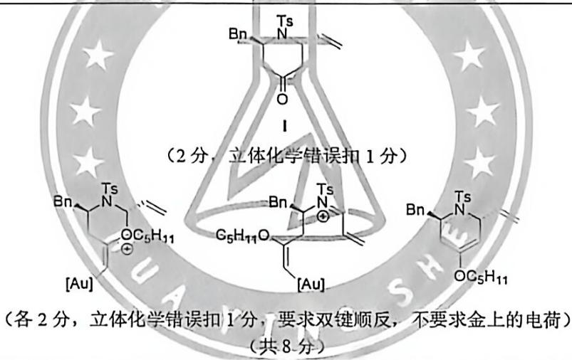

# 题-HYS-40-07-早在1979年研究人员就报道

## 题目

### 第 7 题真的“很简单”的重排反应（33分，占 $13\%$ ）

早在 1979 年，研究人员就报道了一种简便的重排反应，可从糖类衍生物出发实现多样转化。九十年代中期，该反应得到了系统性且完整的深入研究，并实现了现代化改造。然而，直到本世纪，随着机理细节的阐明和试剂条件的优化，这一重排才逐渐成为充满活力的研究领域和创新热点。该反应在复杂天然产物全合成中有着大量应用，其实用价值已毋庸置疑。近年来的研究进展进一步将其拓展至更丰富的方法学构建和更广泛的合成应用。

7.1.1 最初，费里尔发现，在化学计量的氯化汞促进下，将不饱和吡喃糖在丙酮水溶液中加热回流，可以高收率地生成含有全碳六元环（不考虑 Bz 和 Ts）的化合物 A。其反应式如下：

画出产物结构，不要求新生成手性中心的立体化学。

7.1.2 针对上述方法的弊端，使用铝催化剂做改进。在 A. B. Smith 及合作者全合成 (+)-phorboxazole A 的过程中，就成功应用于改进型的重排：

7.1.2.1 已知 R 基团不参与反应: $Cp_{2}TiMe_{2}$ 可生成高活性的钛卡宾用于将羰基转化为亚甲基; B 中含有该重排的关键缩醛结构（参考 7.1.1）。画出 B 和 C 的结构式，要求立体化学。

7.1.2.2 然而，若将催化剂换为三异丁基铝，则会发生额外的一步反应，使 C 经过六元环过渡态得到另一种产物。写出一种试剂以将该产物转化为 C。

7.2 机理洞察

7.2.1 立体化学分析是机理洞察的关键一步，通过反应产物的立体化学信息，得以一窥重排的过渡态特征。

7.2.1.1 在上述全合成中，为了选择性获取目标分子片段，开展了如下的模型化合物研究。

已知 R 基团不参与反应：两种底物均可反应，然而只得到了单一立体化学的产物。画出产物的立体结构：思考反应构象的多种可能，通过分别画出顺式和反式底物得到产物的关键过渡态（不要求电荷）以解释产物的立体化学。

7.2.1.2 根据上述实验结果，画出如下底物与铝催化剂反应得到的产物，标出所有手性中心的绝对构型。

7.2.2 除了上述影响因素以外，还有其他相互作用促进或干扰该重排。在一项研究中，发现对于如下两种结构相似的底物，仅有一种可以成功进行重排。仔细观察底物结构，思考催化剂与底物结合的方式，回顾重排机理，选择成功反应的底物；通过画图解释两者反应性的差异。（R基不参与反应）

## 7.3 方法学进展

7.3.1 扩大底物适用范围是方法学研究的重点。如下展示了拓展的一锅重排反应。

画出 F 的结构，要求立体化学。

7.3.2 改变催化剂则是另一种方法学研究的策略。比较典型的是引入金催化，凭借其对不饱和键的活化作用，提供更为多样的底物选择。接下来的问题中，任何一种金属均可简写为[对应元素符号]，例如[Au]

7.3.2.1 研究人员首先通过如下转换过程构建了反应底物：

已知 L\* 是一种手性配体。画出 G、H 的结构式：画出最后一步钯催化反应的关键离子对中间体，不要求立体化学。（已知该中间体中钯与分配体结合）

7.3.2.2 接下来，对于此重排反应，开展了新型催化剂的适配性研究。其反应如下所示：

已知1的 $\mathrm{H}$ NMR(300 MHz, CDCl₃): δ 7.59 (d, $J = 8.1\mathrm{Hz}$ , 2H), 7.36-7.12 (m, 7H), 5.77 (ddd, $J = 17.1$ , 10.5, 6.0 Hz, 1H), 5.14 (dd, $J = 17.1$ , 0.9, 1H), 5.10 (dd, $J = 10.5$ , 0.9 Hz, 1H), 4.74-4.69 (m, 1H), 4.52-4.47 (m, 1H), 3.25 (dd, $J = 13.5$ , 5.1 Hz, 1H), 2.74 (d, $J = 5.1\mathrm{Hz}$ , 1H), 2.71 (dd, $J = 13.5$ , 3.3 Hz, 1H), 2.60 (dd, $J = 16.2$ , 5.4 Hz, 1H), 2.49 (dd, $J = 16.2$ , 3.6 Hz, 1H), 2.40 (s, 3H)

已知此流程利用金催化剂条件，获得了本题重排的前体并完成了重排步骤（你可以参考7.2中的例子）。据此，画出Ⅰ的结构及反应的关键中间体，要求立体化学（进一步研究表明，此处氮上取代基的立体化学影响较弱，无需考虑）。

## 参考答案

(1 分)
7.1.2 针对上述方法的弊端，使用铝催化剂做改进。在 A. B. Smith 及合作者全合成 (+)-phorboxazole A 的过程中，就成功应用了改进型的重排：

   DMP 等氧化剂(1 分)   

(共4分, 各2分, 立体化学错误扣1分)
7.2 机理洞察

(2 分，立体化学错误扣 1 分)
(5 分，第一个 2 分，第二个 3 分，构象或立体化学错误不得分，漏写过渡态符号扣一分)
不要求电荷，不要求铝催化剂的具体形式
(共 7 分)

(共2分, 骨架1分, 构型全部标对1分)

(共3分, 选择1分, 图各1分, 不要求铝催化剂的具体形式)
7.3 方法学进展
7.3.1 扩大底物适用范围是方法学研究的重点。如下展示了拓展的一锅重排反应。

画出 F 的结构，要求立体化学。

(2 分, 立体化学错误扣 1 分)
7.3.2 改变催化剂则是另一种方法学研究的策略。比较典型的是引入金催化，凭借其对不饱和键的活化作用，提供更为多样的底物选择。接下来的问题中，任何一种金属均可简写为[对应元素符号]，例如[Au]。
7.3.2.1 研究人员首先通过如下转换过程构建了反应底物：

已知 L\*是一种手性配体。画出 G、H 的结构式；画出最后一步钯催化反应的关键离子对中间体，不要求立体化学。（已知该中间体中钯与 $\eta^{3}$ 配体结合）

(共5分，G和H的结构各1分，阳离子2分，阴离子1分)
7.3.2.2 接下来，对于此重排反应，开展了新型催化剂的适配性研究。其反应如下所示：

已知1的 $\mathrm{H}$ NMR(300 MHz, CDCh): $\delta$ 7.59 (d, $J = 8.1~\mathrm{Hz}$ , 2H), 7.36-7.12 (m, 7H), 5.77 (ddd, $J = 17.1$ , 10.5, 6.0 Hz, 1H), 5.14 (dd,

📎 **答案出处**：源卷答案已回源补全（末段续补，尾部已收尾）；OCR 原文转录，数值未逐条复核。

, 5.10 (dd, $J = 10.5$ , 0.9 Hz, 1H), 4.74-4.69 (m, 1H), 4.52-4.47 (m, 1H), 3.25 (dd, $J = 13.5$ , 5.1 Hz, 1H), 2.74 (d, $J = 5.1~\mathrm{Hz}$ , 1H), 2.71 (dd, $J = 13.5$ , 3.3 Hz, 1H), 2.60 (dd, $J = 16.2$ , 5.4 Hz, 1H), 2.49 (dd, $J = 16.2$ , 3.6 Hz, 1H), 2.40 (s, 3H)

已知此流程利用金催化剂条件，获得了本题重排的前体并完成了重排步骤（你可以参考7.2中的例子）。据此，画出I的结构及反应的关键中间体，要求立体化学（进一步研究表明，此处氮上取代基的立体化学影响较弱，无需考虑）。

（各2分，立体化学错误扣1分，要求双键顺反，不要求金上的电荷）
(共8分)

## 知识点映射

- （待人工校准）

> ⚠️ **自动拆卡标记**：`subject_module`/`difficulty` 为关键词粗判，答案数值与单位**尚未经人工复核**（OCR 原文逐字转录，可能保留原卷笔误）。