# 题-BJLY-1785409334-07-71一种三价铝物种与足量的钾

## 题目

### 第 7 题 一价铝的奇妙冒险（26 分，占 16%）

7-1 一种三价铝物种与足量的钾反应，生成 Td 点群的一价铝簇，该簇中 Al 的质量分数为 16.63%，仅含一种芳香配体，试画出该铝簇的结构。

7-2 一常见一价铝活性化合物合成（反应式量比已给出）

画出 L、A、B、X 的结构，已知 L 中有分子内氢键。

7-3 作为一价铝活性物种，X 的反应活性极高，其与等当量乙炔反应生成高张力的 P，再向体系中加入当量乙炔，P 释放张力生成 C 或 D，已知 C 中含五元环，D 中仅含六元环，且有碳碳三键。画出 P、C、D 的结构。

7-4 当反应物由 $C_{2}H_{2}$ 变为 $C_{2}$ （TMS）2 生成 P 的类似物 Q，由于 TMS 的大位阻，P 和 Q 的反应性确实有差异。Q 与 $PhN_{3}$ 反应生成含 Al 5.04% 的 M，而 P 与 $PhN_{3}$ 反应则加成得 N，试画出 M、N 的结构。

7-5 如你所料，一价铝具有非常强的还原性，极易被氧化为三价。室温下，X 与白磷以 2:1 反应插入两个 P-P 键得 $O_{1}$ ，X 与 $Ph2CN_{2}$ 以 1:2 反应生成含 Al 3.35%， $C_{2}v$ 对称性的 $O_{2}$ ，X 与 PhB（OH）2 以 1:2 反应生成含六元螺环的 $O_{3}$ 。已知 $O_{1}$ 、 $O_{2}$ 、 $O_{3}$ 种的 Al 均为正三价且均为四配位，画出 $O_{1}$ 、 $O_{2}$ 、 $O_{3}$ 的结构。

## 参考答案

7-1（2 分）铝簇结构：

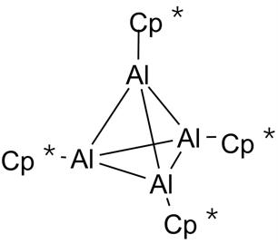

7-2（2 分＋2 分＋1 分＋1 分）L、A、B、X：

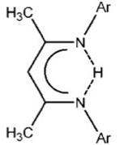
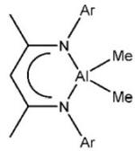
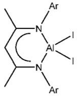
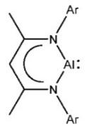

7-3（2 分＋2 分＋3 分）P、C、D：

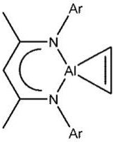
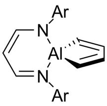
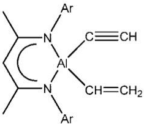

7-4（2 分＋2 分）M、N：

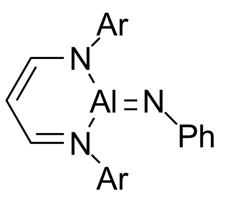
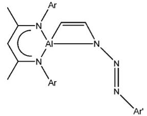

7-5（2 分＋2 分＋3 分）O₁、O₂、O₃：

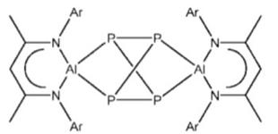
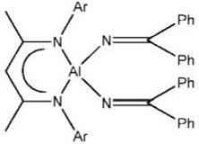
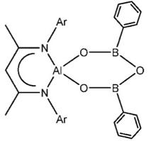

> 📌 据源答案册（`北京夏令营-无机巩固练习一-答案`）第 7 题逐图提取，图序按原册排布。

## 知识点映射

- （待人工校准）

> ⚠️ **自动拆卡标记**：`subject_module`/`difficulty` 为关键词粗判，答案数值与单位**尚未经人工复核**（OCR 原文逐字转录，可能保留原卷笔误）。