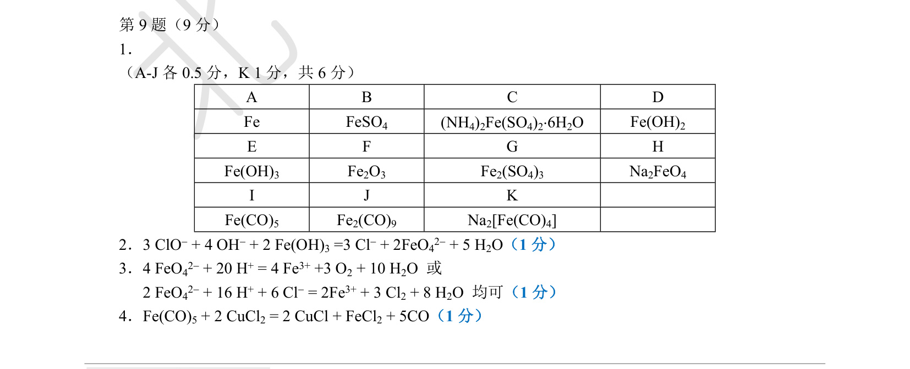

# 题-BJLY-1785491436-09-某过渡金属X的单质A在生活中

## 题目

### 第 9 题（9分）

某过渡金属 X 的单质 A 在生活中应用广泛。A 不与水反应，溶于稀硫酸得到 B，向 B 的水溶液中加入适量饱和硫酸铵溶液可析出固体 C。C 是一种复盐，摩尔质量 392g/mol，C 与稀硝酸反应放出 NO 气体。无氧条件下，C 与 NaOH 溶液反应放出氨气，同时生成白色沉淀 D，向 D 的悬浊液中通入空气，最终得到红色沉淀 E，E 加热后得到砖红色氧化物 F，由 E 到 F 失重约 25%。在稀硫酸溶液中 B 易被空气中的氧气氧化，得到含 G 的溶液，向 G 的溶液中加入 NaOH 溶液也可得到沉淀 E。向 E 的悬浊液中加入含有 NaOH 和 NaClO 的混合溶液，可得到强氧化性的盐 H，H 在水中和稀盐酸中均可分解。固体 A 和高压 CO 在 200℃左右反应，可得 X 的羰基配合物 I，I 中只含有 1 个 X 原子，且满足 EAN 规则。在丙酮溶液中 I 可被 CuCl₂ 氧化，该反应中 CO 全部释放，且每 1mol 化合物 I 生成 2mol CuCl。I 受热分解可以生成另一种 X 的双核配合物 J，该过程失重约 7.1%。J 与 Na 单质在液氨溶液中反应得到 K，K 是一种钠盐，其中只含有 1 个 X 原子，X 的质量分数约为 26%，且阴离子满足 EAN 规则。

回答下列问题:

1. 写出 A\~K 的化学式。

2. 写出 E 与 NaOH 和 NaClO 反应制备 H 的离子方程式。

3. 写出 H 与稀盐酸反应的离子方程式。

4. 写出丙酮溶液中 I 被 $CuCl_{2}$ 氧化的化学方程式。

## 参考答案

第 9 题（9 分）解答（源答案册原文：A–K 推断表 Fe/FeSO₄/(NH₄)₂Fe(SO₄)₂·6H₂O/…/Na₂[Fe(CO)₄]，及 3 个反应方程式）：

> 📌 据源答案册（`北京夏令营-无机巩固练习二-答案`）第 9 题区域裁图，含表格与方程式，未作转录以免失真。

## 知识点映射

- （待人工校准）

> ⚠️ **自动拆卡标记**：`subject_module`/`difficulty` 为关键词粗判，答案数值与单位**尚未经人工复核**（OCR 原文逐字转录，可能保留原卷笔误）。