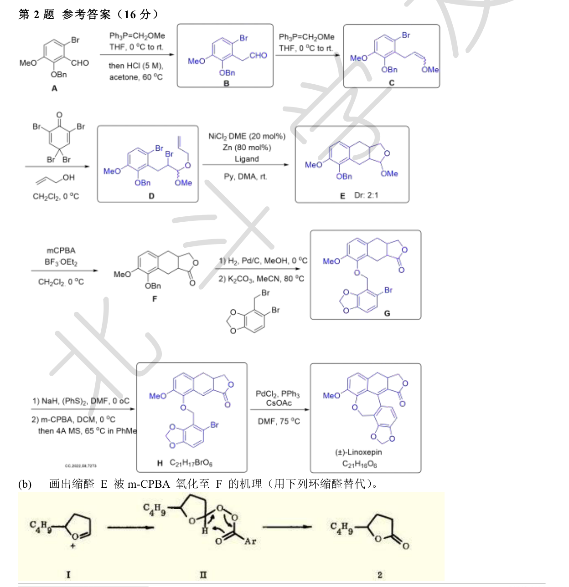

# 题-BJLY-北京夏令营-有机巩固练习一-02-1完成Linoxepin的合

## 题目

### 第 2 题 成环策略与天然产物全合成（16 分）

1. 完成(±)-Linoxepin 的合成（不考虑立体化学），E 是缩醛（1 分）。

2. 画出缩醛 E 被 m-CPBA 氧化至 F 的机理（2 分；用下列环缩醛替代）。

## 参考答案

> 第2题完整解答（自源卷答案 PDF 高清渲染）

## 知识点映射

- （待人工校准）

> ⚠️ **自动拆卡标记**：`subject_module`/`difficulty` 为关键词粗判，答案数值与单位**尚未经人工复核**（OCR 原文逐字转录，可能保留原卷笔误）。