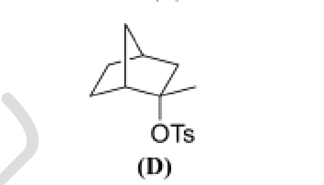
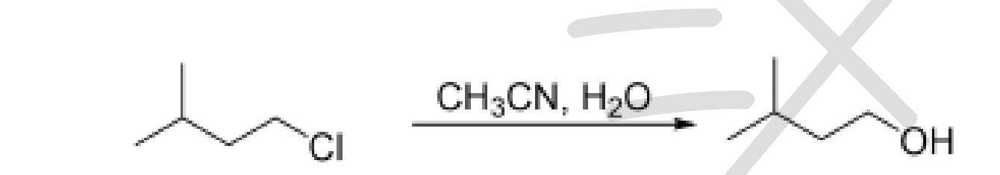

# 题-BJLY-北京夏令营-有机综合-01-1下列两组分子发生溶剂解时反

## 题目

### 第 1 题 基本概念考察（26分，占 $21\%$ ）

1. 下列两组分子发生溶剂解时，反应速率差别很大，请判断哪个速率更快并回答理由。

(1)

(A)

(B)
(2)

(C)

(D)

2. 对下列苯酚进行酸性排序？

$\mathrm{NO}_{2}$

3. 写出下列卤代烷烃发生 SN2 反应时的活性顺序？

(A)

(B)

(C)

(D)

(E)

4. 环辛烯有几个立体异构体？画出其构型式。

5. 吡咯结构中，有三个反应位点，请分析这三个位点被质子化的比例大小？

6. 比较下列三个分子溶剂解的顺序？解释原因？

7. 比较下列四个分子溶剂解速度？

8. 解释下列炔烃和溴反应的实验结果，为什么对三氟甲基得到反式产物而对甲氧基得到顺式？（1 分）。

9. 氯代烃的水解

(1) 解释下列水解反应速度差别原因？

(2) 某同学尝试类似反应时, 下列底物反应时却发现没有得到相应水解产物, 而是得到另外一个同分异构体, 请推测该分子结构式?

## 参考答案

1. 下列两组分子发生溶剂解时，反应速率差别很大，请判断哪个速率更快？答案：

(1)

(A)

$$
\mathbf {A} / \mathbf {B} = 8.8 \times 10 ^ {- 5}: 1
$$

(2)

(C)

(B)

(D)

$$
\mathbf {C} / \mathbf {D} = 39000: 1
$$

(2 分)

2. 对下列苯酚进行酸性排序？

answer:

(4 分)

3. 写出下列卤代烷烃发生 SN2 反应时的活性顺序?

answer:

(C)

(B)

(E)

(D)

(5 分)

4. 环辛烯有几个立体异构体？画出其构型式。

3 个

(4 分)

5. 吡咯结构中，有三个反应位点，请分析这三个位点被质子化的比例大小？

(3 分)

6. 比较下列三个分子溶剂解的顺序？解释原因？

The retention of configuration in both cases indicates $\pi$ participation. The greater rate enhancement in 13-A indicates that the isolated double bond is more effective at stabilizing the TS than an aryl ring. This can be explained in terms of the $\pi$ -bond order of the participating bonds, which is 1.0 in 13-A as opposed to 0.5 for 13-B. This implies higher electron density to the back side of the bromine in 13-A. The aromatic $\pi$ electrons are also “harder.”

(4 分)

7. 比较下列四个分子溶剂解速度？ ANSWER:

(4 分)

8. 解释下列炔烃和溴反应的实验结果，为什么对三氟甲基得到反式产物而对甲氧基得到顺式？

注意：邻基参与

(3 分)

9. 氯代烃的水解

(1) 解释下列水解反应速度差别原因？

(2 分)

(2) 某同学尝试类似反应时，下列底物反应时却发现没有得到相应水解产物，而是得到另外一个同分异构体，请推测该分子结构式？

## 知识点映射

- （待人工校准）

> ⚠️ **自动拆卡标记**：`subject_module`/`difficulty` 为关键词粗判，答案数值与单位**尚未经人工复核**（OCR 原文逐字转录，可能保留原卷笔误）。