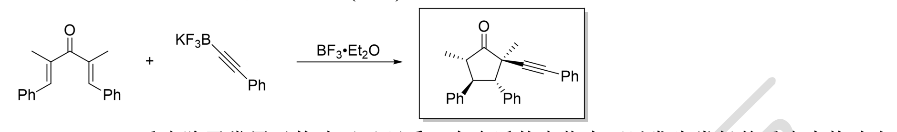
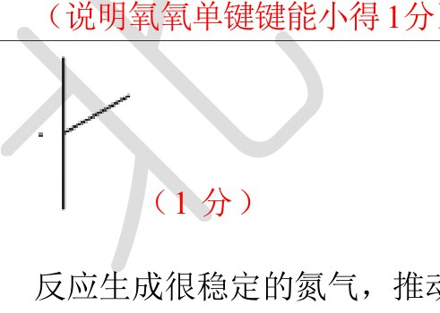

# 题-BJLY-北京夏令营-有机综合-03-Nazarov环化反应早在2

## 题目

### 第 3 题 成环反应（10 分，占 $10\%$ ）

Nazarov环化反应早在20世纪初就被发现了，后续被广泛应用于有机合成当中，例如Trauner在2003年的一篇工作中有过如下报道：

3-1 目前为止，该反应公认的反应机理是经过一个如下图所示的含有的阳离子的过渡态，随后发生环化反应，并通过β-氢消除得到中性的产物。试根据以上描述完成上述反应的机理。

3-2 而 Gilles 在用 Bi(OTf)3 处理类似的底物时，却出乎意料的得到了下图所示的化合物，试推测该化合物产生的机理。

3-3 反应中生成的碳正离子除了可以被水捕获外，还可以被其它的亲核试剂捕获生成一系列衍生物，请给出下面反应的最终产物。

3-4 Nazarov 反应除了常用于构建五元环系，在合适的底物中可以发生类似的反应来构建七元环系，试给出下面反应的产物。

## 参考答案

第3题（10分）

1.

## 四、自由基反应的若干问题(17')
根据Hammond 假说，过渡态的结构与能量接近的那一边类似，而烷烃的氯代反应决速步是放热反应，因此过渡态更像反应物，自由基的稳定性对过渡态的稳定性影响不大，倾向于不同种类的氢取代概率相差不大；但是烷烃的溴代反应决速步是吸热反应，过渡态更像生成物，自由基的稳定性对过渡态的稳定性有很大影响，倾向于生成稳定自由基对应的产物。
（2 分，氯代反应的过渡态像反应物，不受自由基稳定性影响 1 分；溴代反应的过渡态像生成物，受自由基稳定性影响 1 分）
(1) (2 分)
过氧键是由两个氧原子形成的非极性共价键，因此容易发生均裂反应生成自由基。
(说明过氧键非极性键得 1 分)
过氧键由于两个氧原子间强烈的 $\alpha$ 效应导致氧氧单键键能小，易断裂。
(说明氧氧单键键能小得1分)

(1 分)
反应生成很稳定的氮气，推动反应正向进行。
同时生成的是三级自由基，很稳定
(生成氮气得 1 分)
3.
<table><tr><td>A(1分)</td><td>B(1分)</td><td>C(1分)</td></tr></table>
4.
(3分)

5.
碘离子和亚铁离子都具有还原性，和自由基反应后，生成碘原子（碘单质）和铁离子，而碘原子（碘单质）和铁离子都非常稳定，不会发生自由基反应。（2分，还原性1分，产物碘原子（碘单质）和铁离子稳定1分）
6.
(1) (1 分)

(2) (1 分)

(3) (1 分)

## 知识点映射

- （待人工校准）

> ⚠️ **自动拆卡标记**：`subject_module`/`difficulty` 为关键词粗判，答案数值与单位**尚未经人工复核**（OCR 原文逐字转录，可能保留原卷笔误）。