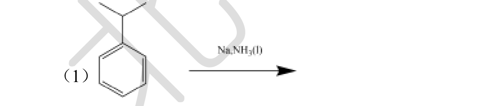

# 题-BJLY-北京夏令营-有机综合-04-1烷烃的光卤代反应是烷烃最重

## 题目

### 第 4 题 自由基反应的若干问题（17 分，占 17%）

1. 烷烃的光卤代反应是烷烃最重要的反应之一，但是由于产物的复杂性没有合成上的意义。烷烃使用氯气和溴进行光卤代反应时，可以明显发现溴的取代效果要优于氯的取代效果，请解释该现象。

2. 自由基的形成是比较困难的，因此一般需要使用自由基引发剂。

（1）过氧化物是特别好用的一种自由基引发剂，请解释过氧化物为啥容易形成自由基来引发反应

（2）下面是一种自由基引发剂，写出它产生自由基的反应并说明该反应发生的动力是什么

3. 乙醚长时间保存常因为自由基氧化反应而生成一爆炸的产物，请写出下列反应中的物质链引发： $+O_{2}\rightarrow A+ \cdot OOH$

链增长： $A+O_{2}\rightarrow B$

$$
\mathrm{B} + \rightarrow \mathrm{C} + \mathrm{A}
$$

请写出 ABC 三种物质或自由基的结构

4. 工业上苯酚和丙酮是利用异丙苯被空气氧化后的产物发生重排后得到的，其反应式如下，请写出对应的反应机理。

5. 自由基反应很多时候需要通过加入自由基淬灭剂，比如碘离子、铁离子等都可以作为自由基淬灭剂淬灭自由基，请说明碘离子和铁离子淬灭自由基的原理

6. 自由基还可以通过还原的方式得到，比如 Brich 还原就是利用钠进行单电子还原形成自由基负离子，请写出下列反应的产物

(1)

(2)

(3)

## 参考答案

⛔ **源答案以解答图给出**：源答案文件 `北京夏令营-有机综合-答案.md` 中第 4 题解答为图片（该题号所在区间含 11 张图、779 字文字），未按题拆分提取。

## 知识点映射

- （待人工校准）

> ⚠️ **自动拆卡标记**：`subject_module`/`difficulty` 为关键词粗判，答案数值与单位**尚未经人工复核**（OCR 原文逐字转录，可能保留原卷笔误）。