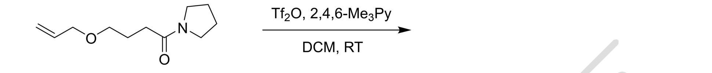
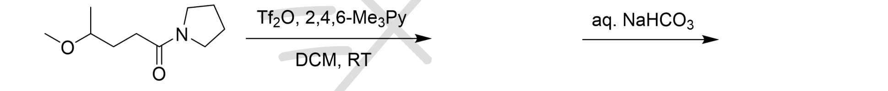

# 题-BJLY-北京夏令营-有机综合-08-81完成下列反应82完成下列

## 题目

### 第 8 题（12分，占 $6\%$ ）

8-1 完成下列反应

8-2 完成下列反应

8-3 完成下列反应

8-4 完成下列反应

8-5 完成下列反应

## 参考答案

📎 **答案出处**：源卷答案 PDF 第 2 页已随卡（见下）；解答含结构式/图，**文字化需人工转录**。

## 知识点映射

- （待人工校准）

> ⚠️ **自动拆卡标记**：`subject_module`/`difficulty` 为关键词粗判，答案数值与单位**尚未经人工复核**（OCR 原文逐字转录，可能保留原卷笔误）。