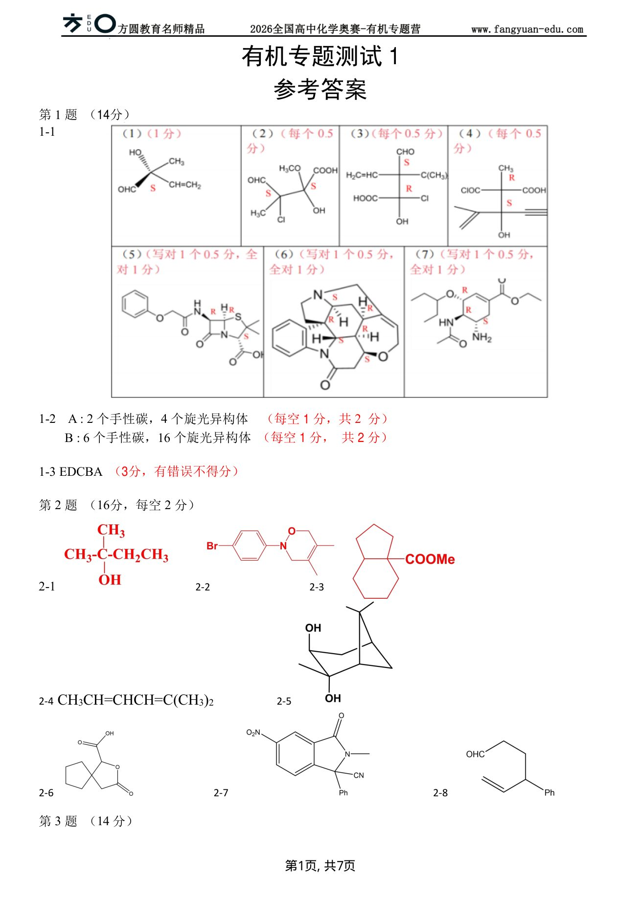

# 题-FY-01-02-21beginarraycm

## 题目

### 第 2 题 （16分） 完成反应式（能确定立体化学的须标明立体化学） （占比13%）

2-1

$$
\begin{array}{c} \mathrm{CH} _ {3} \\ \mathrm{CH} _ {3} - \mathrm{C} - \mathrm{CH} _ {2} \mathrm{Cl} \\ \mathrm{CH} _ {3} \end{array} \xrightarrow {\mathrm{Ag} ^ {+} / \mathrm{H} _ {2} \mathrm{O}}
$$

2-4

2-5

2-6

2-7

## 参考答案

📎 **答案出处**：源卷**参考答案**页已随卡（见下）；答案含结构式/矢量图，文字层仅含可直接转录的部分。

OCR 原文（仅留痕，非答案）

## 知识点映射

- （待人工校准）

> ⚠️ **自动拆卡标记**：`subject_module`/`difficulty` 为关键词粗判，答案数值与单位**尚未经人工复核**（OCR 原文逐字转录，可能保留原卷笔误）。