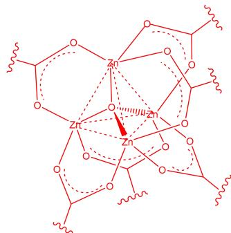
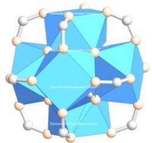
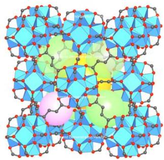
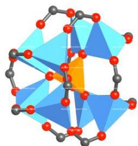
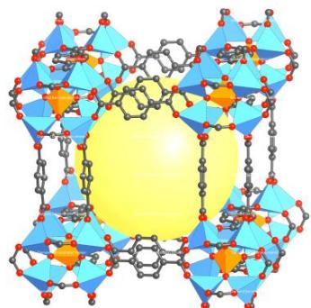

# 题-FY-01-02-金属有机框架MetalOrg

## 题目

### 第 2 题 Metal-Organic Frameworks （共 20 分，占 9%）

金属有机框架（Metal-Organic Frameworks, MOFs）是由无机金属中心（金属离子或金属簇）与桥连的有机配体通过自组装相互连接，形成的一类具有周期性网络结构的晶态多孔材料。MOFs具有多孔、大比表面积和多金属位点等诸多性能，因此在化学化工领域得到许多应用，例如气体贮存、分子分离、催化、药物缓释等。2025年，北川进（Susumu Kitagawa）、理查德·罗布森（Richard Robson）、奥马尔M·亚吉（Omar M. Yaghi）因对金属有机框架发展的贡献，获得2025年诺贝尔化学奖。本题就让我们来欣赏MOFs的美丽结构。

## 2-1 MOF-5 的结构

作为一种经典的 MOF 材料，MOF-5 具有极佳的储氢性能。将经过 4Å 分子筛除水的 DMF 与二水合乙酸锌和对苯二甲酸混合，密封在 130°C 恒温油浴中静置 4 小时，即得到无色晶体 MOF-5。若不考虑其中共结晶的客体分子，则其中金属元素的质量分数为 33.97%，O 的质量分数为 27.02%。

2-1-1 试通过计算得出 MOF-5 的化学式。

2-1-2 对 MOFs 的结构描述可以从次级结构单元（secondary building unit, SBU）与连接子出发，连接子将 SBU 连接形成无限二维平面或三维立体网状结构。多数情况下，金属离子或金属簇作为 SBU，而多齿桥联配体作为连接子。试画出 MOF-5 的 SBU 结构（配体可适当简化）。

2-1-3 SBU 与连接子的特点决定了骨架结构，试根据分析得出 MOF-5 具有以下哪种骨架结构？

A

B

C

D

E

## 2-2 MOF-801 的结构

一种含 Zr 的材料 MOF-801 具有良好的吸水性能，有潜力用于捕捉和释放偏远沙漠地区的大气水。对于其结构的描述如下：

在 SBU 中，Zr 均被 O 配位，形成四方反棱柱形配位多面体。O 可以分为两种，一种为近直线型二羧酸配体中羧基上的 O，另一种为非羧基 O，其中一半为 $O^{2-}$ ，一半为 $OH^{-}$ （可视为等同），均对 3 个 Zr 配位，若将一个 SBU 中所有的这种 O 相连，则形成一种正多面体。且在该正多面体中，每个面上的 O 均对同一个 Zr 配位。每个 Zr 剩余的配位数由羧基 O 提供。

2-2-1 试根据描述，写出 MOF-801 的化学式，二羧酸配体的一半可用（R-CO₂）表示。

2-2-2 该 SBU 的结构可以用多层多面体包合的型式理解，最内层为第二种 O 形成的正多面体，向外依次是 Zr 与羧基 C 形成的对称性较高的多面体，试写出该结构的多面体包合型式。（采用[]@[]@[]的格式书写）

2-2-3 试根据该 SBU 的对称性，选出以下可能的骨架结构。

A

B

C

D

E

F

G

H
2-3 一种含有 $\mathrm{SiO}_4^{4-}$ 离子的MOF材料

在该 MOF 的 SBU 中，Zn 均被 O 以四面体型式配位。 $SiO_{4}^{4-}$ 四面体在中心，每个 O 均对 2 个 Zn 配位。所有 Zn 的排列型式可近似看作立方体，其剩余的配位数由直线型二羧酸配体 m-BDC 提供。（m-BDC 为对苯二甲酸）

2-3-1 试根据描述，写出该 MOF 材料的化学式。

2-3-2 两个 SBU 间通过几个 m-BDC 配体桥联？配体间存在何种分子间作用力？

## 参考答案

2-1-1 （共3分）

金属元素为 Zn，先计算 O 与 Zn 的个数比：

$$
\mathrm{n(O):n(Zn)} = \frac {2 7 . 0 2}{1 6 . 0 0} \div \frac {3 3 . 9 7}{6 5 . 3 8} = 3. 2 5 0 = 1 3: 4 (1 \text {分})
$$

含 O 的配体可能有 DMF、乙酸根、对苯二甲酸根、 $H_{2}O$ （ $O^{2-}$ 、 $OH^{-}$ ）等

由于要形成网络结构，故首先考虑桥联配体对苯二甲酸根 $C_{6}H_{4}C_{2}O_{4}^{2-}$ ，而 DMF 与乙酸根配位概率较小，先暂且不考虑

若有 1 个 $C_{6}H_{4}C_{2}O_{4}^{2-}$ ，则还剩 9 个 O 需带有 6 个负电荷

$$
\mathrm{M} _ {\text {剩}} = 65.38 \times 4 \div 33.97 \% - 65.38 \times 4 - 164.11 = 344.22 \mathrm{g/mol}
$$

分类讨论可知无合理答案

若有 2 个 $C_{6}H_{4}C_{2}O_{4}^{2-}$ ，则还剩 5 个 O 需带有 4 个负电荷

$$
\mathrm{M} _ {\text {剩}} = 65.38 \times 4 \div 33.97 \% - 65.38 \times 4 - 164.11 \times 2 = 180.11 \mathrm{g/mol}
$$

分类讨论可知无合理答案（1 分）

若有 3 个 $C_{6}H_{4}C_{2}O_{4}^{2-}$ ，则还剩 1 个 O 需带有 2 个负电荷

$$
\mathrm{M} _ {\text {剩}} = 65.38 \times 4 \div 33.97 \% - 65.38 \times 4 - 164.11 \times 3 = 16.00 \mathrm{g/mol}
$$

刚好对应一个 $O^{2-}$ 离子（1 分）

故 MOF-5 的化学式为 $\mathrm{Zn_{4}O}\left(\mathrm{C_{6}H_{4}C_{2}O_{4}}\right)_{3}$

2-1-2 （2 分）（苯环部分省略）

2-1-3 （2 分） B

$$
2 - 2 - 1 \quad (2 \text {分}) \quad \mathrm{Zr} _ {6} \mathrm{O} _ {4} (\mathrm{OH}) _ {4} (\mathrm{R-CO} _ {2}) _ {1 2}
$$

第2页,共9页

2-2-2 （各 1 分，共 3 分） $[4^{6}]\text{@}[3^{8}]\text{@}[4^{6}3^{8}]$ 参考如下：

2-2-3 （2 分） B 参考如下:

2-3-1 （2 分） $Zn_{8}(SiO_{4})(m-BDC)_{6}$ 参考如下：

## 2-3-2 （各 2 分，共 4 分） 2 个；范德华力， $\pi-\pi$ 堆积 参考如下：

## 知识点映射

- （待人工校准）

> ⚠️ **自动拆卡标记**：`subject_module`/`difficulty` 为关键词粗判，答案数值与单位**尚未经人工复核**（OCR 原文逐字转录，可能保留原卷笔误）。