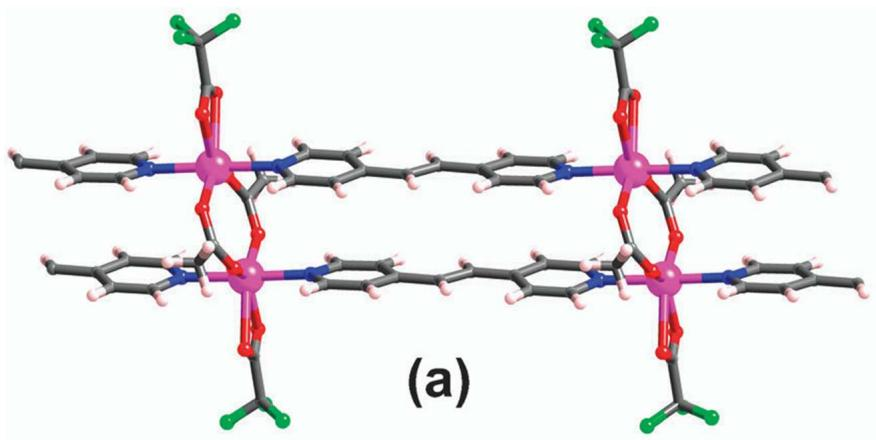
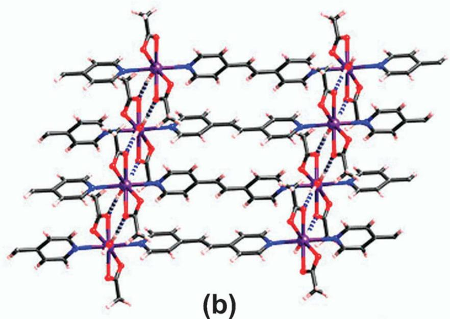
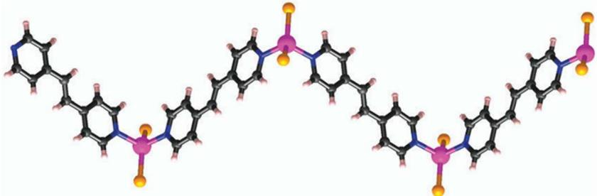
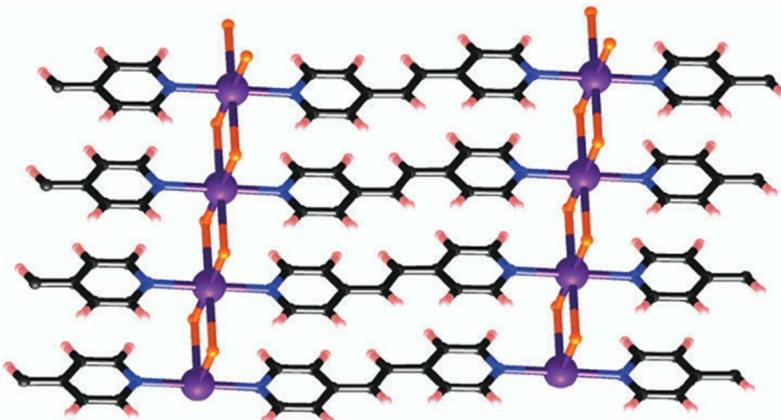

# 题-FY-01-02-金属有机框架MetalOrg

## 题目

### 第 2 题 Metal-Organic Frameworks （共 20 分，占 9%）

金属有机框架（Metal-Organic Frameworks, MOFs）是由无机金属中心（金属离子或金属簇）与桥连的有机配体通过自组装相互连接，形成的一类具有周期性网络结构的晶态多孔材料。MOFs具有多孔、大比表面积和多金属位点等诸多性能，因此在化学化工领域得到许多应用，例如气体贮存、分子分离、催化、药物缓释等。2025年，北川进（Susumu Kitagawa）、理查德·罗布森（Richard Robson）、奥马尔M·亚吉（Omar M. Yaghi）因对金属有机框架发展的贡献，获得2025年诺贝尔化学奖。本题就让我们来欣赏MOFs的美丽结构。

## 2-1 MOF-5 的结构

作为一种经典的 MOF 材料，MOF-5 具有极佳的储氢性能。将经过 4Å 分子筛除水的 DMF 与二水合乙酸锌和对苯二甲酸混合，密封在 130°C 恒温油浴中静置 4 小时，即得到无色晶体 MOF-5。若不考虑其中共结晶的客体分子，则其中金属元素的质量分数为 33.97%，O 的质量分数为 27.02%。

2-1-1 试通过计算得出 MOF-5 的化学式。

2-1-2 对 MOFs 的结构描述可以从次级结构单元（secondary building unit, SBU）与连接子出发，连接子将 SBU 连接形成无限二维平面或三维立体网状结构。多数情况下，金属离子或金属簇作为 SBU，而多齿桥联配体作为连接子。试画出 MOF-5 的 SBU 结构（配体可适当简化）。

2-1-3 SBU 与连接子的特点决定了骨架结构，试根据分析得出 MOF-5 具有以下哪种骨架结构？

A

B

C

D

E

## 2-2 MOF-801 的结构

一种含 Zr 的材料 MOF-801 具有良好的吸水性能，有潜力用于捕捉和释放偏远沙漠地区的大气水。对于其结构的描述如下：

在 SBU 中，Zr 均被 O 配位，形成四方反棱柱形配位多面体。O 可以分为两种，一种为近直线型二羧酸配体中羧基上的 O，另一种为非羧基 O，其中一半为 $O^{2-}$ ，一半为 $OH^{-}$ （可视为等同），均对 3 个 Zr 配位，若将一个 SBU 中所有的这种 O 相连，则形成一种正多面体。且在该正多面体中，每个面上的 O 均对同一个 Zr 配位。每个 Zr 剩余的配位数由羧基 O 提供。

2-2-1 试根据描述，写出 MOF-801 的化学式，二羧酸配体的一半可用（R-CO₂）表示。

2-2-2 该 SBU 的结构可以用多层多面体包合的型式理解，最内层为第二种 O 形成的正多面体，向外依次是 Zr 与羧基 C 形成的对称性较高的多面体，试写出该结构的多面体包合型式。（采用[]@[]@[]的格式书写）

2-2-3 试根据该 SBU 的对称性，选出以下可能的骨架结构。

A

B

C

D

E

F

G

H
2-3 一种含有 $\mathrm{SiO}_4^{4-}$ 离子的MOF材料

在该 MOF 的 SBU 中，Zn 均被 O 以四面体型式配位。 $SiO_{4}^{4-}$ 四面体在中心，每个 O 均对 2 个 Zn 配位。所有 Zn 的排列型式可近似看作立方体，其剩余的配位数由直线型二羧酸配体 m-BDC 提供。（m-BDC 为对苯二甲酸）

2-3-1 试根据描述，写出该 MOF 材料的化学式。

2-3-2 两个 SBU 间通过几个 m-BDC 配体桥联？配体间存在何种分子间作用力？

## 参考答案

对大多数化学反应而言，液相、气相提供了反应物之间更大的接触面积与更高的碰撞概率，因此液相与气相反应在化学反应中占据主要地位。然而，某些特定反应能在固相发生，且具有环保、易提纯等优点。2012年，研究者发现了一类配位聚合物（CPs）在研磨条件下能与KBr发生离子交换反应，反应结束后容器中的混合物经水洗、真空干燥即能获得产物，且经PXRD表征纯度较高，未观测到反应起始物特征峰，间接证明该反应具有接近100%的转化率。

2-1 反应物 A 的化学式为 $[Zn(\mu - CH_{3}CO_{2})(CF_{3}CO_{2})bpe]$ ，其中 bpe 为 1,2-双 (4-吡啶基) 乙烯。A 为一维无限延伸“阶梯状”结构，其中所有 Zn 原子的化学环境相同，均为 6 配位， $CH_{3}CO_{2}^{-}$ 桥连两个距离最近的 Zn 原子。请根据以上信息画出 A 的结构。

(共4分)

2-2 反应物 B 的化学式为 $[Cd(CH_{3}CO_{2})_{2}bpe(H_{2}O)]$ ，具有与 A 中相似的链状结构。链间通过氢键连接形成二维结构，且 $CH_{3}CO_{2}^{-}$ 不充当桥连配体。所有 Cd 原子的化学环境相同且均为 7 配位。请根据以上信息画出 B 的结构（不考虑 Cd 的配位构型，仅需表示出原子间键连关系）。

(共4分)

2-3 将反应物 A 与 KBr 置于玛瑙研钵中手动研磨，一段时间后反应得到产物 C。已知 C 的化学式为 $[Zn(bpe)(Br)_{2}]$ ，为 zig-zag 型（即锯齿型）分子，Zn 的配位数变为 4。请画出 C 的结构。

(共4分)

2-4 同样地，将反应物 B 进行上述操作，得到产物 D。D 的化学式为 $[Cd(bpe)(Br)_{2}]$ ，仍然为二维结构，不同的是链间连接方式改为 Br 原子进行桥联。Cd 的配位数为 6。请画出 D 的结构。

(共4分)

2-5 已知在合适波长的光照下能够发生 $[2+2]$ 环加成反应。

2-5-1 研究者观察到反应物 A 具有光活性，而对应产物 C 却不具有光活性，试解释原因。A 中两条链上的 bpe 平行排列，在光照条件下容易发生 $[2+2]$ 环加成反应；C 中仅剩一条链，bpe 相隔较远且非平行排列，不容易发生 $[2+2]$ 环加成反应。

(共4分)

2-5-2 研究者还发现反应物 B，D 均具有光活性，但 B 仅显示出较弱的光活性。试解释原因。

1）B 中链间以氢键连接，距离较远，轨道重叠较差，不易发生环加成反应；D 中链间由溴原子桥联，距离较近，容易发生环加成反应；

## 第5页,共23页

2）B 以氢键相连，网络柔性较大，bpe 可转动，仅有部分 bpe 之间保持平行，可发生环加成反应；D 通过溴原子桥联构成刚性网络，相邻链上的 bpe 完全平行，极易在光照条件下发生反应。

(共6分，每点3分)

2-6 为什么该反应体系的提纯仅需加入水洗涤并干燥？

反应物几乎完全转化，剩余物种均为钾盐，经水洗可除去，干燥后即得高纯产物。

(共2分)

## 知识点映射

- （待人工校准）

> ⚠️ **自动拆卡标记**：`subject_module`/`difficulty` 为关键词粗判，答案数值与单位**尚未经人工复核**（OCR 原文逐字转录，可能保留原卷笔误）。