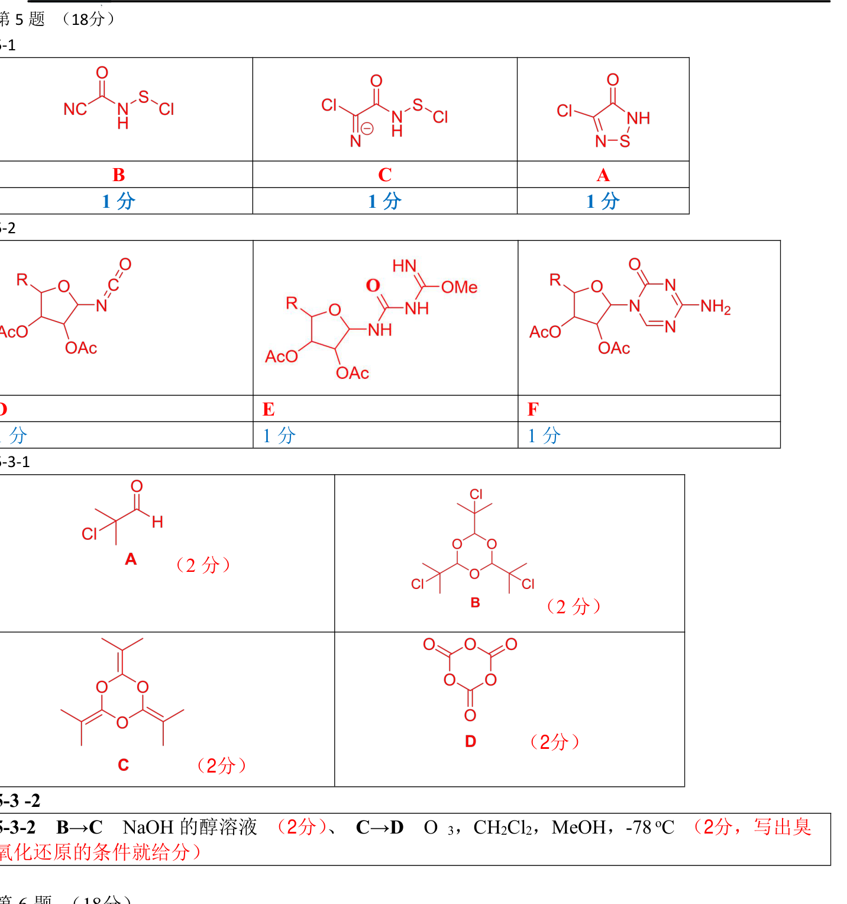

# 题-FY-01-05-51给出中间产物A以及关键中~2

## 题目

### 第 5 题 （18分）有机推断

5-1 给出中间产物 A 以及关键中间体 B、C 结构式，其中 C 为负一价离子。

5-2 给出中间产物 D、E、F 的结构式（不要求立体化学）。

(1) $\mathrm{A}$ 是一个醛；氧化剂

(2)分子B、C、D中都有 ${\mathrm{C}}_{3}$ 轴；

(3) $1\mathrm{{mol}}\mathrm{D}$ 在 $- {40}^{ \circ  }\mathrm{C}$ 以上分解生成的唯一产物是一种气体,这些气体在 ${298}\mathrm{\;K},1\mathrm{{bar}}$ 压力下的体积约为 ${74}\mathrm{\;L}$ ,密度约为 ${1.8}\mathrm{\;{kg}} \cdot  {\mathrm{m}}^{-3}$ 。

5-3-1 写出 A, B, C, D 的结构简式。

5-3 -2 写出 B→C 、 C→D 的反应条件

## 参考答案

（源：方圆《有机化学测试题1》参考答案 · 第 5 题；按原册裁区，保留结构图与答案）

> 📌 据源答案册逐题裁区回填。

## 知识点映射

- （待人工校准）

> ⚠️ **自动拆卡标记**：`subject_module`/`difficulty` 为关键词粗判，答案数值与单位**尚未经人工复核**（OCR 原文逐字转录，可能保留原卷笔误）。