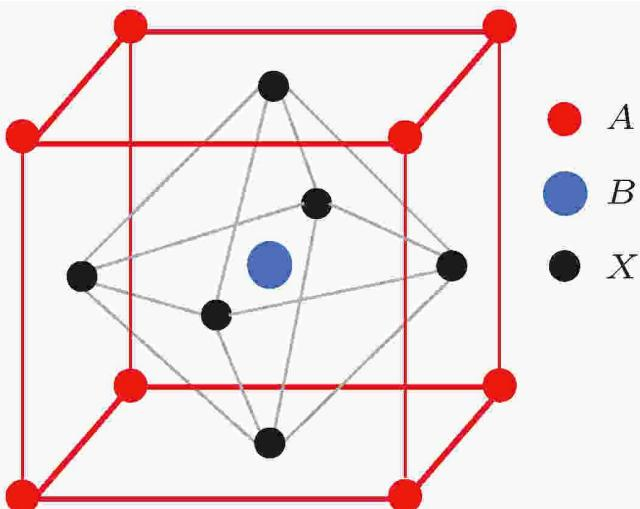
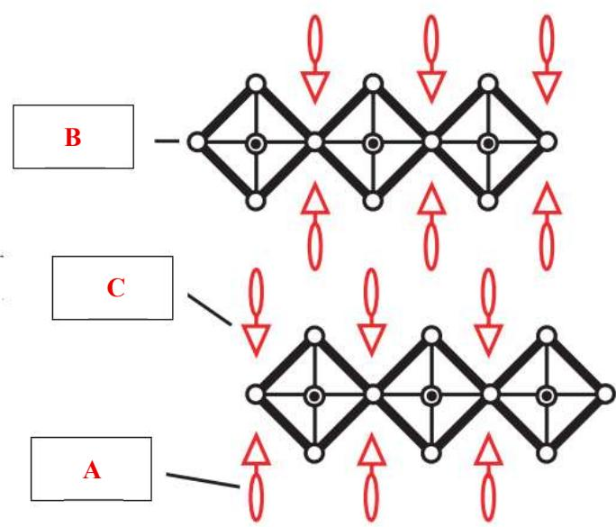
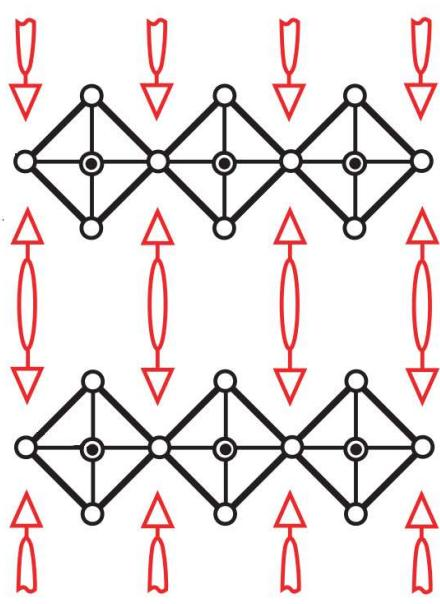
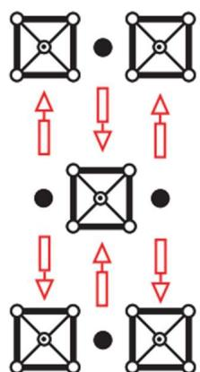

# 题-FY-01-05-下图所示的是CuO沿三个轴向

## 题目

### 第 五 题：晶体投影图（17分，8%）

下图所示的是 CuO 沿三个轴向的晶胞投影图（图中黑球为铜，白球为氧），晶胞参数为 a=468.44 pm，b=341.92 pm，c=512.31 pm， $\beta=99.76^{\circ}$ 。

5-1 指出三幅图分别属于哪个轴向的投影，并说明该结构属于何种晶系。

5-2 晶胞中有几个化学式？

5-3 写出其结构基元并计算晶体的密度

5-4 已知其中一个铜原子坐标为（0.25，0.25，0），请写出其余所有铜原子的坐标。

5-5 指出铜和氧的配位数和配位多面体形状。

## 参考答案

有机-无机杂化材料（Organic-inorganic hybrid materials）是一类将有机与无机的特性整合到同一物种中的新兴材料。独特的光学与电学性质令其倍受化学与材料科研工作者的青睐。其中，由钙钛矿结构衍生而来的一类有机-无机杂化材料通过无机层作为半导体量子阱，有机层作为势垒，能产生室温下稳定的激子吸收峰。

5-1 钙钛矿结构为 $ABO_{3}$ 型，其中A，B为两种金属，A与O共同作立方最密堆积，B填在仅由O构成的空隙中。请画出钙钛矿的晶胞示意图，并给出两种金属的填隙情况。

（4 分，A、B 位置互换得 2 分）
A：立方八面体空隙（1 分）
B：八面体空隙（1 分）

(共6分)

5-2 该类有机-无机杂化材料中有一物种具有类似于单层钙钛矿的结构（如图），请将与结构对应的选项填入方框内（其中-R为烷基，M为金属， $X = Cl^{-}, Br^{-}, I^{-}$ ），并给出该结构的化学式（注意电荷所带来的取向影响）。
A. -R
B. $MX_{4}^{2-}$ C. $-NH_{3}^{+}$

## 第9页,共23页

化学式为 $(R - NH_3)_2MX_4$

（共 7 分， $MX_{4}$ 对应方框 1 分，-R、 $-NH_{3}^{+}$ 对应方框各 2 分，化学式 2 分）

5-3-1 若将有机阳离子换成二胺衍生物（ $H_{3}N - R - NH_{3}$ ） $^{2+}$ ，其结构会发生微妙的变化。钙钛矿层间从交错式堆叠变成重叠式堆叠，且有机阳离子在层间的取向与钙钛矿层垂直，起到类似“桥联”的作用（但并未形成化学键）。请仿照 5-2 图画出其晶体结构的示意图，并给出化学式。

（共6分，结构4分，意思对即可，化学式2分）

5-3-2 设具有上述结构某化合物的部分晶胞参数如下： $a = b = 5.656 \, \text{Å}$ ， $\alpha = \beta = \gamma = 90^\circ$ ，近似认为八面体为正八面体，钙钛矿层间距为 $7.423 \, \text{Å}$ ，该化合物分子量为 $303.5 \, g \cdot mol^{-1}$ ，试计算该化合物的密度。

$$
c = 5.656 \mathrm{A} + 7.423 \mathrm{A} = 13.079 \mathrm{A} (2 \text {分})
$$

$$
\rho = \frac {Z M}{N _ {A} V} = \frac {1 * 303.5}{6.022 * 10 ^ {23} * 5.656 * 5.656 * 13.079 * 10 ^ {- 24}} = 1.205 g \cdot c m ^ {- 3} (4 \text {分})
$$

(共6分)

5-4 上述结构均为单层钙钛矿的类似物。通过略微改变制备条件，能生成双层、三层或更多层的钙钛矿衍生结构。同时由于有机阳离子并不能参与钙钛矿层内部的填隙，在钙钛矿内部将由另一种金属A替代有机阳离子的位置，仅在层间保留有机阳离子。请写出 $(R-NH_{3})^{+}$ 、M、A与 $X^{-}$ 构成的n层钙钛矿衍生结构的组成通式（参考5-2图）。

$$
(R - N H _ {3}) _ {2} A _ {n - 1} M _ {n} X _ {3 n + 1}
$$

(共4分)

5-5 对于钙钛矿衍生结构而言，其层状结构可以从<100>晶面方向截取，也可以从<110>晶面方向截取（即旋转 $45^{\circ}$ 截取）。从<110>晶面截取得到的单层结构如图。试写出该结构的化学式。

(黑球表示 A 原子)

$$
(R - N H _ {3}) _ {2} A M X _ {5}
$$

(共3分)

## 知识点映射

- （待人工校准）

> ⚠️ **自动拆卡标记**：`subject_module`/`difficulty` 为关键词粗判，答案数值与单位**尚未经人工复核**（OCR 原文逐字转录，可能保留原卷笔误）。