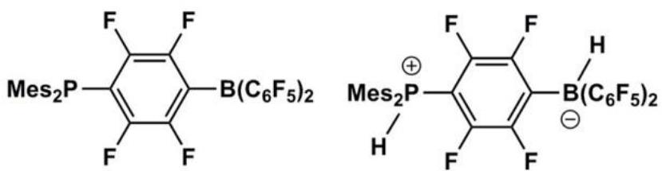
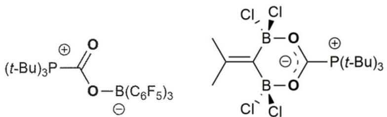
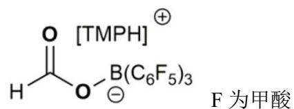
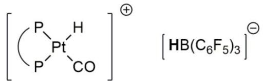
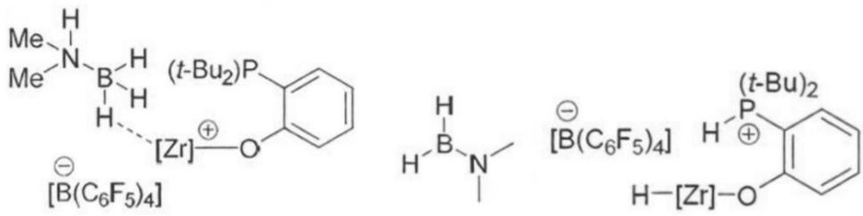

# 题-FY-01-06-某些具有特殊结构的Lewis

## 题目

### 第 六 题：受阻 Lewis 酸碱对（20 分，11%）

某些具有特殊结构的 Lewis 酸碱组合具有潜在的小分子活化性能，这些 Lewis 酸碱之间无法直接连接，因此被称为受阻 Lewis 酸碱对。

6-12006 年，当 Stephen 小组将常见的 Lewis 酸 $\left(\mathrm{B}\left(\mathrm{C}_{6}\mathrm{F}_{5}\right)_{3}\right)$ 与 Lewis 碱 $\left(\mathrm{PHMe}_{2}\right)$ 混合，发现没有发生典型的加合反应，而是 1:1 发生了取代反应生成了化合物 A，令人振奋的是，A 与 $H_{2}$ 反应时，竟得到了同时带有正负电性氢的稳定化合物 B，为室温下氢气的非金属活化提供了可能性，请写出 A 和 B 的结构。

6-2-12009 年，Erker 小组将 $\mathrm{B}(\mathrm{C}_{6}\mathrm{F}_{5})_{3}$ 和 $\mathrm{P}(\mathrm{tBu})_{3}$ 混合，并在其中通入 $CO_{2}$ ，得到了不太稳定的加合产物 C，为了提高加合物的稳定性以实现 $CO_{2}$ 的进一步还原，他们将 Lewis 酸更换为如下结构的分子，并得到了稳定的加合产物 D。请写出 C 和 D 的结构。

6-2-2 受阻 Lewis 酸碱对的研究启发了硼氢还原 $CO_{2}$ 机理的研究，2009 年，Ashley 小组在用还原剂 $\mathrm{Na}[\mathrm{HB}(\mathrm{C}_{6}\mathrm{F}_{5})_{3}]$ 还原 $CO_{2}$ 的反应体系中，分离出一种稳定的还原中间体 E，并且可以在 1 当量氢气的作用下得到还原产物 F 和还原剂本身，请写出 E 和 F 的结构。

6-3 过渡金属也可以在受阻 Lewis 酸碱对中承担酸碱的功能

6-3-1 完成下列方程式:

6-3-2 已知在下图的循环中，锆配合物作为受阻 Lewis 酸碱对起到了容纳氢气分子的作用。请写出 G，H，I 的结构。

## 参考答案

6-1（4分）

6-2-1（4分）

6-2-2（4 分，答甲醇也可得分）

6-3-1（2分）

第6页,共9页

6-3-2（6分）

## 知识点映射

- （待人工校准）

> ⚠️ **自动拆卡标记**：`subject_module`/`difficulty` 为关键词粗判，答案数值与单位**尚未经人工复核**（OCR 原文逐字转录，可能保留原卷笔误）。