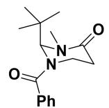
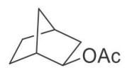

# 题-FY-01-07-71排序化合物ABC离去OT

## 题目

### 第 七 题：基本有机原理（21分，10%）

7-1 排序，化合物 ABC 离去 OTs 生成相应碳正离子的速率。

7-2 比较 A 和 B 两组第五发生 Click 反应的速率。

A

7-3 比较下面两个底物发生 Claisen 反应的速率。

7-4 画出下列分子最稳定的构象，分析另一种构象不稳定的原因。

7-5 比较化合物 A 和 B 生成碳正离子的速率

7-6 指出以下化合物亲电取代活性最高的位点，并解释原因。

7-7 画出如下光学纯化合物在 AcOH/KOAc 中溶剂解的产物。

## 参考答案

7-1 C>B>A (3 分)

7-2 A<B (3 分)

7-3 A<B (3 分)

7-4 叔丁基位于平伏键时和羰基存在 A(1,3)斥力（将酰胺 N 画成平面也可以）（1 分）

(2 分)

7-5 A>B (3 分)

7-64 号位。受芳香性影响，五元环较富电子，而且 4 号位亲电取代形成的碳正离子有更多保留七元环芳香性的共振式。（3 分）

7-7（3 分，未画出外消旋或对映体，得 1 分）

(±)

## 知识点映射

- （待人工校准）

> ⚠️ **自动拆卡标记**：`subject_module`/`difficulty` 为关键词粗判，答案数值与单位**尚未经人工复核**（OCR 原文逐字转录，可能保留原卷笔误）。