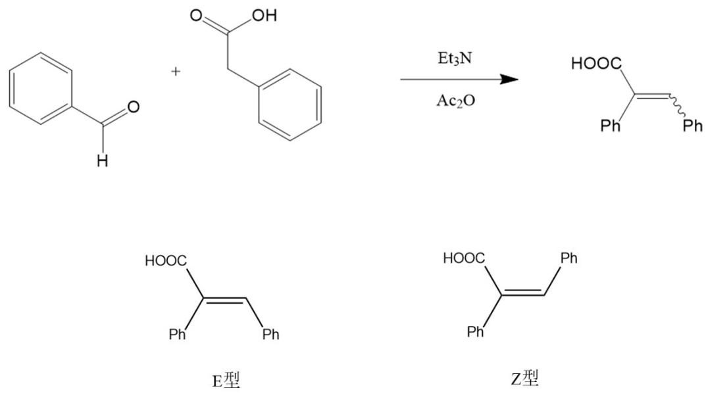
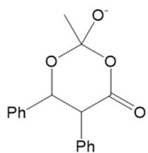
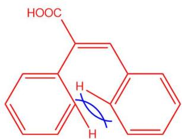

# 题-FY-01-07-71排序化合物ABC离去OT

## 题目

### 第 七 题：基本有机原理（21分，10%）

7-1 排序，化合物 ABC 离去 OTs 生成相应碳正离子的速率。

7-2 比较 A 和 B 两组第五发生 Click 反应的速率。

A

7-3 比较下面两个底物发生 Claisen 反应的速率。

7-4 画出下列分子最稳定的构象，分析另一种构象不稳定的原因。

7-5 比较化合物 A 和 B 生成碳正离子的速率

7-6 指出以下化合物亲电取代活性最高的位点，并解释原因。

7-7 画出如下光学纯化合物在 AcOH/KOAc 中溶剂解的产物。

## 参考答案

Perkin 反应是一个非常经典的有机人名反应。该反应为芳香醛和酸酐在碱性催化剂的条件下生成 $\alpha$ ， $\beta$ -不饱和芳香酸，表观上发生了类似于羟醛缩合的过程。在三颈烧瓶中加入苯乙酸、苯甲醛、三乙胺和乙酸酐，加热回流。加入浓盐酸，反应物凝结成固体。加入适量乙醚，水浴加热使固体完全溶解，然后转移至分液漏斗中分出水相；有机相用水洗涤两次后转移至圆底烧瓶，加入氢氧化钠溶液，微热并搅拌，分液，保留水相。随后加入浓盐酸，即可析出 E- $\alpha$ -苯基肉桂酸与 Z- $\alpha$ -苯基肉桂酸粗产品。

7-1 请写出 Perkin 反应有可能经历的带电荷六元环中间体。

(3 分)

7-2 反应需要消耗多少当量的乙酸酐？

2 当量（2 分）。

7-3 回流反应结束后为什么要加入浓盐酸？

(1)与过量的三乙胺反应

(2)质子化产物肉桂酸钠，生成肉桂酸（共2分，回答一点即可）。

7-4 分液后，向水相中缓慢滴加浓盐酸调节 pH 会析出 α-苯基肉桂酸（见上图），且 E 型产物与 Z 型产物会在不同的 pH 析出。请根据所学知识推断 E-α-苯基肉桂酸与 Z-α-苯基肉桂酸的析出顺序，并解释原因。

E-α-苯基肉桂酸先析出。（2分）E型产物的两个苯环因为H的排斥无法同时跟双键、羧基共平面（1分），导致其共轭减弱（1分），电离产生的负电荷受到的共轭稳定作用较弱，因此E-α-苯基肉桂酸的酸性较弱（2分），在pH较高时先析出。

(共6分)

7-5 结晶析出粗产品后，需用乙醇-水混合溶剂对其进行重结晶提纯。首先加入适量乙醇加热溶解粗产品，趁热过滤，在 $60^{\circ}\mathrm{C}$ 水浴中边振摇边缓慢滴加去离子水，直到产生混浊，加热变清，室温下冷却结晶。乙醇-水混合溶剂重结晶相比与直接使用 $95\%$ 乙醇重结晶有什么优点？

混合溶剂重结晶通过逐滴加入来控制乙醇与水的比例（1 分），减小产物溶解度的同时防止杂质的析出（1 分），所得产品产率更高（2 分）。

(共4分)

## 知识点映射

- （待人工校准）

> ⚠️ **自动拆卡标记**：`subject_module`/`difficulty` 为关键词粗判，答案数值与单位**尚未经人工复核**（OCR 原文逐字转录，可能保留原卷笔误）。