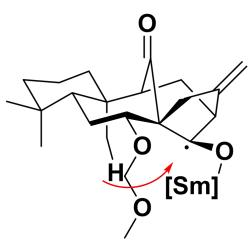
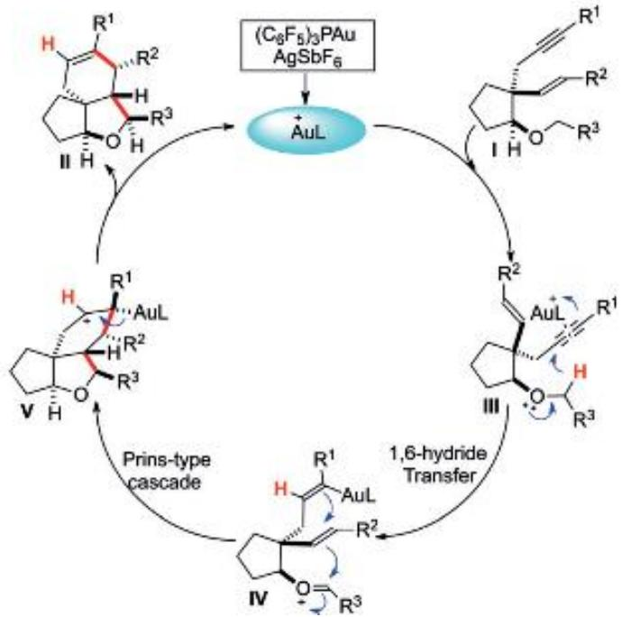
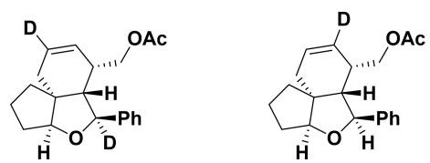
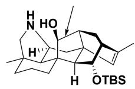

# 题-FY-01-08-81Carreira课题组在

## 题目

### 第 八 题：氢迁移反应的妙用（18 分，10%）

8-1 Carreira 课题组在合成 Crokonoid A 时尝试了 SmI $_{2}$ 介导的还原反应

8-1-1 在以 THF 和 $H_{2}O$ 作为溶剂时，主要发生了如下所示的副反应，请画出反应的机理。

8-1-2 在完成上述推断后，该课题组将反应的条件更换为 THF 为溶剂，加入 HMPA 和三氟乙醇，在该条件下可以得到羰基还原的主要产物。请分析为何该条件能够抑制氢迁移产物的产生。

4:18-2 在一篇献给 KCN 七十大寿的文献中，作者设计了如下所示的金催化串联反应。

8-2-1 请画出反应的机理。

8-2-2 根据你画的反应机理，请画出以下反应的产物。

8-3 Luo 课题组在合成 Kobusine 的过程中采用了如下所示碱性条件下的氢迁移反应完成氧化态的修饰。已知起始原料的低场区（>3.0 ppm）的核磁共振氢谱为 5.46(1H), 3.63-3.54 (m, 1H), 3.43 (1H), 低场区（>70 ppm）的核磁共振碳谱为 213.7, 141.2, 130.7, 90.4。

产物的低场区（>3.0 ppm）的核磁共振氢谱为 5.35 (1H), 4.94 (1H), 4.09 -3.86 (m, 1H), 3.60 (1H)。低场区（>70 ppm）的核磁共振碳谱为 143.4, 126.6, 73.9, 71.4。请根据以上信息画出产物结构。

## 参考答案

8-1-1 与角甲基发生了[1,7]氢迁移完成了逆 aldol 反应（3 分）

## 第7页,共9页

8-1-2 三氟乙醇是更强的氢给体，可以快速淬灭 $\mathrm{SmI}_2$ 还原产生的 Oα位自由基，从而抑制了氢迁移产物的生成。（2 分）

8-2-1（6分，三键配位、抓氢键、成环得到的三个中间体各2分）

8-2-2（4分）

8-3（3分）

(构型画错也可以得分)

## 知识点映射

- （待人工校准）

> ⚠️ **自动拆卡标记**：`subject_module`/`difficulty` 为关键词粗判，答案数值与单位**尚未经人工复核**（OCR 原文逐字转录，可能保留原卷笔误）。