# 题-FY-01-08-81Carreira课题组在

## 题目

### 第 八 题：氢迁移反应的妙用（18 分，10%）

8-1 Carreira 课题组在合成 Crokonoid A 时尝试了 SmI $_{2}$ 介导的还原反应

8-1-1 在以 THF 和 $H_{2}O$ 作为溶剂时，主要发生了如下所示的副反应，请画出反应的机理。

8-1-2 在完成上述推断后，该课题组将反应的条件更换为 THF 为溶剂，加入 HMPA 和三氟乙醇，在该条件下可以得到羰基还原的主要产物。请分析为何该条件能够抑制氢迁移产物的产生。

4:18-2 在一篇献给 KCN 七十大寿的文献中，作者设计了如下所示的金催化串联反应。

8-2-1 请画出反应的机理。

8-2-2 根据你画的反应机理，请画出以下反应的产物。

8-3 Luo 课题组在合成 Kobusine 的过程中采用了如下所示碱性条件下的氢迁移反应完成氧化态的修饰。已知起始原料的低场区（>3.0 ppm）的核磁共振氢谱为 5.46(1H), 3.63-3.54 (m, 1H), 3.43 (1H), 低场区（>70 ppm）的核磁共振碳谱为 213.7, 141.2, 130.7, 90.4。

产物的低场区（>3.0 ppm）的核磁共振氢谱为 5.35 (1H), 4.94 (1H), 4.09 -3.86 (m, 1H), 3.60 (1H)。低场区（>70 ppm）的核磁共振碳谱为 143.4, 126.6, 73.9, 71.4。请根据以上信息画出产物结构。

## 参考答案

8-1 试比较下列氢的酸性（由弱至强）。

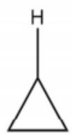

A

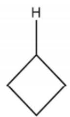

B

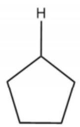

C

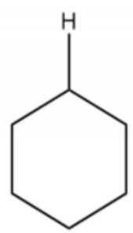

D

D < C < B < A

(共 4 分, 按空给分, 1 个 1 分)

8-2 试比较下列化合物的pKa（由大到小）。

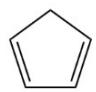

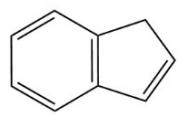

A

B

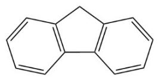

C

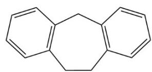

D

D > C > B > A

(共 4 分, 按空给分, 1 个 1 分)

8-3 试比较下列化合物的 $pKa$ （由大到小）。

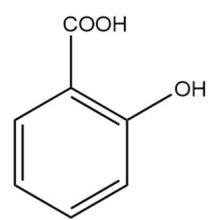

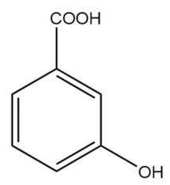

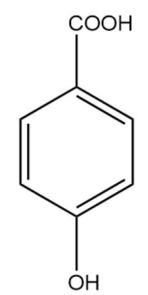

A

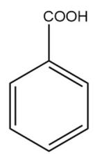

B

C

D

$$
\mathrm{C} > \mathrm{D} > \mathrm{B} > \mathrm{A}
$$

(共 4 分，按空给分，1 个 1 分)

8-4 试比较下列化合物的芳香性，并给出理由（由弱到强）。

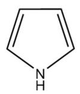

A

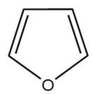

B

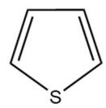

C

$$
\mathrm{B} <   \mathrm{A} <   \mathrm{C}
$$

原子的电负性顺序为 $0 > N > S \approx C$ ，因此三种芳环的杂原子孤对电子与其他碳原子 p 轨道上的单电子共轭产生的离域效应由强到弱为 $B < A < C$ ，即芳香性的强弱顺序

（共6分，排序按空给分，1个1分；解释3分）

## 知识点映射

- （待人工校准）

> ⚠️ **自动拆卡标记**：`subject_module`/`difficulty` 为关键词粗判，答案数值与单位**尚未经人工复核**（OCR 原文逐字转录，可能保留原卷笔误）。