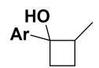
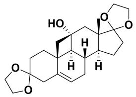
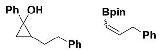
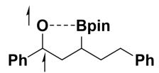
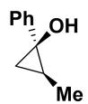

# 题-FY-01-09-NorrishII型反应在合

## 题目

### 第 九 题：Norrish II 型反应（21 分，12%）

Norrish II 型反应在合成中是一类重要的自由基反应，请根据提示回答以下问题。

9-1 在不作任何修饰的情况下，请画出下列 Norrish II 型反应的产物 B（提示，B 中存在高张力环，反应过程中经过了六元环状过渡态）。

9-2 Baran 课题组在合成 Ouabagenin 的过程中运用了一步 Norrish II 型反应构建出一个关键的氧化态，请推测如下反应产物 A 的结构，已知 A 中包含 7 个环：

9-3 在 3 号位引入 B 取代后，反应会变得更加丰富。

9-3-1 光照条件下可以生成 Norrish II 型产物 C 和 Norrish I 型产物 D，已知 C 中存在与上两问不同的高张力环，D 中含有 B，且含有烯氢，画出 C 和 D 的结构。

9-3-2 请画出生成化合物 C 的反应中重要的中间体 E。

9-3-3 解释为什么下列反应在相同的条件下无法进行。

9-4 在一定条件下，该反应可以获得立体选择性。

9-4-1 请画出主产物 E 的结构，E 是一对对映异构体。

9-4-2 请解释产物 E 中 Ph 和 Me 的相对立体构型的来源。

## 参考答案

9-1（3分）

9-2（3分）

9-3-1 （6 分）D 顺反异构不做要求

9-3-2 O 被 B 捕捉后 B-C 键断裂成三元环（2 分）

9-3-3 孤立的羰基 HOMO LUMO 的能级差更大，需要更短的波长才能够激发。（2 分）
9-4-1（3 分，画出其对映体亦可）

9-4-2 在形成三元环的一步，Ph 和 Me 之间存在较大的空间排斥力，为了避免这种斥力，Ph 会扭到 Me 的反面。（2 分）

## 知识点映射

- （待人工校准）

> ⚠️ **自动拆卡标记**：`subject_module`/`difficulty` 为关键词粗判，答案数值与单位**尚未经人工复核**（OCR 原文逐字转录，可能保留原卷笔误）。