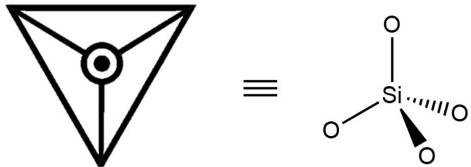
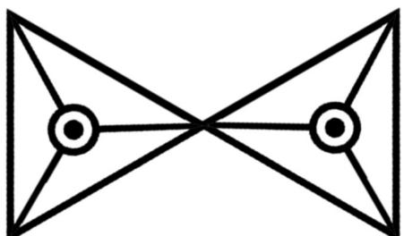
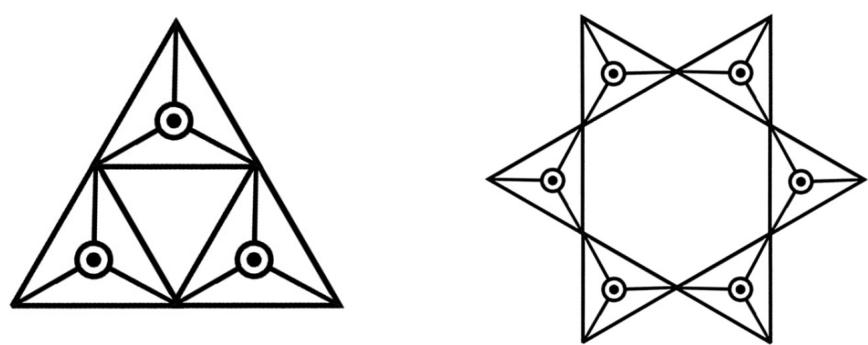
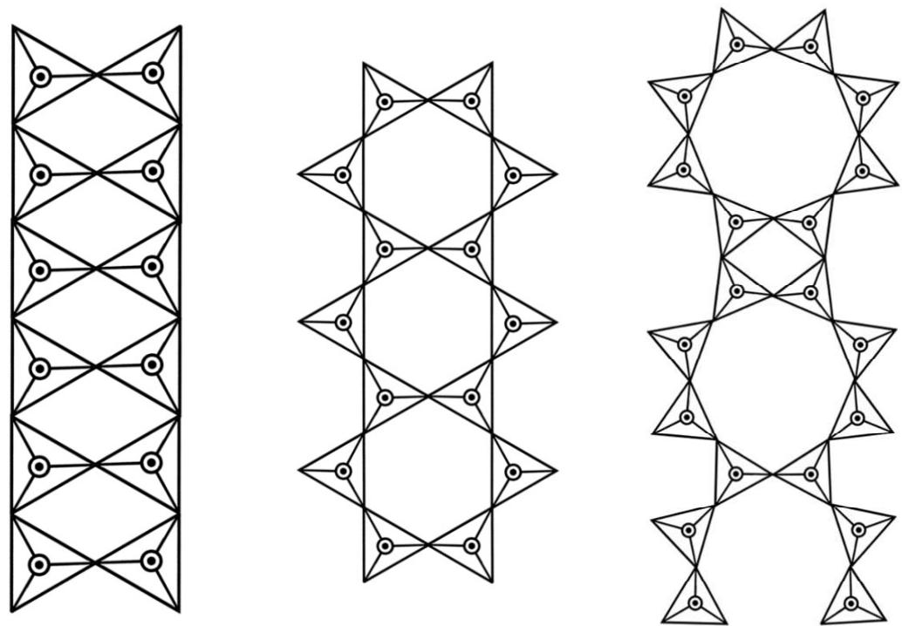
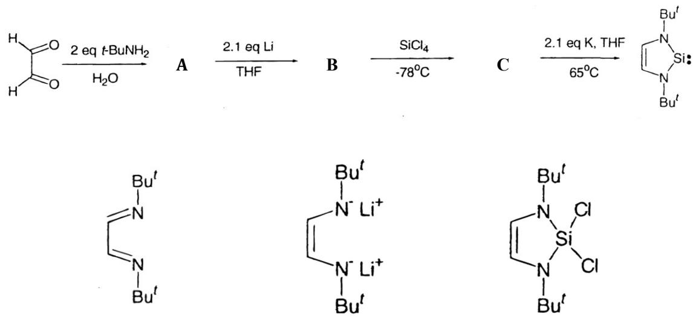
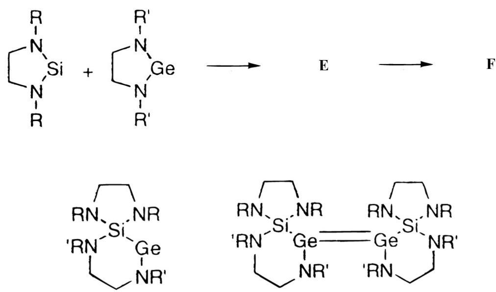

# 题-FY-卷一-01-11SiC俗名金刚砂是一种极

## 题目

### 第 1 题 硅的化学（34 分，占 12%）

1-1 SiC，俗名金刚砂，是一种极其耐磨的材料，可用于制作轴承、砂轮等器件。SiC由于表层覆盖有 $SiO_{2}$ ，对酸的抗腐蚀能力较强。用熔融的NaOH除去表面的 $SiO_{2}$ 后，SiC在空气中会迅速与NaOH反应。请写出反应方程式。

1-2 $SiH_{4}$ 与AgCl在260℃发生反应，生成一种无色透明且有刺激性气味的气体，其中Cl的质量分数为53.3%。请写出该反应的化学方程式。

1-3 Si与O的高亲和性使得硅酸盐的种类与结构丰富多彩。大多数硅酸盐中都包含有 $[SiO_{4}]$ 四面体单元。该单元的表示方法如下图（俯视图）。

1-3-1 请用该表示方式画出 $Si_{2}O_{7}^{6-}$ 的示意图。

1-3-2 试写出下面结构对应的化学式。

1-3-3 试写出下面一维无限延伸结构对应的化学式（写最简式）。

1-4 Si与C属同一主族，化学性质也较为相似。硅能够在一定条件下形成硅卡宾并发生有趣的反应。

1-4-1 请写出中间产物 $A - C$ 的结构。

1-4-2 硅的同族锗也能形成锗卡宾。当锗卡宾与硅卡宾处于同一体系中，二者将会表现出略微不同的性质。反应首先发生了一步插入反应得到 E，随后 E 二聚得到产物 F。请画出 E 和 F 的结构。

## 参考答案

1-1 SiC，俗名金刚砂，是一种极其耐磨的材料，可用于制作轴承、砂轮等器件。SiC由于表层覆盖有 $SiO_{2}$ ，对酸的抗腐蚀能力较强。用熔融的NaOH除去表面的 $SiO_{2}$ 后，SiC在空气中会迅速与NaOH反应。请写出反应方程式。

$$
S i C + 4 N a O H + 2 O _ {2} \rightarrow N a _ {2} S i O _ {3} + 2 H _ {2} O + N a _ {2} C O _ {3}
$$

(共2分)

1-2 $SiH_{4}$ 与AgCl在260℃发生反应，生成一种无色透明且有刺激性气味的气体，其中Cl的质量分数为53.3%。请写出该反应的化学方程式。

$$
S i H _ {4} + 2 A g C l \rightarrow S i H _ {3} C l + H C l + 2 A g
$$

(共2分)

1-3 Si与O的高亲和性使得硅酸盐的种类与结构丰富多彩。大多数硅酸盐中都包含有 $[SiO_{4}]$ 四面体单元。该单元的表示方法如下图（俯视图）。

1-3-1 请用该表示方式画出 $Si_{2}O_{7}^{6-}$ 的示意图。

(共3分)

1-3-2 试写出下面结构对应的化学式。

$Si_{3}O_{9}^{6-}$ ; $Si_{6}O_{18}^{12-}$

(共6分，每个3分)

1-3-3 试写出下面一维无限延伸结构对应的化学式（写最简式）。

$Si_{2}O_{5}^{2 - }$ ； $Si_{4}O_{11}^{6 - }$ ； $Si_{6}O_{17}^{10 - }$

(共9分，每个3分)

1-4 Si与C属同一主族，化学性质也较为相似。硅能够在一定条件下形成硅卡宾并发生有趣的反应。

1-4-1 请写出中间产物 $A - C$ 的结构。

(共6分，每个2分)

1-4-2 硅的同族锗也能形成锗卡宾。当锗卡宾与硅卡宾处于同一体系中，二者将会表现出略微不同的性质。反应首先发生了一步插入反应得到 E，随后 E 二聚得到产物 F。请画出 E 和 F 的结构。

(共6分，每个3分)

## 知识点映射

- （待人工校准）

> ⚠️ **自动拆卡标记**：`subject_module`/`difficulty` 为关键词粗判，答案数值与单位**尚未经人工复核**（OCR 原文逐字转录，可能保留原卷笔误）。