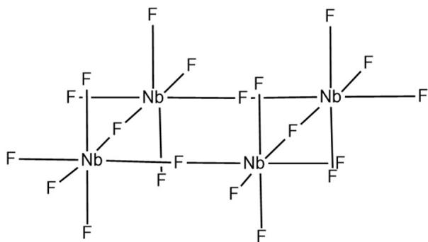
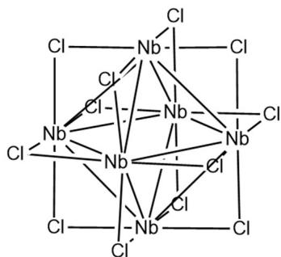
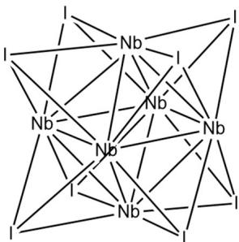

# 题-FY-卷一-06-某元素X的黄色含氯化合物A能

## 题目

### 第 6 题 多彩的元素化学（31分，占 $11\%$ ）

某元素 X 的黄色含氯化合物 A 能与 $F_{2}$ 发生反应生成白色的易挥发固体 B，B 与 X 的单质可继续反应生成一种易水解的黑色化合物 C，C 反常地具有较低的磁矩。B 溶于 HF 的水溶液可生成一种含 X 45.56% 的阴离子 D。A 在高温下与 X 的单质反应可能生成两种含 X 的化合物 E 与 F，且 E 与 F 中含有相同的结构单元 $U_{1}$ ，该单元属于 $O_{h}$ 点群，其中 X 的质量分数为 56.72%。然而，若采用 A 的类似物 G 与 X 的单质反应，可得到具有不同结构的化合物 H，其中 X 的质量分数为 28.54%。H 中含有另一种属于 $O_{h}$ 点群的结构单元 $U_{2}$ 。在 X 的最高价含氧酸根的强碱性水溶液中加入过量 $H_{2}O_{2}$ ，可生成一种淡黄色配合物，其阴离子 I 的配位构型为菱形十二面体。

6-1 请写出物种 A\~D 、 G\~I 的化学式。

6-2 B 常以四聚体形式存在，请画出 B 四聚体的结构

6-3 C 中 X 原子均为八面体配位，通过共用原子形成无限层状结构。计算 C 的理论磁矩，并尝试解释为什么 C 的磁矩较小？

6-4-1 请给出 $U_{1}$ 单元的化学式（不要求金属价态与电荷），并画出 $U_{1}$ 的结构。

6-4-2 在 E 中，每个 $U_{1}$ 单元周围有 4 个 $U_{1}$ 单元，单元之间通过 Cl 桥连构成二维无限延伸结构；在 F 中，每个 $U_{1}$ 单元周围有 6 个 $U_{1}$ 单元，单元之间通过 Cl 桥连构成三维无限延伸结构。请写出 E、F 的化学式（最简式）。

6-4-3 根据以上信息给出 $\mathbf{U}_2$ 的化学式，并画出 $\mathbf{U}_2$ 的结构

6-5 试给出生成 I 的反应方程式（为简便起见，认为最高价含氧酸根为单核）

7-1 请写出 Perkin 反应有可能经历的带电荷六元环中间体。(不包括苯环)

## 参考答案

某元素 X 的黄色含氯化合物 A 能与 $F_{2}$ 发生反应生成白色的易挥发固体 B，B 与 X 的单质可继续反应生成一种易水解的黑色化合物 C，C 反常地具有较低的磁矩。B 溶于 HF 的水溶液可生成一种含 X 45.56% 的阴离子 D。A 在高温下与 X 的单质反应可能生成两种含 X 的化合物 E 与 F，且 E 与 F 中含有相同的结构单元 $U_{1}$ ，该单元属于 $O_{h}$ 点群，其中 X 的质量分数为 56.72%。然而，若采用 A 的类似物 G 与 X 的单质反应，可得到具有不同结构的化合物 H，其中 X 的质量分数为 28.54%。H 中含有另一种属于 $O_{h}$ 点群的结构单元 $U_{2}$ 。在 X 的最高价含氧酸根的强碱性水溶液中加入过量 $H_{2}O_{2}$ ，可生成一种淡黄色配合物，其阴离子 I 的配位构型为菱形十二面体。

6-1 请写出物种 A\~D 、 G\~H 的化学式。

$$
\mathbf {A} \colon N b C l _ {5} \mathbf {B} \colon N b F _ {5} \mathbf {C} \colon N b F _ {4} \mathbf {D} \colon [ N b O F _ {5} ] ^ {2 -} \mathbf {G} \colon N b I _ {5} \mathbf {H} \colon N b _ {6} I _ {1 1} \mathbf {I} \colon [ N b (O _ {2}) _ {4} ] ^ {3 -}
$$

(共7分，每个1分)

6-2 B 常以四聚体形式存在，请画出 B 四聚体的结构

(共3分)

6-3 C 中 X 原子均为八面体配位，通过共用原子形成无限层状结构。计算 C 的理论磁矩，并尝试解释为什么 C 的磁矩较小？

$$
\mu = \sqrt {n (n + 2)} = \sqrt {3} = 1. 7 3 \mu . B.
$$

C 通过层内金属-金属相互作用导致单电子离域，实际磁矩较小。

(共 4 分, 磁矩 2 分, 解释 2 分)

6-4-1 请给出 $U_{1}$ 单元的化学式（不要求金属价态与电荷），并画出 $U_{1}$ 的结构。

化学式： $Nb_{6}Cl_{12}$

(共 4 分, 化学式 1 分, 结构 3 分)

6-4-2 在 E 中，每个 $U_{1}$ 单元周围有 4 个 $U_{1}$ 单元，单元之间通过 Cl 桥连构成二维无限延伸结构；在 F 中，每个 $U_{1}$ 单元周围有 6 个 $U_{1}$ 单元，单元之间通过 Cl 桥连构成三维无限延伸结构。请写出 E、F 的化学式（最简式）。

E: $Nb_{3}Cl_{7}$ F: $Nb_{6}Cl_{15}$ ，可以简写为 $Nb_{2}Cl_{5}$

(共4分，各2分)

6-4-3 根据以上信息给出 $U_{2}$ 的化学式，并画出 $U_{2}$ 的结构

化学式： $Nb_{6}I_{8}$

(共 4 分, 化学式 1 分, 结构 3 分)

6-5 试给出生成 I 的反应方程式（为简便起见，认为最高价含氧酸根为单核），

$$
N b O _ {4} ^ {3 -} + 4 H _ {2} O _ {2} \rightarrow [ N b (O _ {2}) _ {4} ] ^ {3 -} + 4 H _ {2} O\tag{5 分}
$$

## 知识点映射

- （待人工校准）

> ⚠️ **自动拆卡标记**：`subject_module`/`difficulty` 为关键词粗判，答案数值与单位**尚未经人工复核**（OCR 原文逐字转录，可能保留原卷笔误）。