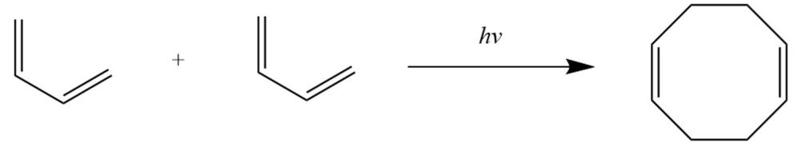
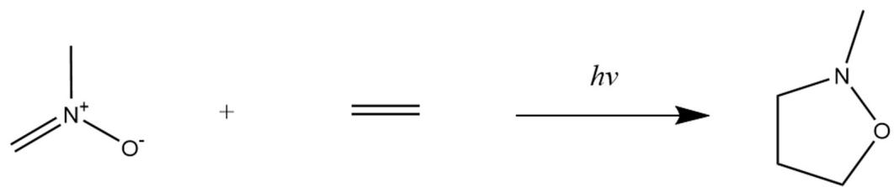
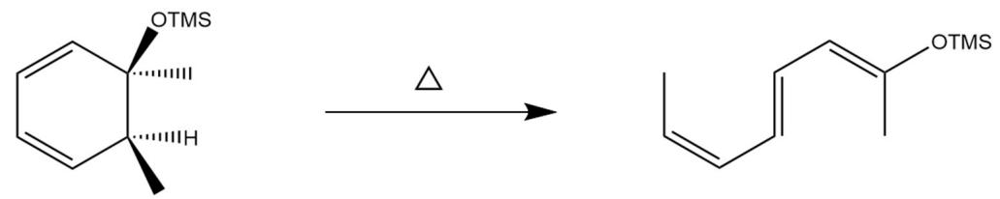
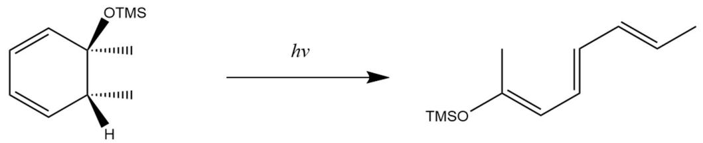
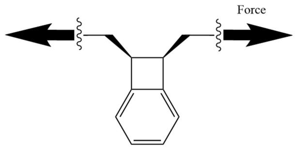
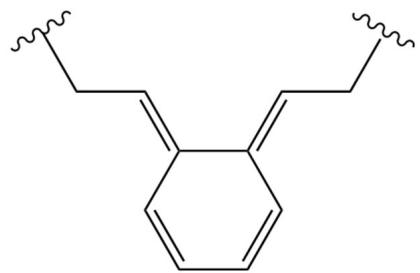
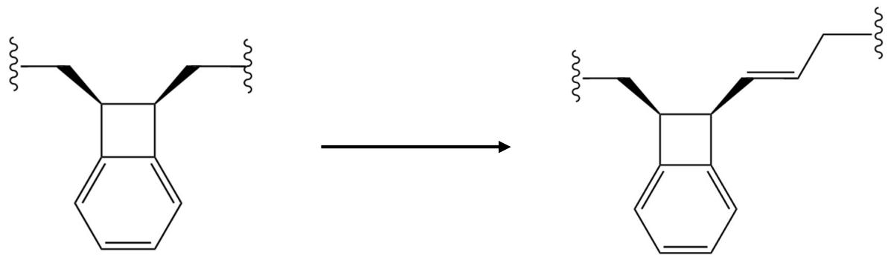

# 题-FY-卷一-09-91在轨道对称性禁阻的情况下

## 题目

### 第 9 题 机械力驱动下的有机反应（13 分，占 8%）

9-1 在轨道对称性禁阻的情况下，大多数周环反应无法进行。请判断下列周环反应在该条件下是处于允许还是禁阻状态。

1)

2)

3)

4)

9-2 但在外界施加机械力的情况下，可以无视轨道对称性完成原本 “禁阻” 的反应。例如对下面这个分子两端施加横向力，可以发生反应。

9-2-1 请写出该反应的产物（要求画出分子构型）。

9-2-2 该反应为对称性禁阻的反应，却能在室温下发生，试猜想该反应的机理（文字解释即可）。

9-3 在原分子的基础上添加一段 $\alpha$ -E-烯烃结构（如图），发现令该分子发生反应所需的最小力 $F_{min}$ 从约1400 pN减小至约900 pN。试从物理学中杠杆效应的角度解释产生上述现象的原因（提示：烯烃结构的刚性较大）。

## 参考答案

9-1 在轨道对称性禁阻的情况下，大多数周环反应无法进行。请判断下列周环反应在该条件下是处于允许还是禁阻状态。

1)

2)

允许；禁阻；禁阻；允许

(共4分，每个1分)

9-2 但在外界施加机械力的情况下，可以无视轨道对称性完成原本 “禁阻” 的反应。例如对下面这个分子两端施加横向力，可以发生反应。

9-2-1 请写出该反应的产物（要求画出分子构型）。

(共3分)

9-2-2 该反应为对称性禁阻的反应，却能在室温下发生，试猜想该反应的机理（文字解释即可）。

在力的作用下，中间的键被拉断形成双自由基，并最终反应生成产物。

(2 分, 答到中间键先断裂即给分)

9-3 在原分子的基础上添加一段 $\alpha$ -E-烯烃结构（如图），发现令该分子发生反应所需的最小力 $F_{min}$ 从约1400 pN减小至约900 pN。试从物理学中杠杆效应的角度解释产生上述现象的原因（提示：烯烃结构的刚性较大）。

添加烯烃刚性结构增加了动力臂长度，由于作用在键两端并令化学键断裂所需的最小力大小始终不变，在分子两端所需施加的最小力就减小了。

(共 4 分，酌情给分，意思对即可。)

## 知识点映射

- （待人工校准）

> ⚠️ **自动拆卡标记**：`subject_module`/`difficulty` 为关键词粗判，答案数值与单位**尚未经人工复核**（OCR 原文逐字转录，可能保留原卷笔误）。