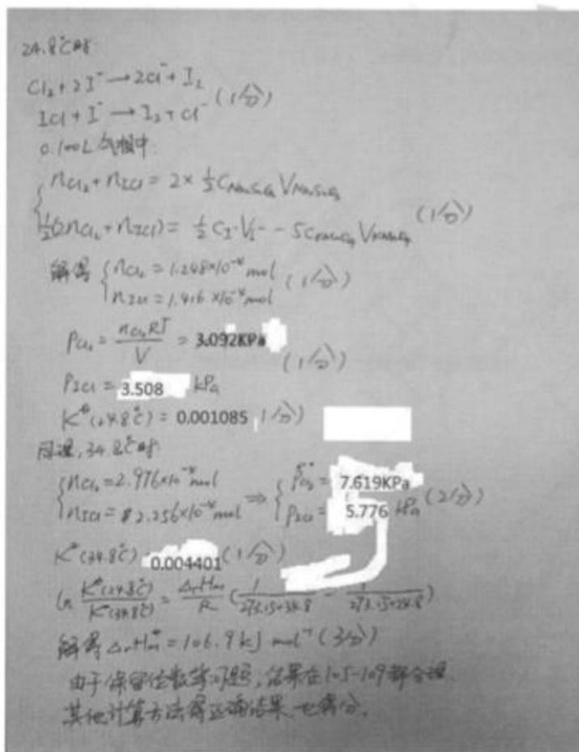

# 题-FY-无机专题二-08-一个容积为2L的烧瓶其中盛有

## 题目

### 第 八 题（12分）

一个容积为 2L 的烧瓶, 其中盛有氯和碘的混合物, 将该瓶在 $24.8^{\circ} \mathrm{C}$ 的恒温槽里保持几天。到达平衡时, 烧瓶里含有 $\mathrm{ICl}_{3}(\mathrm{s})$ 、 $\mathrm{ICl}(1)$ 和一个主要由 $\mathrm{Cl}_{2}$ 和 $\mathrm{ICl}$ 组成的气相 ( $\mathrm{I}_{2}$ 的浓度可以忽略不计)。把 0.100L 的该气相放入另一烧瓶并吸收于 100.0mL 0.01500mol/L 的 KI 溶液里。之后将所得溶液分成相等的两部分 A 和 B, A 用 0.01200mol/L 的硫代硫酸钠溶液滴定, 需要 22.20mL; B 先酸化后, 再用 $4.00 \times 10^{-3}$ mol/L 的高锰酸钾溶液滴定, 使溶液中负一价的碘变成 $I_{2}$ 。后者用四氯化碳萃取出来以便于观察高锰酸钾的颜色, 溶液 B 共耗去高锰酸钾 27.72mL。当在 $34.8^{\circ}C$ 进行同样的实验时, A 共耗去硫代硫酸钠溶液 43.60ml, B 耗去高锰酸钾溶液 16.98mL。求反应 $\mathrm{ICl}_{3}(\mathrm{s}) \rightarrow \mathrm{ICl}(\mathrm{g}) + \mathrm{Cl}_{2}(\mathrm{g})$ 的 $\Delta_{r}H_{m}$ . 要求写出计算过程。

## 参考答案

📎 **答案出处**：源答案卷（`答案--无机专题试卷二.md`）第 8 题**手写解答图**已随卡；含分步计算（n(ICl)/n(ICl3)、p、K° 及 ΔrHm=106.9 kJ/mol）。

## 知识点映射

- （待人工校准）

> ⚠️ **自动拆卡标记**：`subject_module`/`difficulty` 为关键词粗判，答案数值与单位**尚未经人工复核**（OCR 原文逐字转录，可能保留原卷笔误）。