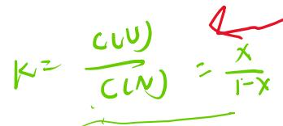

# 题-FY-无机专题二-09-在自然条件下蛋白质会由所含氨

## 题目

### 第 九 题（12分）

在自然条件下，蛋白质会由所含氨基酸残基的亲水性、疏水性及所带电荷性质等通过氨基酸残基之间的相互作用而折叠成立体的三级结构，当蛋白质被加热，或用化学试剂处理时，一些蛋白质便会失去其折叠结构，这一过程可以用平衡来表示：

$$
\mathrm{N} (\text { 折   叠   态 }) \leftrightarrow \mathrm{U} (\text { 非   折   叠   态 })
$$

上述平衡会受到温度影响而发生移动。蛋白质的熔化温度(Tm)定义为上述反应达到平衡时，折叠态和非折叠态各占50%时的温度。

下面的实验，测量了总量为 1.0umol/L 的糜蛋白酶抑制剂 2(CI2)，在温度为 58-66 度时，波长为 356nm 的荧光信号强度随温度的变化关系。

<table><tr><td>温度/°C</td><td>58</td><td>60</td><td>62</td><td>64</td><td>66</td></tr><tr><td>荧光强度</td><td>27</td><td>30</td><td>34</td><td>37</td><td>40</td></tr></table>

已知 1.0umol/L 折叠态的糜蛋白酶抑制剂 2(CI2) 在 356nm 处的荧光强度为 21 单位，1.0umol/L 非折叠态的糜蛋白酶抑制剂 2(CI2) 在 356nm 处的荧光强度为 43 单位.

9-1 假设每个物种产生的荧光强度与该物种的浓度成正比，计算在各个温度下，非折叠态蛋白质的占比 x。

9-2 计算平衡常数 K 与 x 的关系，并由此计算各温度下的平衡常数 K。

9-3 根据上述结果计算 $CI_{2}$ 的熔化温度。

## 参考答案

在自然条件下，蛋白质会由所含氨基酸残基的亲水性、疏水性及所带电荷性质等通过氨基酸残基之间的相互作用而折叠成立体的三级结构，当蛋白质被加热，或用化学试剂处理时，一些蛋白质便会失去其折叠结构，这一过程可以用平衡来表示：

N(折叠态) $\leftrightarrow$ U(非折叠态)

上述平衡会受到温度影响而发生移动。蛋白质的熔化温度(Tm)定义为上述反应达到平衡时，折叠态和非折叠态各占50%时的温度。

下面的实验，测量了总量为 $1.0\mathrm{umol / L}$ 的糜蛋白酶抑制剂2(CI2)，在温度为58-66度时，

<table><tr><td>温度/°C</td><td>58</td><td>60</td><td>62</td><td>64</td><td>66</td></tr><tr><td>荧光强度</td><td>27</td><td>30</td><td>34</td><td>37</td><td>40</td></tr></table>

已知 1.0umol/L 折叠态的糜蛋白酶抑制剂 2(CI2) 在 356nm 处的荧光强度为 21 单位，1.0umol/L 非折叠态的糜蛋白酶抑制剂 2(CI2) 在 356nm 处的荧光强度为 43 单位。9-1 假设每个物种产生的荧光强度与该物种的浓度成正比，计算在各个温度下，非折叠态蛋

9-2 计算平衡常数 $K$ 与 $x$ 的关系，并由此计算各温度下的平衡常数 $K$ 。

9-3 根据上述结果计算 $\mathrm{CI}_{2}$ 的熔化温度。

$$
c (v) = x, c (N) = 1 - x
$$

$21(1-x)+43x=$ 费光强度

$$
\begin{array}{l l l l l} {9 - 1:} & & & {6 4} & {6 6} \\ {T: 5 8} & {6 0} & {6 3} & & \\ {x: 0. 2 7} & {0. 4 1} & {0. 5 9} & {0. 7 3} & {0. 8 6} \end{array}
$$

$$
9 - 2
$$

$$
\ln \frac {k _ {1}}{k _ {2}} = \frac {\Delta H}{R} (\frac {1}{T _ {2}} - \frac {1}{T})
$$

## 知识点映射

- （待人工校准）

> ⚠️ **自动拆卡标记**：`subject_module`/`difficulty` 为关键词粗判，答案数值与单位**尚未经人工复核**（OCR 原文逐字转录，可能保留原卷笔误）。