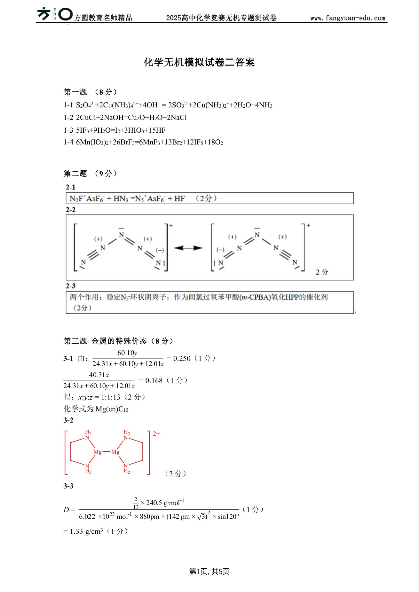

# 题-FY-无机专题一-02-全氮类物质能够分解产生极稳定

## 题目

### 第 二 题（9分）全氮离子的结构和性质

全氮类物质能够分解产生极稳定的 $N_{2}$ ，具有能量密度高、爆轰产物清洁无污染等优点，作为新一代超高含能材料有希望应用于炸药、推进剂等领域。随着研究的不断深入，人们对全氮结构的了解程度不断提高。

2-1 首例全氮阳离子 $N_{5}^{+}$ 的无机盐由 $N_{2}F^{+}AsF_{6}^{-}$ 与 $HN_{3}$ 在 $-78^{\circ}C$ 于液态 HF 中制得，请写出合成过程的化学反应方程式。

2-2 已知 $N_{5}^{+}$ 具有 $C_{2v}$ 对称性，请画出能表达其结构与价键的共振结构式。

2-3 中国科学家首次合成了环状全氮阴离子盐 $(\mathrm{H}_3\mathrm{O})_3(\mathrm{NH}_4)_4(\mathrm{N}_5)_6\mathrm{Cl}$ ，其中分子 HPP（下图）是合成 $(\mathrm{H}_3\mathrm{O})_3(\mathrm{NH}_4)_4(\mathrm{N}_5)_6\mathrm{Cl}$ 的关键中间体。将 1 当量的 HPP 溶于乙氰和甲醇的混合溶剂中，加入 2.5 当量的甘氨酸亚铁 $[\mathrm{Fe}(\mathrm{Gly})_2]$ 时没有化学反应发生，再继续加入 4 当量的间氯过氧苯甲酸 $(m-\mathrm{CPBA})$ ，则能检测到 $\mathrm{N}_5^-$ 阴离子的生成。该反应中甘氨酸亚铁 $[\mathrm{Fe}(\mathrm{Gly})_2]$ 的作用是什么？

HPP

## 参考答案

📎 **答案出处**：源卷**参考答案**页已随卡（见下）；答案含结构式/矢量图，文字层仅含可直接转录的部分。

OCR 原文（仅留痕，非答案）

## 知识点映射

- （待人工校准）

> ⚠️ **自动拆卡标记**：`subject_module`/`difficulty` 为关键词粗判，答案数值与单位**尚未经人工复核**（OCR 原文逐字转录，可能保留原卷笔误）。