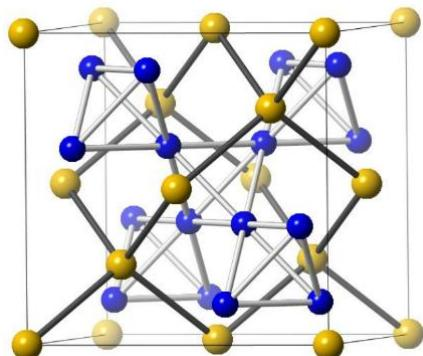
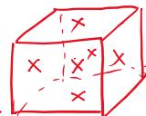
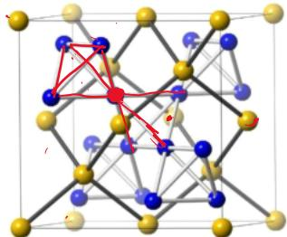
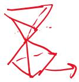
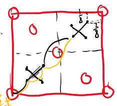

# 题-FY-无机专题一-07-合金为面心立方结构在此结构中

## 题目

### 第 七 题 合金结构（7分）

合金 $MgCu_{2}$ 为面心立方结构，在此结构中，每个铜原子被 12 个原子包围，其中 Cu-Cu 的距离为 247.1 pm。

7-1 计算该晶体的密度

7-2 指出包围铜原子的 12 个原子中，有几个铜原子几个镁原子

7-3 在晶胞中任意圈出一个铜原子，以晶胞左后下角的镁原子为坐标原点，写出其原子坐标

7-4 该晶胞中有几种化学环境的镁原子，几种空间环境的铜原子

## 参考答案

合金 $MgCu_{2}$ 为面心立方结构，在此结构中，每个铜原子被 12 个原子包围，其中 Cu-Cu 的距离为 247.1 pm。

7-1 计算该晶体的密度 $P = 5 \cdot 892 g \cdot cm^{-3}$

7-2 指出包围铜原子的 12 个原子中，有几个铜原子几个镁原子 $6 + 6$

7-3 在晶胞中任意圈出一个铜原子，以晶胞左后下角的镁原子为坐标原点，写出其原子坐标

7-4 该晶胞中有几种化学环境的镁原子，几种空间环境的铜原子 结构基无量有价钢、

就有几种空间环境

$$
\sqrt {2} a = 4 d (c _ {n} - c _ {y})
$$

$$
a = 2 \sqrt {2} \times 2 4 7. 1 p m
$$

同化学环境

## 知识点映射

- （待人工校准）

> ⚠️ **自动拆卡标记**：`subject_module`/`difficulty` 为关键词粗判，答案数值与单位**尚未经人工复核**（OCR 原文逐字转录，可能保留原卷笔误）。