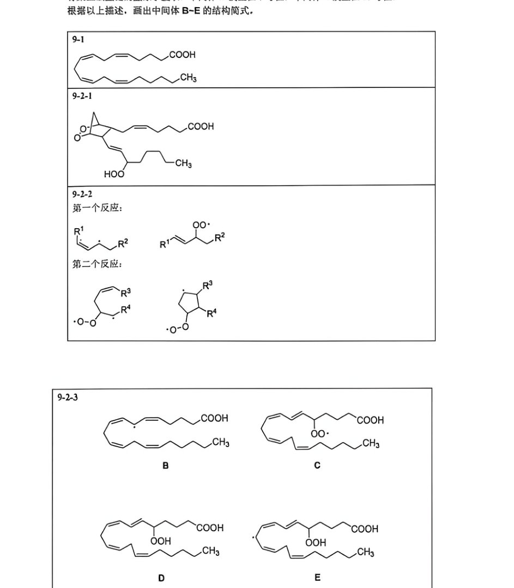

# 题-HZ-02-09-前列腺素prostaglan

## 题目

### 第 9 题（附加题不计分）前列腺素、白三烯与自由基反应

前列腺素(prostaglandin, PG)是一类与二十酸相关的化合物，因此又被成为二十酸类化合物(icosanoicls)。前列腺素类物质合成的前体是花生四烯酸A，其系统命名为(5Z, 8Z, 11Z, 14Z)-二十碳四烯酸，其经过代谢之后会形成一系列前列腺素物种。

9-1 画出花生四烯酸的结构式。

9-2 A 在脂肪酸氧化酶的作用下与氧气反应生成前列腺素 $G_{2}(PGG_{2})(C_{20}H_{32}O_{4})$ ，这一反应可以认为是两分子氧气对 A 进行的自由基取代及加成反应，其中 A 羧酸的 16 号位上氢原子被氢过氧基(-OOH)取代，且双键的构型发生了改变，反应模式如下：

而 A 的 8 号和 11 号位双键则被氧气进行自由基加成而形成[2.2.1]桥环结构，反应模式如下：

9-2-1 据此，画出 $PGG_{2}$ 的结构简式。

9-2-2 画出上面两种反应模式的关键中间体，每个反应画出至少两个。

9-3 白三烯类物质也是由花生四烯酸氧化得到的一类二十碳结构的生物分子，由于最早在白细胞中发现，且分子中存在共轭三烯结构，故而名为白三烯。其中，白三烯 $A_{4}(LTA_{4})$ 的结构如下所示：

研究表明，花生四烯酸氧化得到白三烯 $A_{4}$ 的机理由一种含有三价铁核的酶介导（可以简记为 $Fe^{II}-OH^{-}$ ），酶催化的反应机理大致如下所示：

$$
\mathrm{A} \xrightarrow [ - \mathrm{Fe} ^ {2 +} - \mathrm{OH} _ {2} ]{\mathrm{Fe} ^ {3 +} - \mathrm{OH} ^ {-}} \mathrm{B} \xrightarrow {\mathrm{O} _ {2}} \mathrm{C} \xrightarrow [ - \mathrm{Fe} ^ {3 +} - \mathrm{OH} ^ {-} ]{\mathrm{Fe} ^ {2 +} - \mathrm{OH} _ {2}} \mathrm{D} \xrightarrow [ - \mathrm{Fe} ^ {2 +} - \mathrm{OH} _ {2} ]{\mathrm{Fe} ^ {3 +} - \mathrm{OH} ^ {-}} \mathrm{E}
$$

$$
\xrightarrow [ - \mathrm{Fe} ^ {3 +} - \mathrm{OH} ^ {-} , - \mathrm{H} _ {2} \mathrm{O} ]{\mathrm{Fe} ^ {2 +} - \mathrm{OH} _ {2}} \quad \mathrm{LTA} _ {4}
$$

对于此机理而言，中间体 B、C、E 为自由基中间体，其中中间体 B 具有五中心五电子共轭 $\pi$ 键，中间体 E 具有七中心七电子共轭 $\pi$ 键，这两个中间体的生成方式均是铁核催化剂对碳骨架上碳氢键的氢原子攫取，中间体 B 发生在 7 号位，中间体 E 发生在 10 号位。

根据以上描述，画出中间体 B\~E 的结构简式。

汇智起航 2026 年（五一期间）有机化学初赛模拟卷 2 答案

## 参考答案

📎 **答案出处**：源卷**参考答案**页（**印刷体**）已随卡；第 9 题各小问的结构式答案见下。

OCR 原文（仅留痕，非答案）

前列腺素(prostaglandin, PG)是一类与二十酸相关的化合物，因此又被成为二十酸类化合物(icosanoicls)。前列腺素类物质合成的前体是花生四烯酸A，其系统命名为(5Z, 8Z, 11Z, 14Z)-二十碳四烯酸，其经过代谢之后会形成一系列前列腺素物种。

9-1 画出花生四烯酸的结构式。

9-2 A 在脂肪酸氧化酶的作用下与氧气反应生成前列腺素 $G_{2}(PGG_{2})(C_{20}H_{32}O_{4})$ ，这一反应可以认为是两分子氧气对 A 进行的自由基取代及加成反应，其中 A 羧酸的 16 号位上氢原子被氢过氧基 (-OOH) 取代，且双键的构型发生了改变，反应模式如下：

而 A 的 8 号和 11 号位双键则被氧气进行自由基加成而形成[2.2.1]桥环结构，反应模式如下：

9-2-1 据此，画出 $PGG_{2}$ 的结构简式。

9-2-2 画出上面两种反应模式的关键中间体，每个反应画出至少两个。

9-3 白三烯类物质也是由花生四烯酸氧化得到的一类二十碳结构的生物分子，由于最早在白细胞中发现，且分子中存在共轭三烯结构，故而名为白三烯。其中，白三烯 $A_{4}(LTA_{4})$ 的结构如下所示：

研究表明，花生四烯酸氧化得到白三烯 $A_{4}$ 的机理由一种含有三价铁核的酶介导（可以简记为 $Fe^{3+}-OH^{-}$ ），酶催化的反应机理大致如下所示：

$$
\mathrm{A} \xrightarrow [ - \mathrm{Fe} ^ {2 +} - \mathrm{OH} _ {2} ]{\mathrm{Fe} ^ {3 +} - \mathrm{OH} ^ {-}} \mathrm{B} \xrightarrow {\mathrm{O} _ {2}} \mathrm{C} \xrightarrow [ - \mathrm{Fe} ^ {3 +} - \mathrm{OH} ^ {-} ]{\mathrm{Fe} ^ {2 +} - \mathrm{OH} _ {2}} \mathrm{D} \xrightarrow [ - \mathrm{Fe} ^ {2 +} - \mathrm{OH} _ {2} ]{\mathrm{Fe} ^ {3 +} - \mathrm{OH} ^ {-}} \mathrm{E}
$$

$$
\xrightarrow [ - \mathrm{Fe} ^ {3 +} - \mathrm{OH} ^ {-} , - \mathrm{H} _ {2} \mathrm{O} ]{\mathrm{Fe} ^ {2 +} - \mathrm{OH} _ {2}} \quad \mathrm{LTA} _ {4}
$$

对于此机理而言，中间体 B、C、E 为自由基中间体，其中中间体 B 具有五中心五电子共轭 $\pi$ 键，中间体 E 具有七中心七电子共轭 $\pi$ 键，这两个中间体的生成方式均是铁核催化剂对碳骨架上碳氢键的氢原子攫取，中间体 B 发生在 7 号位，中间体 E 发生在 10 号位。

根据以上描述，画出中间体 B\~E 的结构简式。

9-2-2

第一个反应：

第二个反应：

## 知识点映射

- （待人工校准）

> ⚠️ **自动拆卡标记**：`subject_module`/`difficulty` 为关键词粗判，答案数值与单位**尚未经人工复核**（OCR 原文逐字转录，可能保留原卷笔误）。