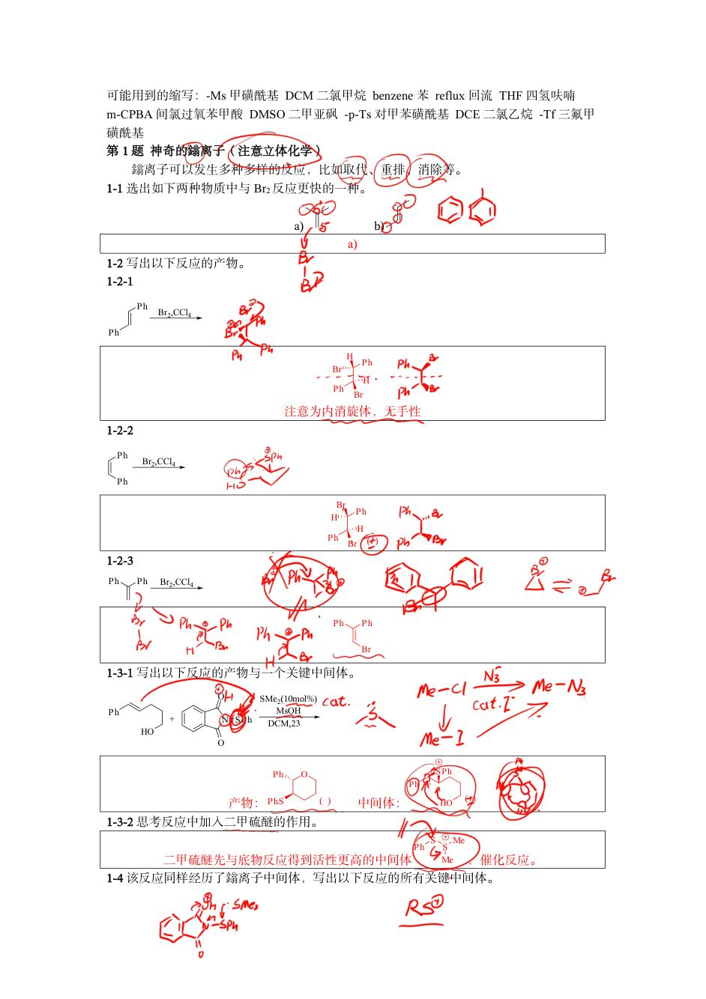
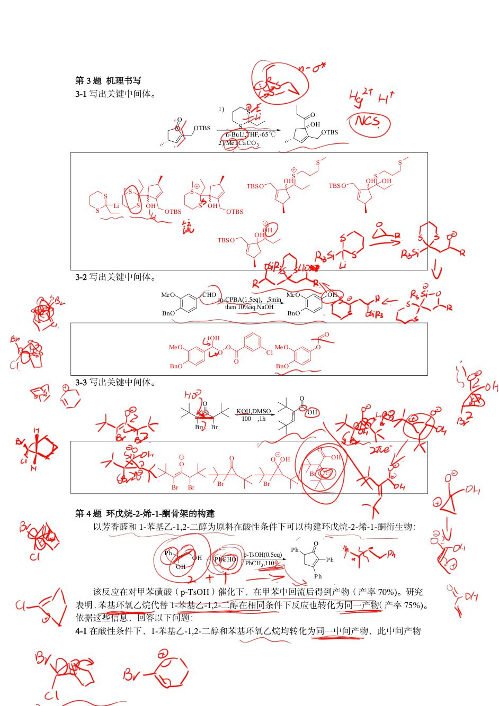

# 题-HZ-07-03-31写出关键中间体32写出关

## 题目

### 第 3 题 机理书写

3-1 写出关键中间体。

3-2 写出关键中间体。

3-3 写出关键中间体。

## 参考答案

📎 **答案出处**：源答案册第 3 题所在页（已定位，见下）；

## 知识点映射

- （待人工校准）

> ⚠️ **自动拆卡标记**：`subject_module`/`difficulty` 为关键词粗判，答案数值与单位**尚未经人工复核**（OCR 原文逐字转录，可能保留原卷笔误）。