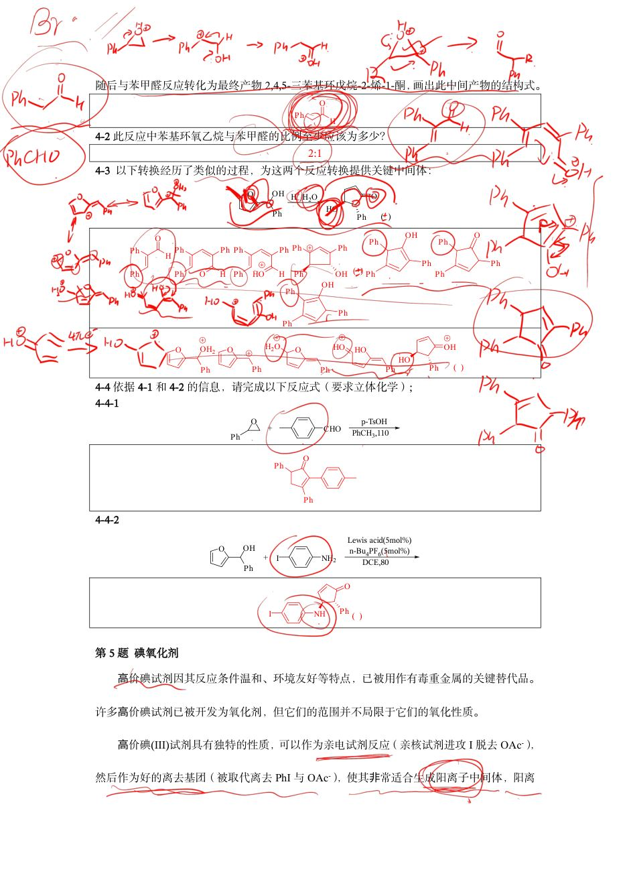
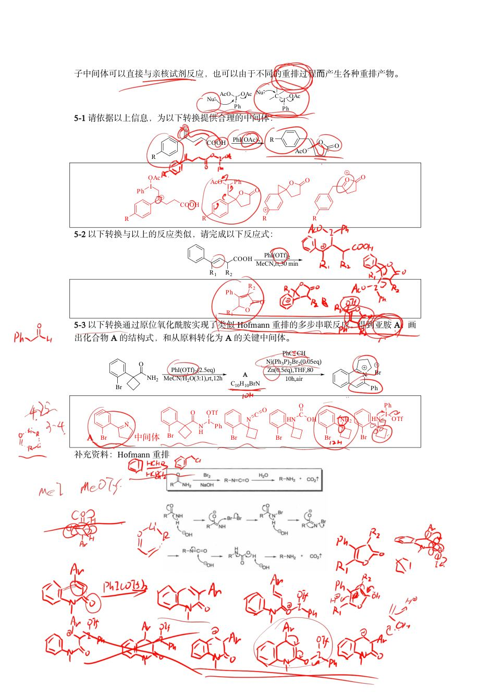

# 题-HZ-07-05-高价碘试剂因其反应条件温和环

## 题目

### 第 5 题 碘氧化剂

高价碘试剂因其反应条件温和、环境友好等特点，已被用作有毒重金属的关键替代品。许多高价碘试剂已被开发为氧化剂，但它们的范围并不局限于它们的氧化性质。

高价碘(III)试剂具有独特的性质，可以作为亲电试剂反应（亲核试剂进攻 I 脱去 OAc⁻），然后作为好的离去基团（被取代离去 PhI 与 OAc⁻），使其非常适合生成阳离子中间体，阳离子中间体可以直接与亲核试剂反应，也可以由于不同的重排过程而产生各种重排产物。

5-1 请依据以上信息，为以下转换提供合理的中间体：

5-2 以下转换与以上的反应类似，请完成以下反应式：

5-3 以下转换通过原位氧化酰胺实现了类似 Hofmann 重排的多步串联反应，得到亚胺 A，画出化合物 A 的结构式，和从原料转化为 A 的关键中间体。

补充资料：Hofmann 重排

# 2026年寒假杭州有机化学班第三天练习题答案（2月7日晚自习）

测试时间：90 分钟

可能用到的缩写：-Ms 甲磺酰基 DCM 二氯甲烷 benzene 苯 reflux 回流 THF 四氢呋喃 m-CPBA 间氯过氧苯甲酸 DMSO 二甲亚砜 -p-Ts 对甲苯磺酰基 DCE 二氯乙烷 -Tf 三氟甲磺酰基

## 参考答案

📎 **答案出处**：源答案册第 5 题所在页（已定位，见下）；

## 知识点映射

- （待人工校准）

> ⚠️ **自动拆卡标记**：`subject_module`/`difficulty` 为关键词粗判，答案数值与单位**尚未经人工复核**（OCR 原文逐字转录，可能保留原卷笔误）。