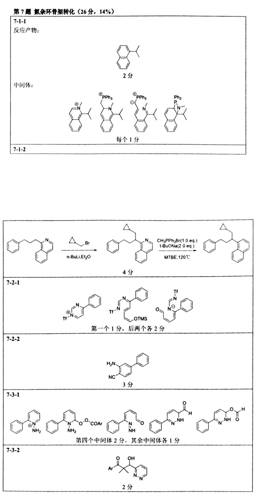

# 题-HZ-2026-07-生物活性分子中常含氮杂环结构

## 题目

### 第 7 题 氮杂环骨架转化 (26分， 14%)

生物活性分子中常含氮杂环结构，对氮杂环骨架进行编辑转化的方法则能有效促进药物分子修饰改性，加速药物研发，因此其受学界关注。

7-1 下面的工作通过 Wittig 反应实现了喹啉环向萘环的转化。

7-1-1 写出反应产物， 给出关键反应中间体。

7-1-2 根据上反应， 使用不超过18个C原子的分子作为原料， 设计合成下分子。

7-2而另一项工作则完成了嘧啶向吡啶的转化。

7-2-1写出反应的关键中间体。 （发生了一步电开环反应）  
7-2-2如下反应， 适当更换反应条件则得到分子式为C₁2HoN₃的产物， 根据7-2的反应结果，画出其结构。

7-3吡啶还可通过一系列反应转化为吡嗪.

# 7-3-17-3-2

上反应除获得右侧正常产物外，还得到一种分子式为 CgH₁ArN₂O2的产物，给出该产物结构。

## 参考答案

> 第 7 题完整解答（自源卷答案 PDF 高清渲染）

## 知识点映射

- （待人工校准）

> ⚠️ **自动拆卡标记**：`subject_module`/`difficulty` 为关键词粗判，答案数值与单位**尚未经人工复核**（OCR 原文逐字转录，可能保留原卷笔误）。