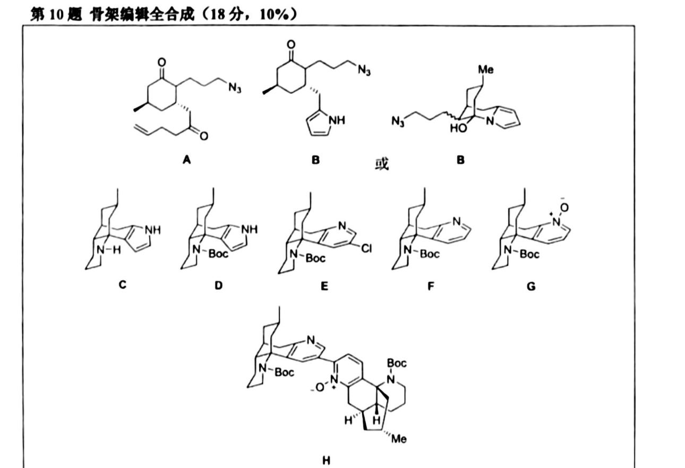

# 题-HZ-2026-10-ComplanadineA的

## 题目

### 第 10 题 骨架编辑全合成 （18分， 10%)

Complanadine A 的显著特征是含吡啶环的多环结构与异源二聚体骨架，根据所学有机知识和提示， 给出A-H的结构式，并给出D→E的关键中间体。  
已知： 底物→A发生步Michael加成反应，B中含有个芳环，B→C成了桥环结构，D→E发生了扩环。

## 参考答案

F

每个结构式2分， 中间体2分

📎 **答案出处**：源卷**参考答案**页（**印刷体**）已随卡；A–H 结构式见图。

## 知识点映射

- （待人工校准）

> ⚠️ **自动拆卡标记**：`subject_module`/`difficulty` 为关键词粗判，答案数值与单位**尚未经人工复核**（OCR 原文逐字转录，可能保留原卷笔误）。