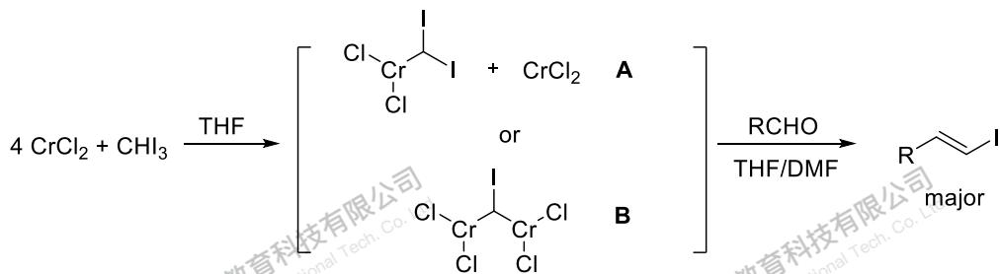
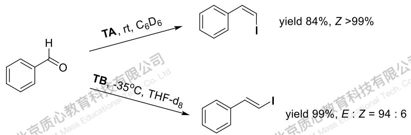

# 题-GChO-09-04-Takai反应是约30年前T

## 题目

### 第 4 题（9分）

Takai 反应是约 30 年前 Takai 与其合作者发展的一种醛基的（卤）烯化反应，其烯化产物以 E 型为主。其中一种利用 $CrCl_{3}$ 被 $LiAlH_{4}$ 还原产生的 $CrCl_{2}$ 和碘仿的混合物来对醛进行的碘烯化反应可以如下示意：

Takai 反应的活性中间体已经被研究了多年，目前普遍的认知是要么是 Cr 处于混合价态的 A，要么是亚甲基碘桥连的 B。然而之前还没人能够将 A 和 B 进行分离，导致无法对 Takai 反应进行更加细致的研究，且 Takai 反应整体上来说产率较低。

近日，有化学家通过改进原位反应的条件，成功合成并分离出了 type A 型和 type B 型的两种能够用于 Takai 反应的活性配合物（分别以 TA 和 TB 表示），并将它们应用于了苯甲醛的碘烯化反应，反应很迅速，并获得了较高的产率和立体选择性：

yield 99%, E : Z = 94 : 6

其中 TA 和 TB 分别在如下的条件下合成:

$$
\begin{array}{r l} \mathrm {Cr[OSi(O^tBu) _ {3} ]_ {2}} + \mathrm {CHI_ {3}} & \xrightarrow {\mathrm {C_ {6} D_ {6} , rt}} \mathrm{TA} \\ \mathrm {CrCl_ {2}} + \mathrm {CHI_ {3}} & \xrightarrow {\mathrm {THF, - 35 ^ {\circ} C}} \mathrm{TB} \end{array}
$$

已知：TA 和 TB 中 Cr 的氧化态分别与 A、B 相同，均含有两个 Cr 原子，且均只有一个 Takai 反应的活性部位。TA 中有三个四元环，Cr 与 Si 的比例是 1:1，含硅配体在配体命名中既是 $\mu_{2}$ 又是 $\eta^{2}$ 。TB 中有两种不同的 Cl 原子，其中 O 元素的质量是 Cr 元素质量的 8/13。

## 第2页/共6页

4-1 写出 A 和 B 中所有 Cr 原子的氧化态。

4-2 清楚的画出配合物 TA 和 TB（均不是离子化合物）的立体结构。

## 参考答案

📎 **答案出处**：源卷**手写解析手稿**第 4 题（p2）已随卡；手写笔迹，含结构式/图，**文字化需人工转录**。组卷命中本卡时请以图为准。

## 知识点映射

- （待人工校准）

> ⚠️ **自动拆卡标记**：`subject_module`/`difficulty` 为关键词粗判，答案数值与单位**尚未经人工复核**（OCR 原文逐字转录，可能保留原卷笔误）。