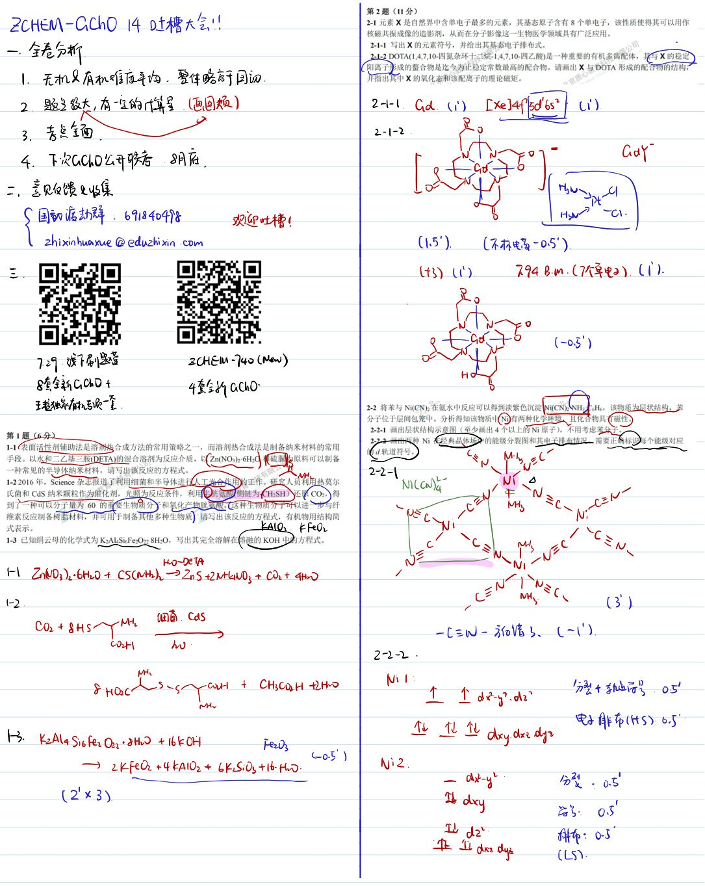
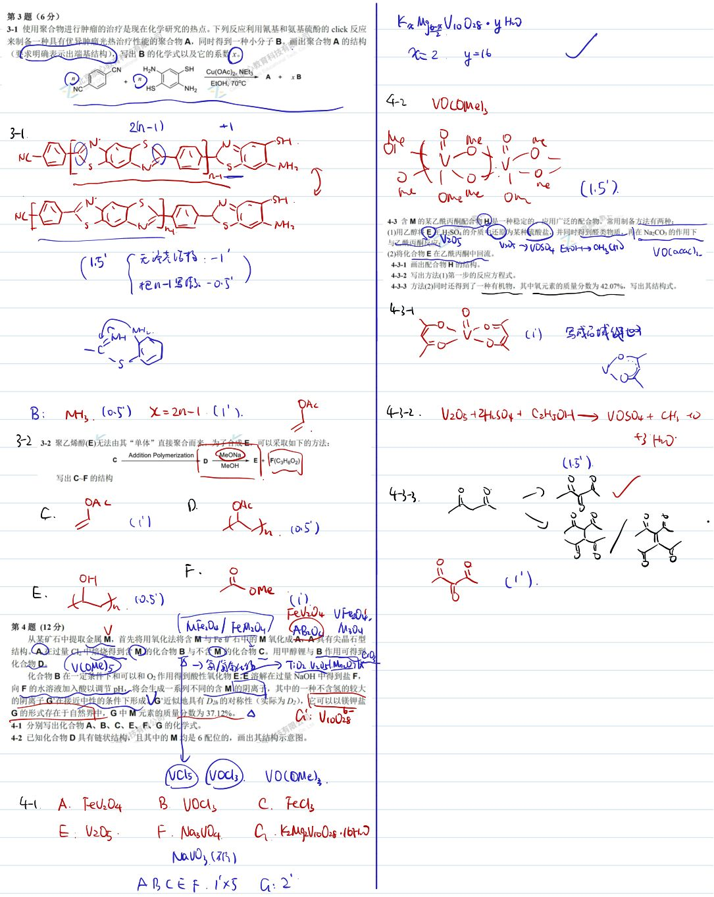
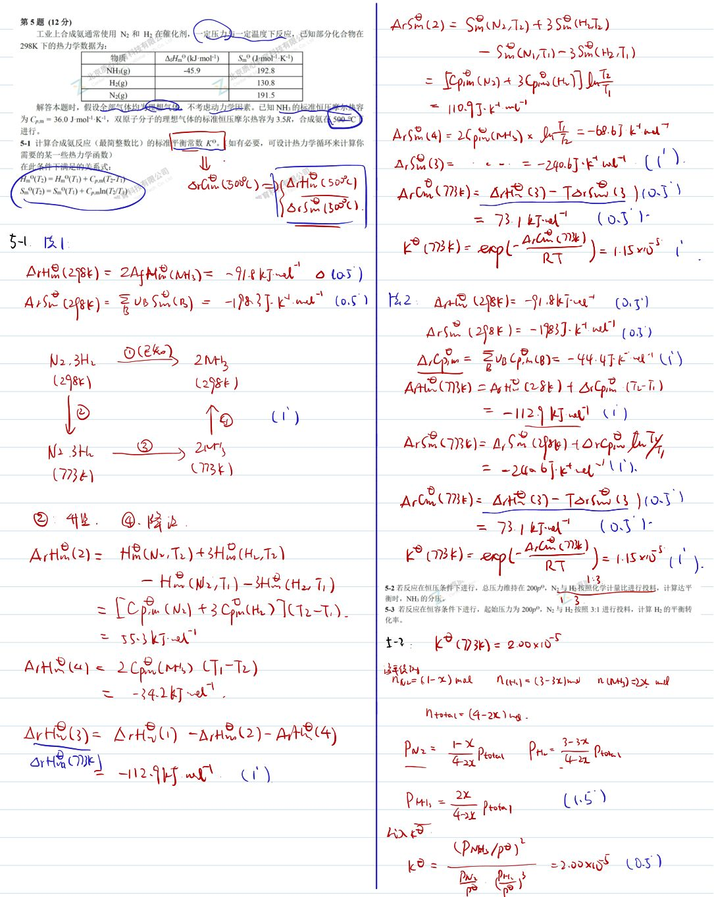
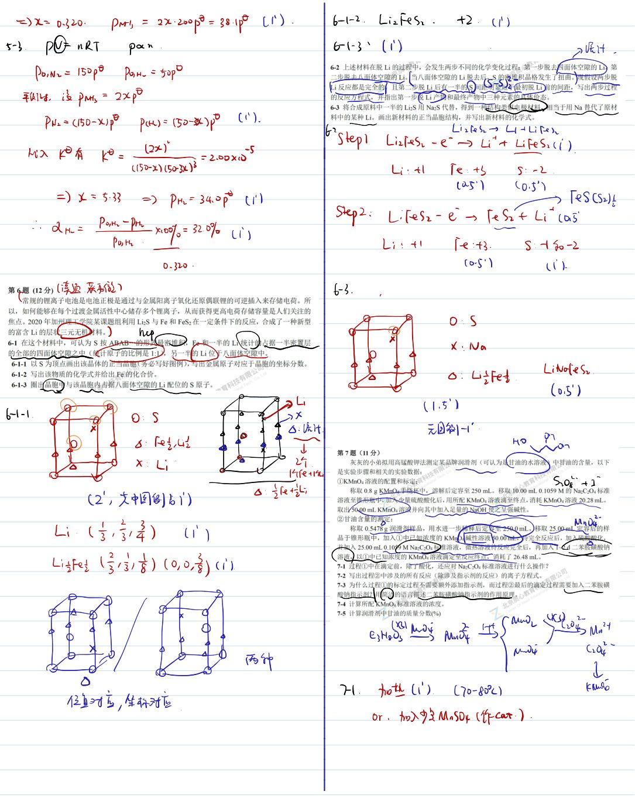
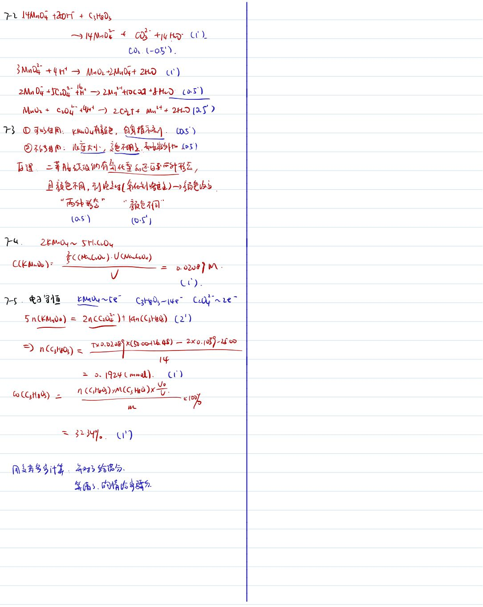
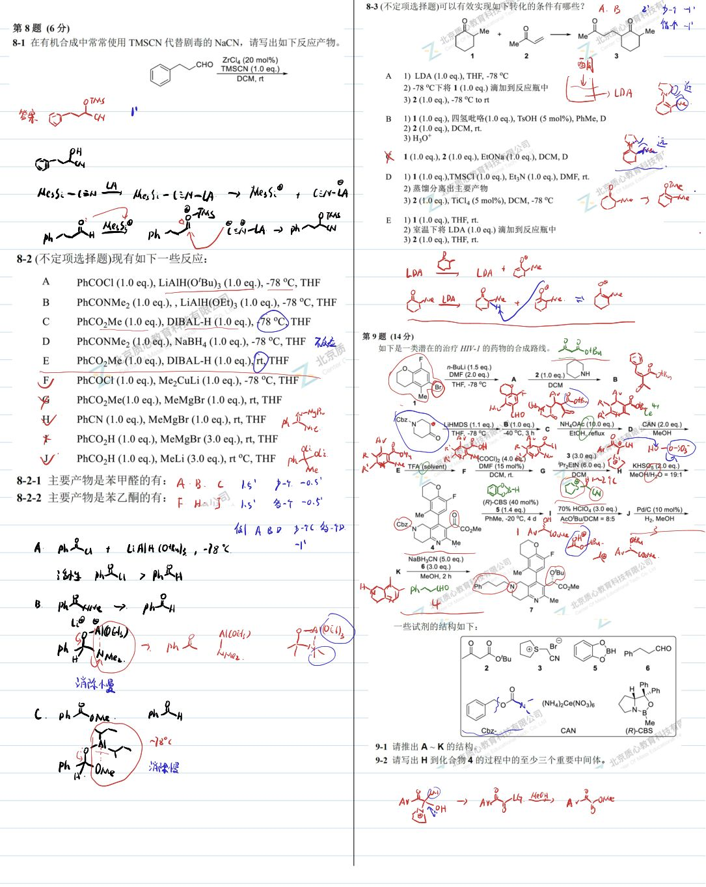
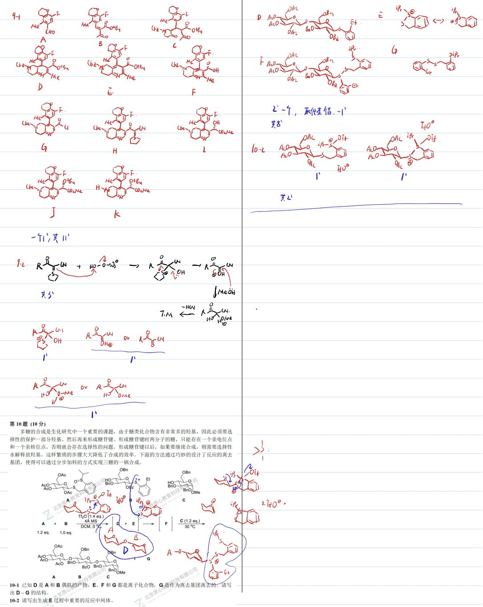

# 题-GChO-14-01-11表面活性剂辅助法是溶剂热

## 题目

### 第 1 题（6分）

1-1 表面活性剂辅助法是溶剂热合成方法的常用策略之一，而溶剂热合成法是制备纳米材料的常用手段。以水和二乙基三胺(DETA)的混合溶剂为反应介质，以 $\mathrm{Zn(NO_{3})_{2}\cdot6H_{2}O}$ 和硫脲为原料可以制备一种常见的半导体纳米材料，请写出该反应的方程式。

1-22016 年，Science 杂志报道了利用细菌和半导体进行人工光合作用的工作。研究人员利用热莫尔氏菌和 CdS 纳米颗粒作为催化剂，光照为反应条件，利用半胱氨酸(侧链为- $CH_{2}SH$ ) 还原 $CO_{2}$ ，得到了一种可以分子量为 60 的重要生物质分子和氧化产物胱氨酸。这种生物质分子可以进一步与纤维素反应制备树脂材料，并可用于制备其他多种生物质。请写出该反应的方程式，有机物用结构简式表示。

1-3 已知绢云母的化学式为 $K_{2}Al_{4}Si_{6}Fe_{2}O_{22}\cdot8H_{2}O$ ，写出其完全溶解在熔融的 KOH 中的方程式。

## 参考答案

1-1表面活性剂辅助法是溶剂热合成方法的常用策略之一 而溶剂热合成法是制备纳米材料的常用手段。以水和二乙基三胺(DETA)的混合溶剂为反应介质， 以Zn(NO3)2·6H2O 硫脲原料可以制备一种常见的半导体纳米材料，请写出该反应的方程式。 √1-22016年，Science杂志报道子利用细菌和半导体进行人工光合作用的重作。研究人员利用热莫尔氏菌和CdS 纳米颗粒作为催化剂，光照为反应条件，利用半胱氨侧链为CH₂SH)还原CO₂，得到了一种可以分子量为60的重要生物质分子和氧化产物胱氨酸。C这种生物质分子可以进一步与纤维素反应制备树脂材料，并可用于制备其他多种生物质） 请写出该反应的方程式， 有机物用结构简式表示。 YA1O2. kFeOr1-3 已知绢云母的化学式为K₂Al4SicFe2O22.8H₂O， 写出其完全溶解在溶融的KOH中的方程式。

HO-DETA  
H ZnN0₃)₂-6H₂O+ CS(NHh)→ZnS+2xH|NO3 + CO2+ 41-2CO2 + 8HSYMr 個菌 CdsC2H Wtoc + CH3C02H +2Hmと

13. K2Al4Si6Fe2O22 ·Hh +16K0r1 Fe20{3(-0.5°→ 2KFeO2 + 4 KA1O2 + 6KLSi03+16-HD.(2'×3)

📎 **答案出处**：源卷**手写解析手稿**全部 7 页已随卡（见下），第 01 题解答在其内；手写笔迹，**文字化需人工转录**。

## 知识点映射

- （待人工校准）

> ⚠️ **自动拆卡标记**：`subject_module`/`difficulty` 为关键词粗判，答案数值与单位**尚未经人工复核**（OCR 原文逐字转录，可能保留原卷笔误）。