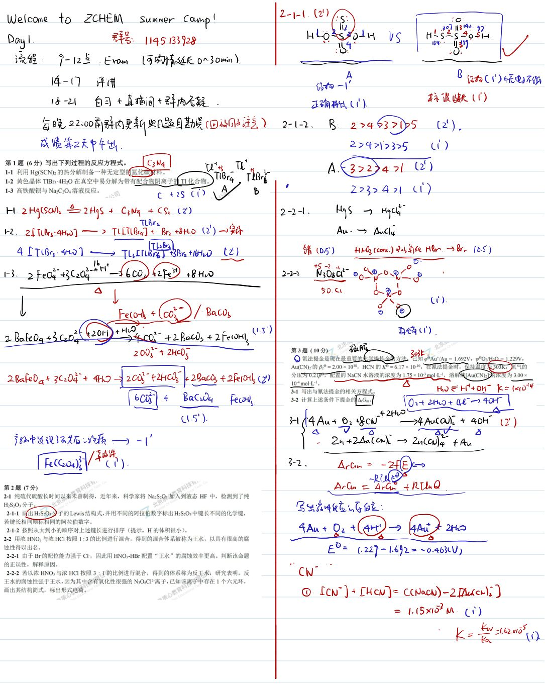
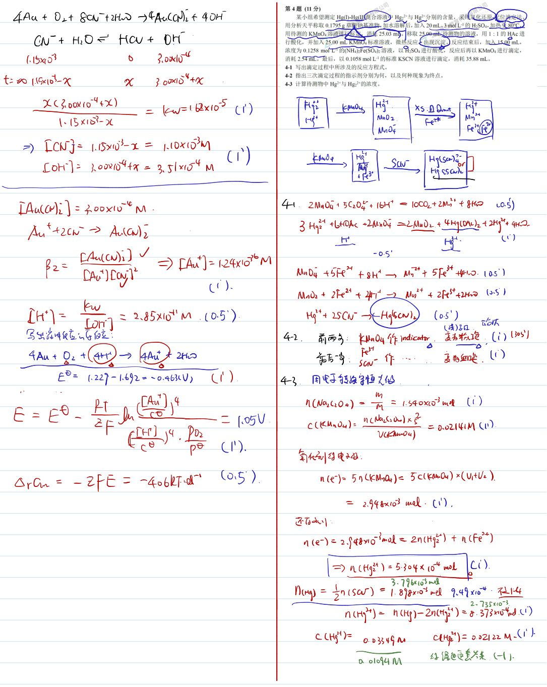
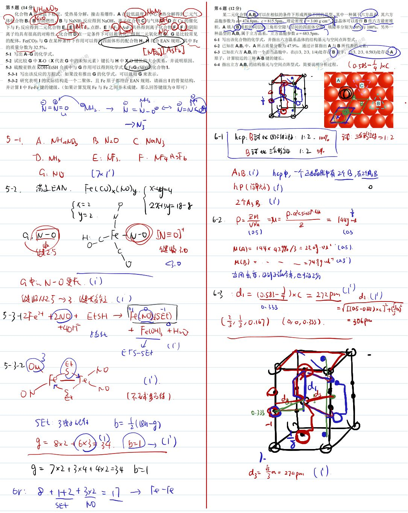
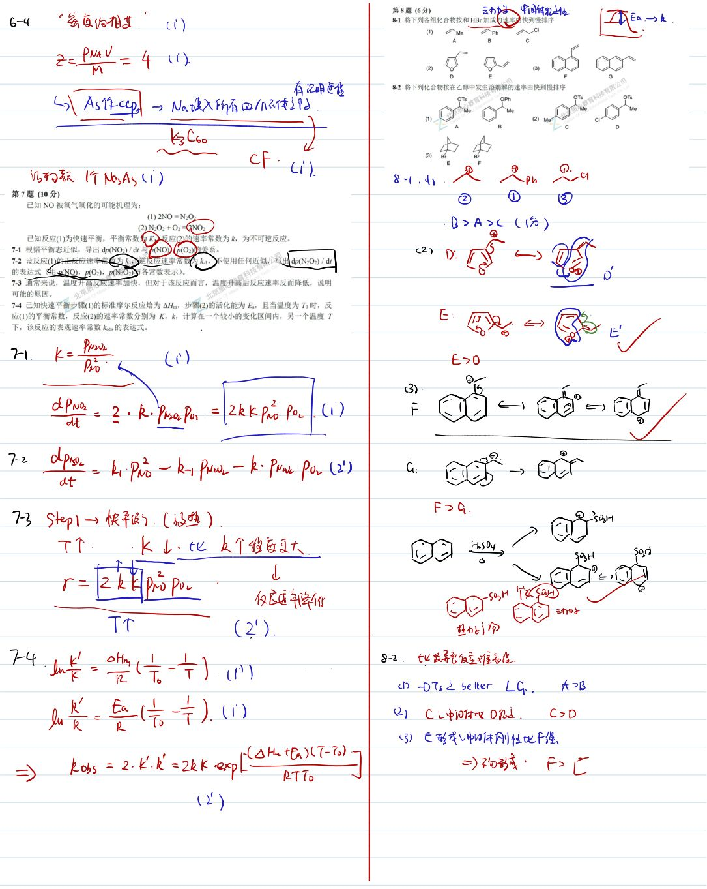
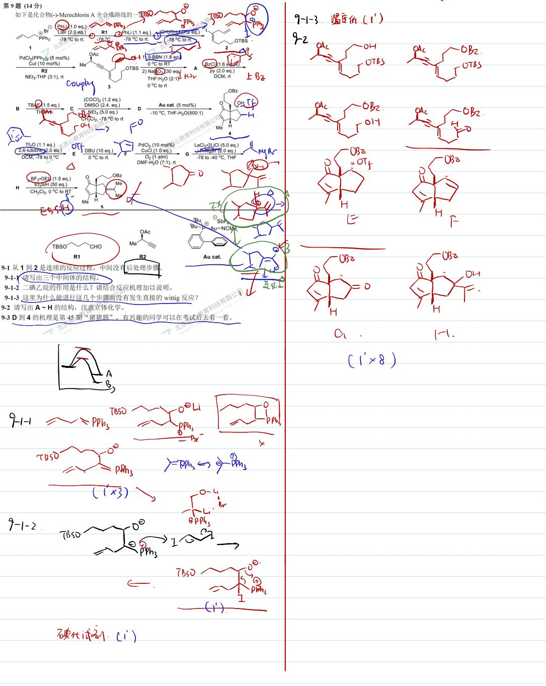
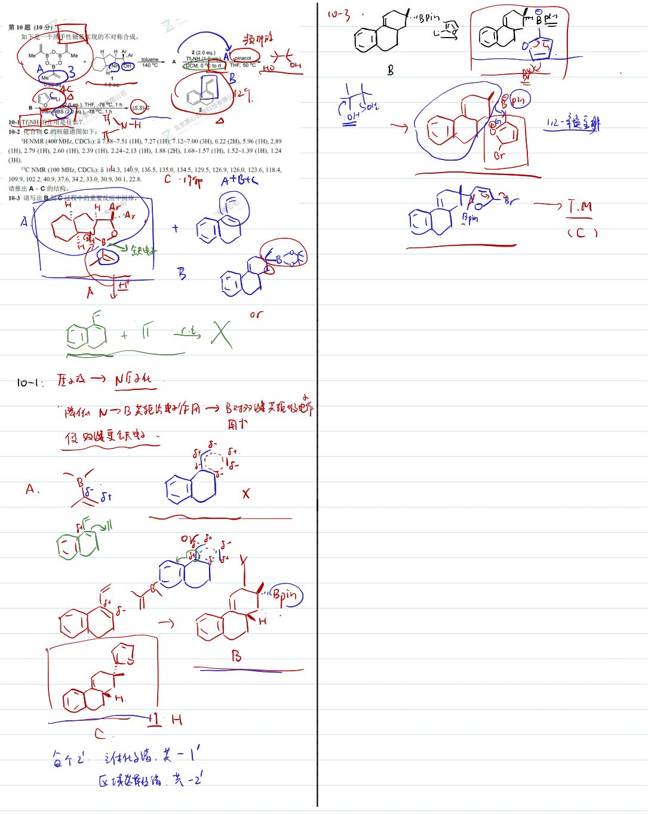

# 题-GChO-15-09-如下是化合物Merochlo

## 题目

### 第 9 题 (14分)

如下是化合物(-)-Merochlorin A 全合成路线的一部分。

其中用到的一些试剂结构如下：

R1

R2

Au cat.

9-1 从 1 到 2 是连续的反应过程，中间没有后处理步骤。

9-1-1 请写出三个中间体的结构。

9-1-2 二碘乙烷的作用是什么？请结合反应机理加以说明。

9-1-3 这里为什么能进行这几个步骤而没有发生直接的wittig反应？

9-2 请写出 A\~H 的结构，注意立体化学。

9-3 D 到 4 的机理是第 45 期 “猪猪题”，有兴趣的同学可以在考试后去看一看。

## 参考答案

📎 **答案出处**：源卷**手写解析手稿**全部 6 页已随卡（见下），第 09 题解答在其内；手写笔迹，**文字化需人工转录**。

## 知识点映射

- （待人工校准）

> ⚠️ **自动拆卡标记**：`subject_module`/`difficulty` 为关键词粗判，答案数值与单位**尚未经人工复核**（OCR 原文逐字转录，可能保留原卷笔误）。