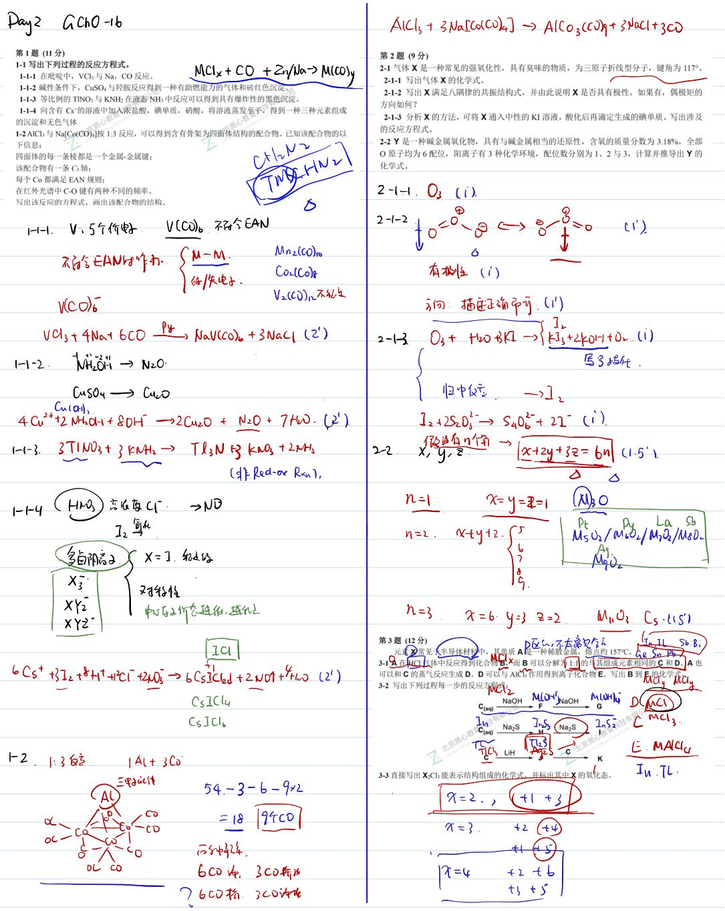
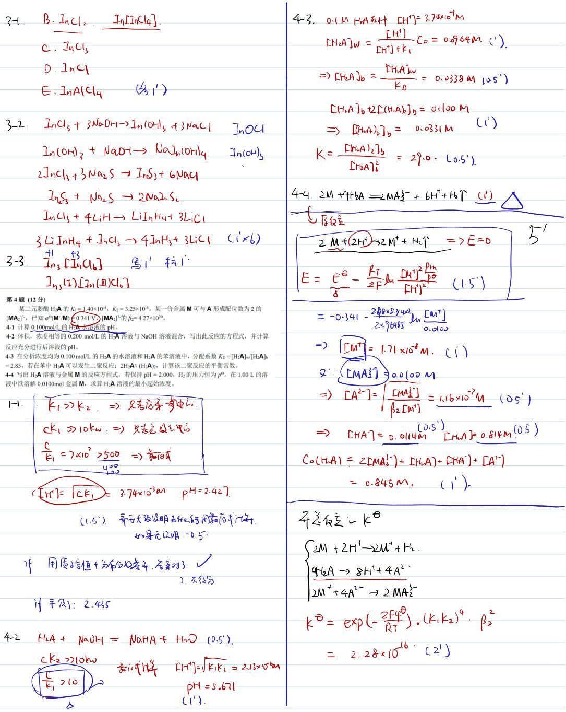
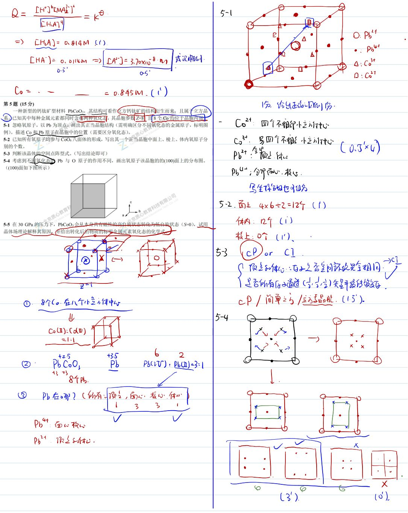
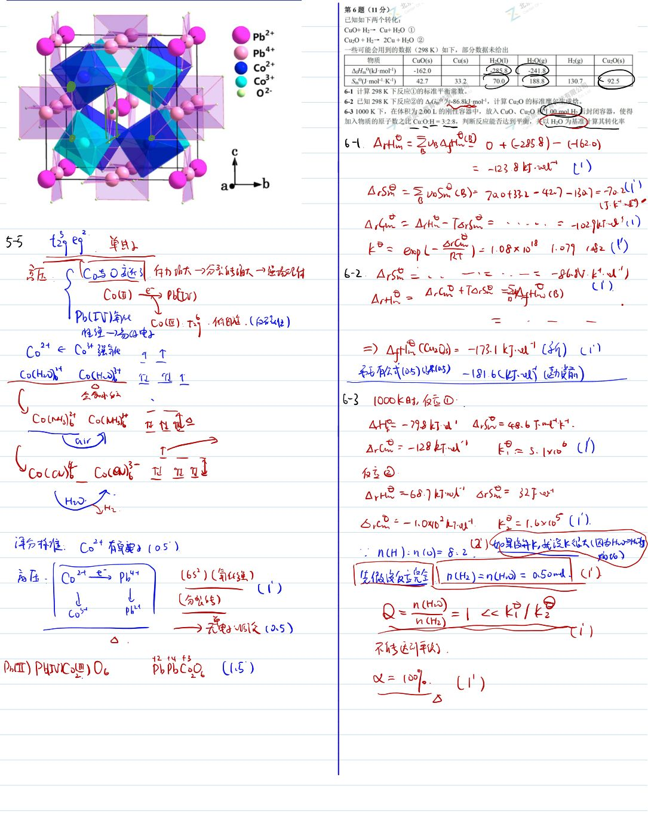
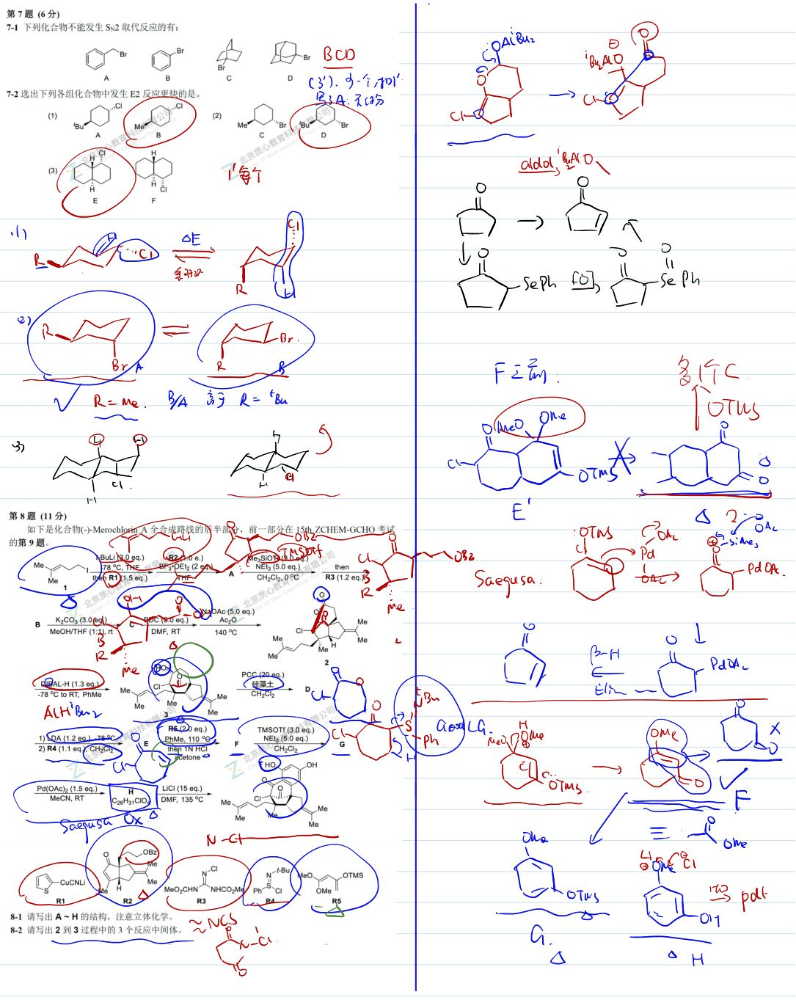
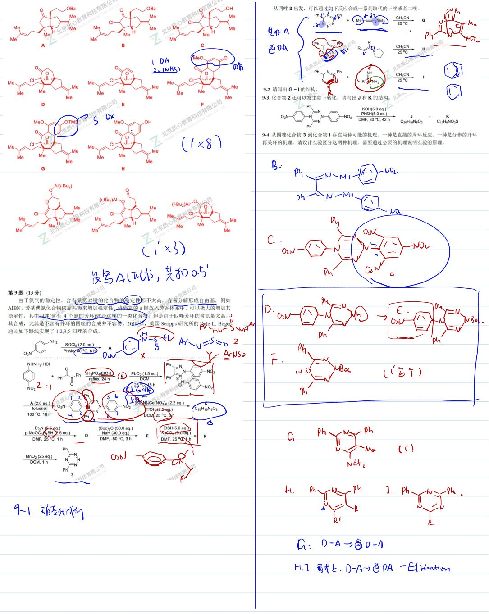
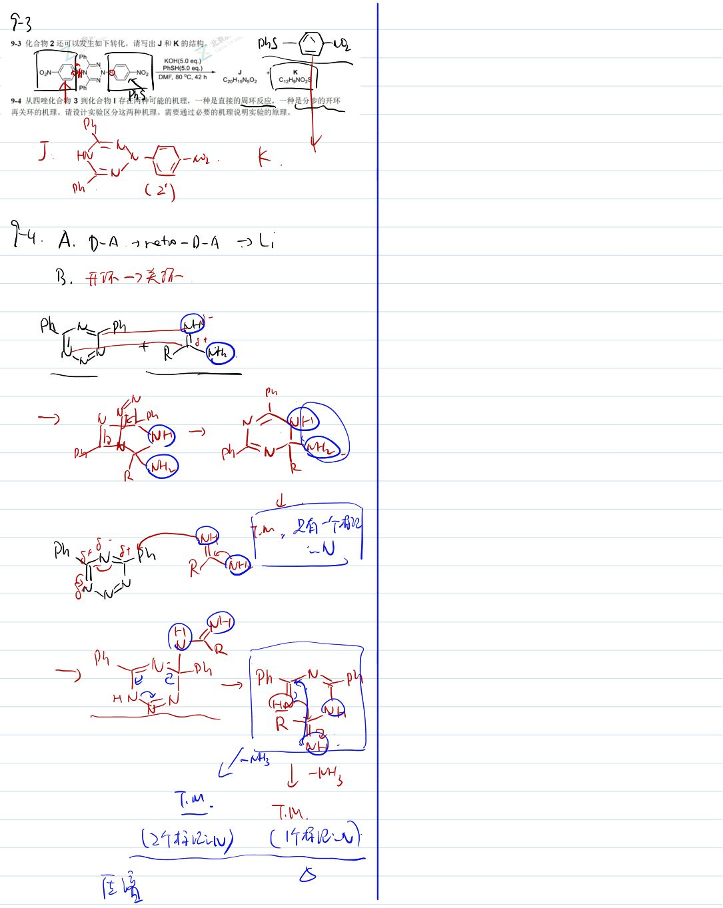

# 题-GChO-16-08-如下是化合物Merochlo

## 题目

### 第 8 题 (11分)

如下是化合物(-)-Merochlorin A 全合成路线的后半部分，前一部分在 15th ZCHEM-GCHO 考试的第 9 题。

其中用到的试剂结构如下：

8-1 请写出 A\~H 的结构，注意立体化学。

8-2 请写出 2 到 3 过程中的 3 个反应中间体。

## 参考答案

📎 **答案出处**：源卷**手写解析手稿**全部 7 页已随卡（见下），第 08 题解答在其内；手写笔迹，**文字化需人工转录**。

## 知识点映射

- （待人工校准）

> ⚠️ **自动拆卡标记**：`subject_module`/`difficulty` 为关键词粗判，答案数值与单位**尚未经人工复核**（OCR 原文逐字转录，可能保留原卷笔误）。