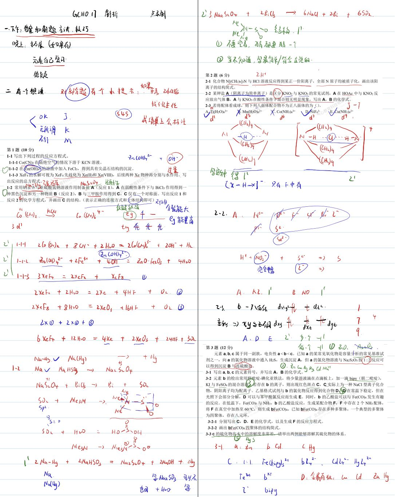
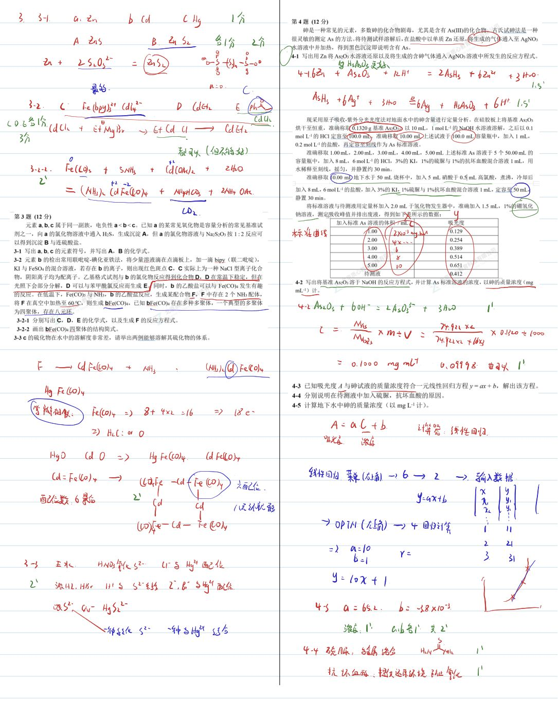
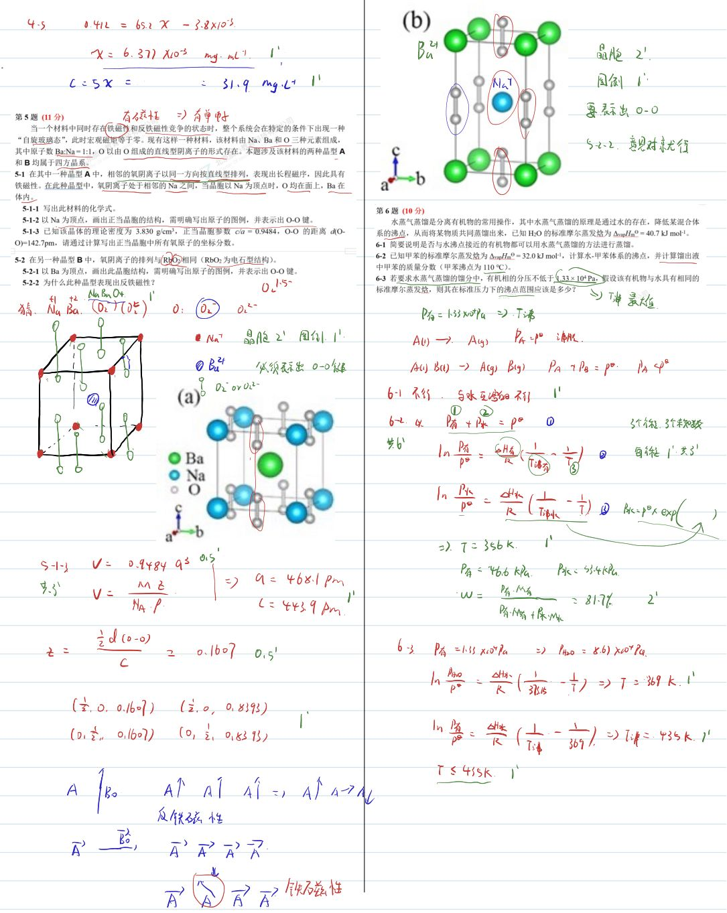
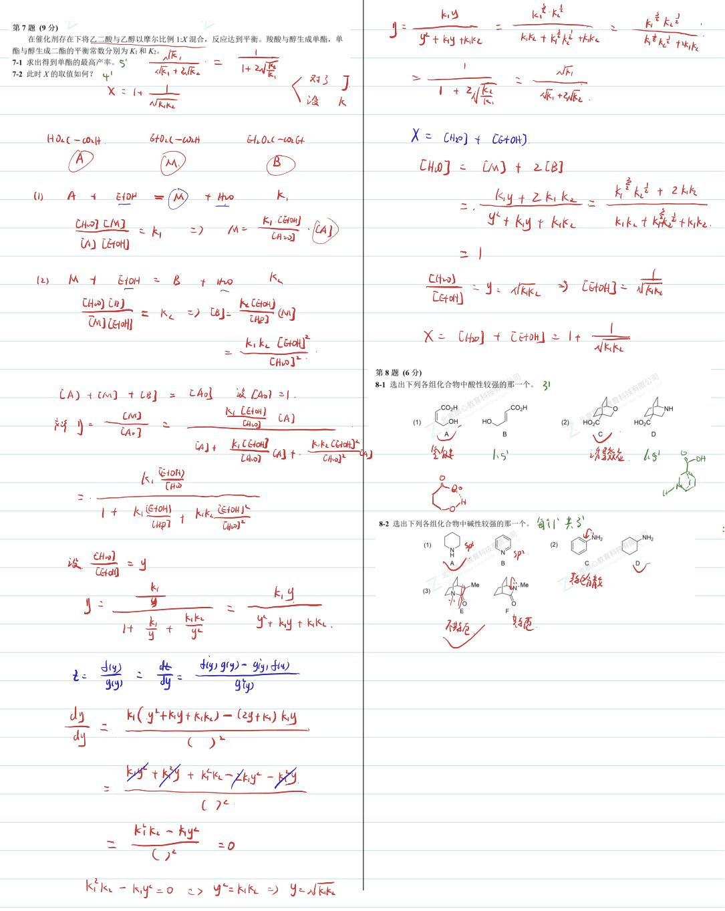
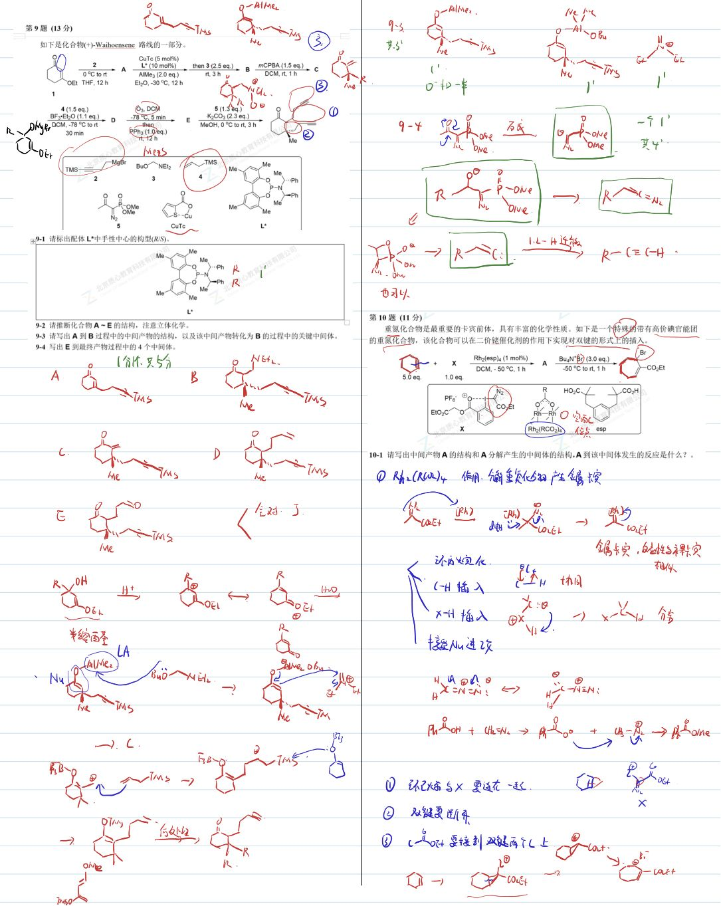
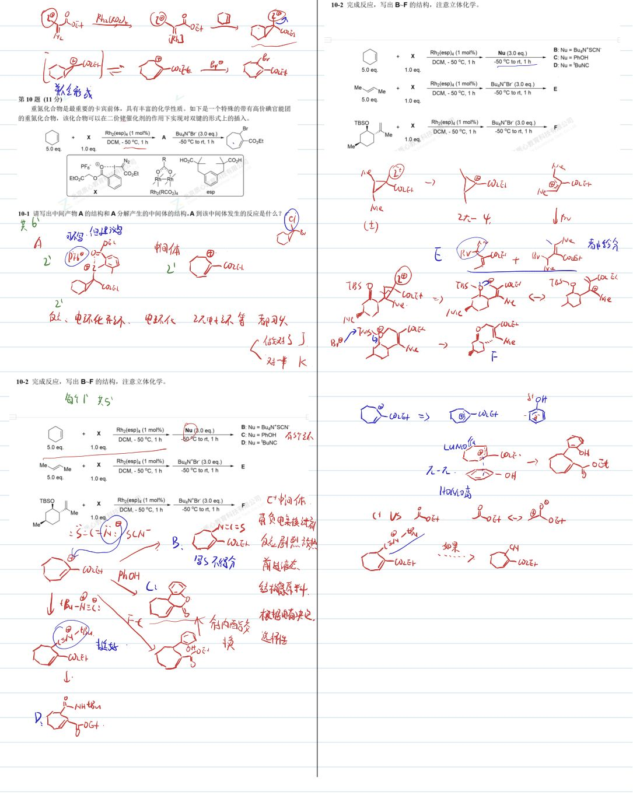
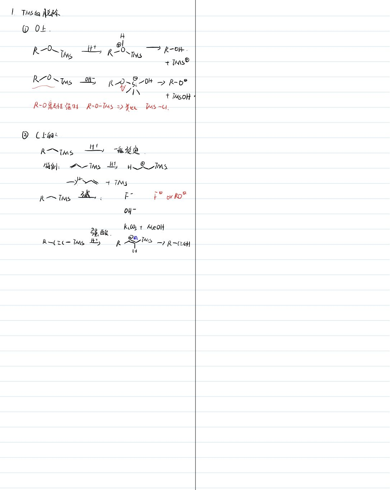

# 题-GChO-17-09-如下是化合物Waihoens

## 题目

### 第 9 题 (13分)

如下是化合物(+)-Waihoensene 路线的一部分。

## 9-1 请标出配体 L\*中手性中心的构型(R/S)。

9-2 请推断化合物 A\~E 的结构，注意立体化学。

9-3 请写出 A 到 B 过程中的中间产物的结构，以及该中间产物转化为 B 的过程中的关键中间体。

9-4 写出 E 到最终产物过程中的 4 个中间体。

## 参考答案

📎 **答案出处**：源卷**手写解析手稿**全部 7 页已随卡（见下），第 09 题解答在其内；手写笔迹，**文字化需人工转录**。

## 知识点映射

- （待人工校准）

> ⚠️ **自动拆卡标记**：`subject_module`/`difficulty` 为关键词粗判，答案数值与单位**尚未经人工复核**（OCR 原文逐字转录，可能保留原卷笔误）。