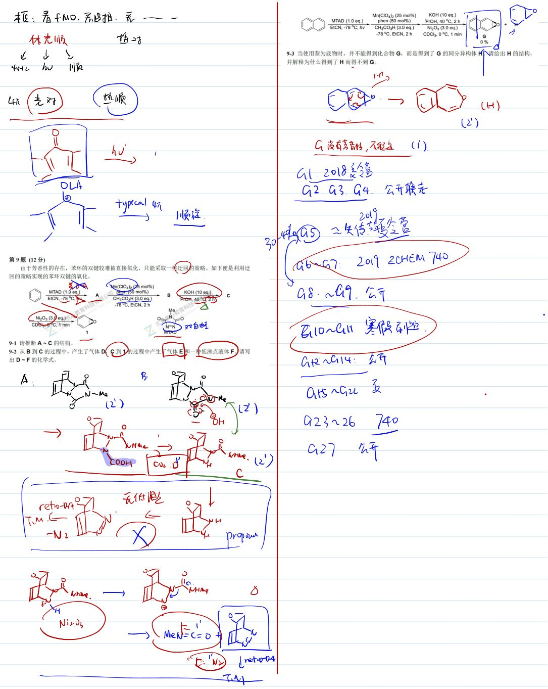
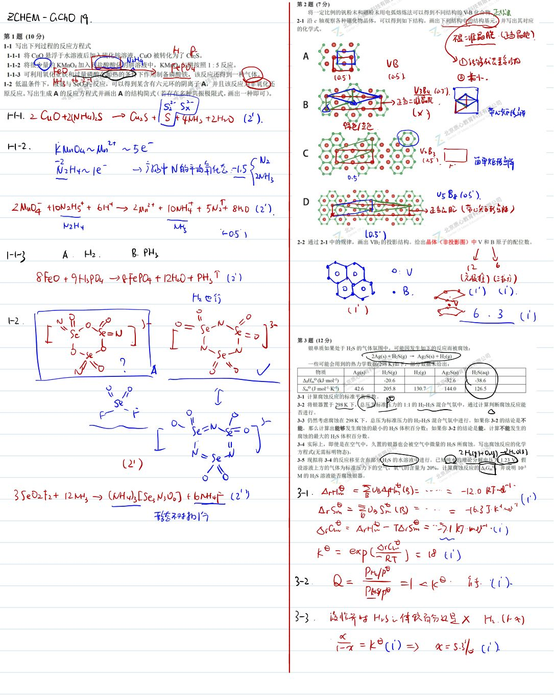
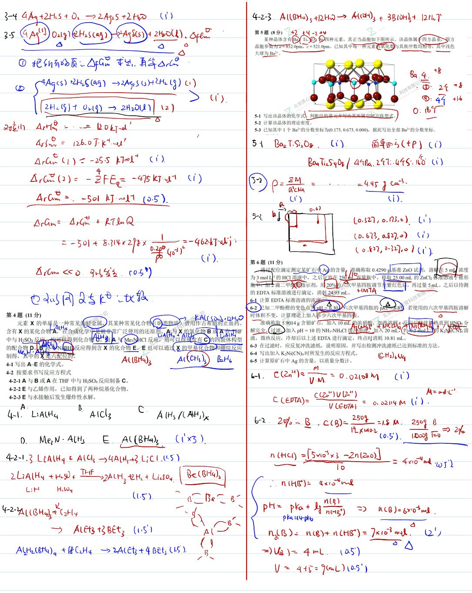
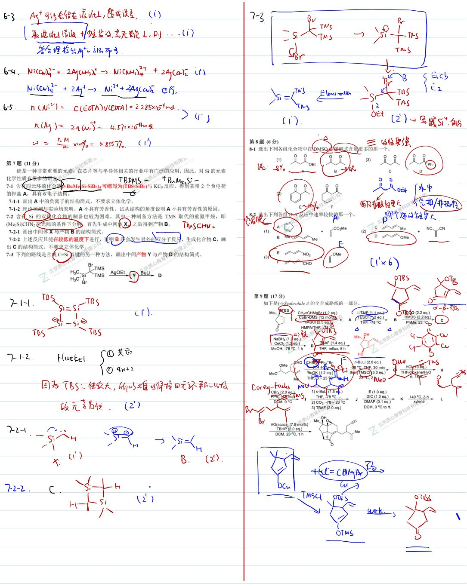
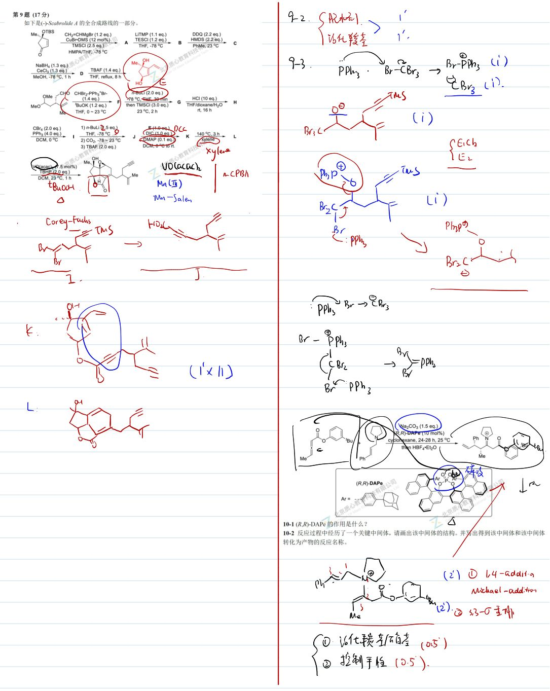

# 题-GChO-19-10-联烯以其独特的反应性成为了近

## 题目

### 第 10 题 (7分)

联烯以其独特的反应性成为了近年来有机合成方法学关注的热点之一。如下是一个基于联烯的转化反应。

10-1 $(R,R)$ -DAPe的作用是什么？

10-2 反应过程中经历了一个关键中间体，请画出该中间体的结构。并写出得到该中间体和该中间体转化为产物的反应名称。

## 参考答案

📎 **答案出处**：源卷**手写解析手稿**全部 5 页已随卡（见下），第 10 题解答在其内；手写笔迹，**文字化需人工转录**。

## 知识点映射

- （待人工校准）

> ⚠️ **自动拆卡标记**：`subject_module`/`difficulty` 为关键词粗判，答案数值与单位**尚未经人工复核**（OCR 原文逐字转录，可能保留原卷笔误）。