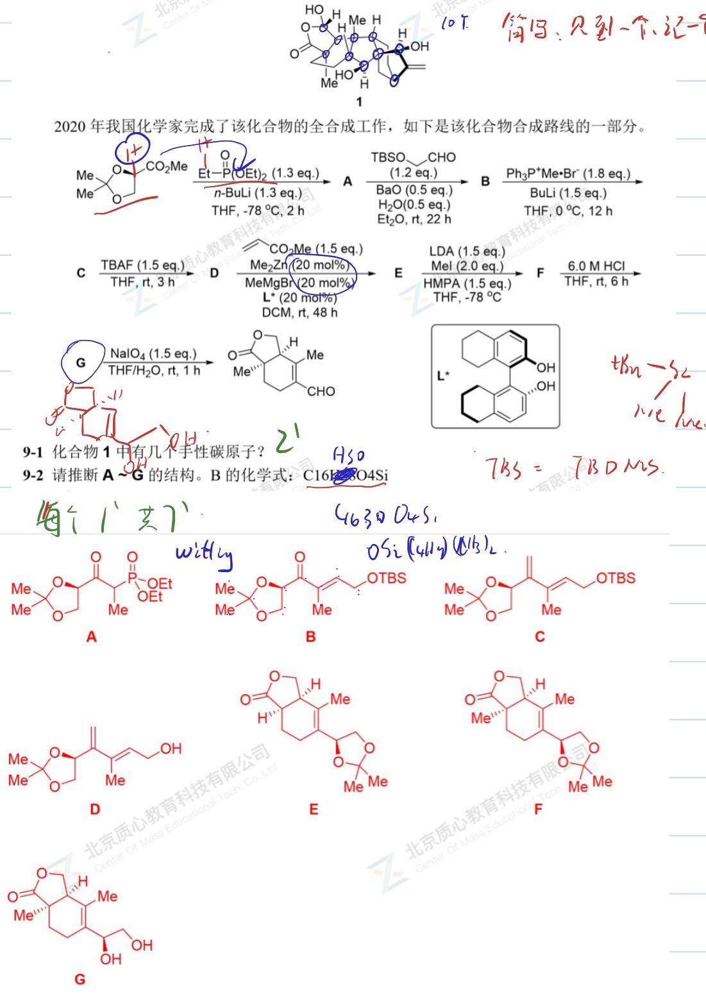
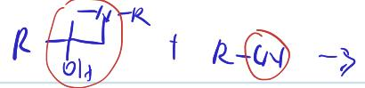

# 题-GChO-22-09-ent类胡萝卜素是一类结构丰

## 题目

### 第 9 题 (9分)

ent-类胡萝卜素是一类结构丰富的多环二萜，最早从腰澡属的植物中发现。其有趣的结构和潜在的生物活性引起了合成化学家的兴趣。如下化合物就是一种 ent-类胡萝卜素

2020年我国化学家完成了该化合物的全合成工作，如下是该化合物合成路线的一部分。

1

9-1 化合物 1 中有几个手性碳原子？

9-2 请推断 $\mathbf{A} \sim \mathbf{G}$ 的结构。

## 参考答案

ent-类胡萝卜素是一类结构丰富的多环二萜，最早从腰澡属的植物中发现。其有趣的结构和谐的生物活性引起了合成化学家的兴趣。如下化合物就是一种ent-类胡萝卜素

2020 年我国化学家完成了该化合物的全合成工作，如下是该化合物合成路线的一部分。

<table><tr><td></td><td></td></tr>
</table>

## 知识点映射

- （待人工校准）

> ⚠️ **自动拆卡标记**：`subject_module`/`difficulty` 为关键词粗判，答案数值与单位**尚未经人工复核**（OCR 原文逐字转录，可能保留原卷笔误）。