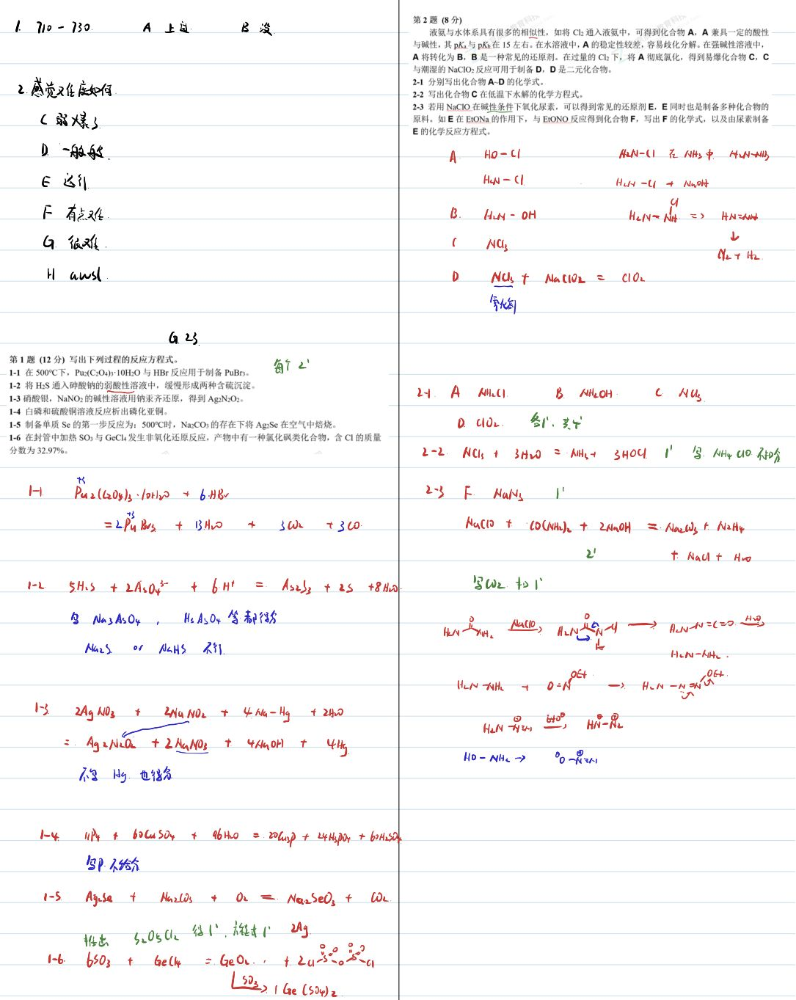
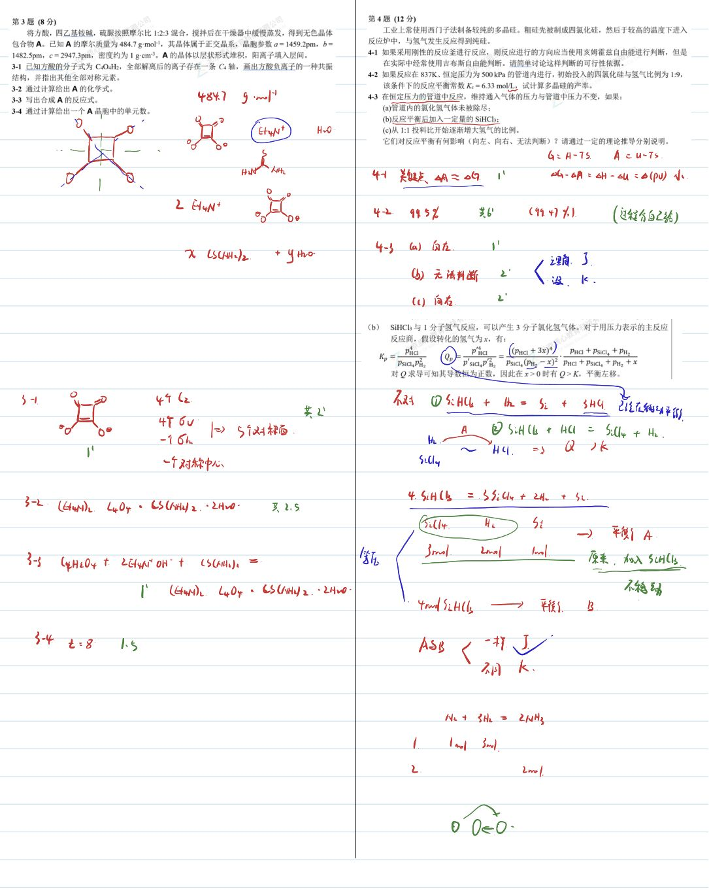
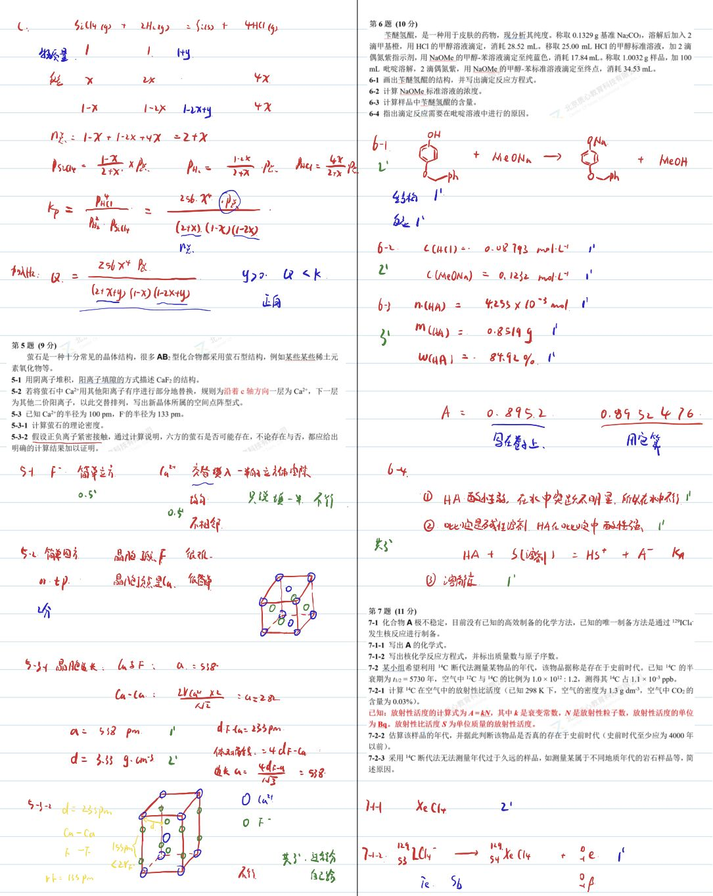
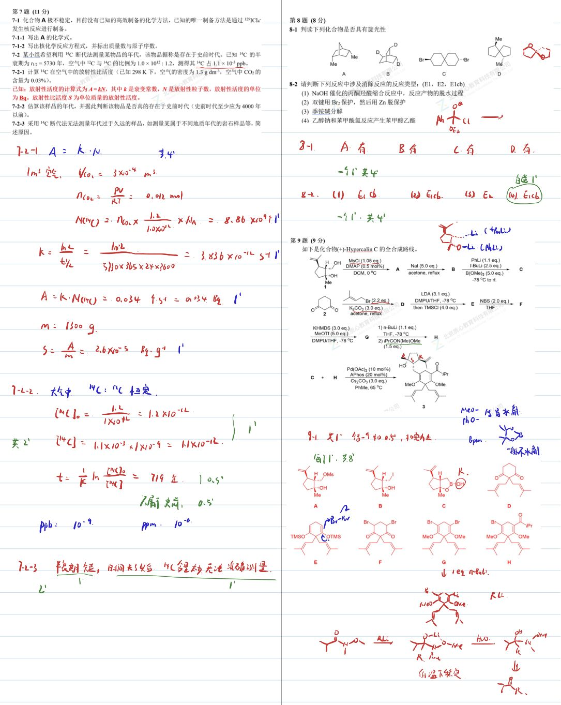
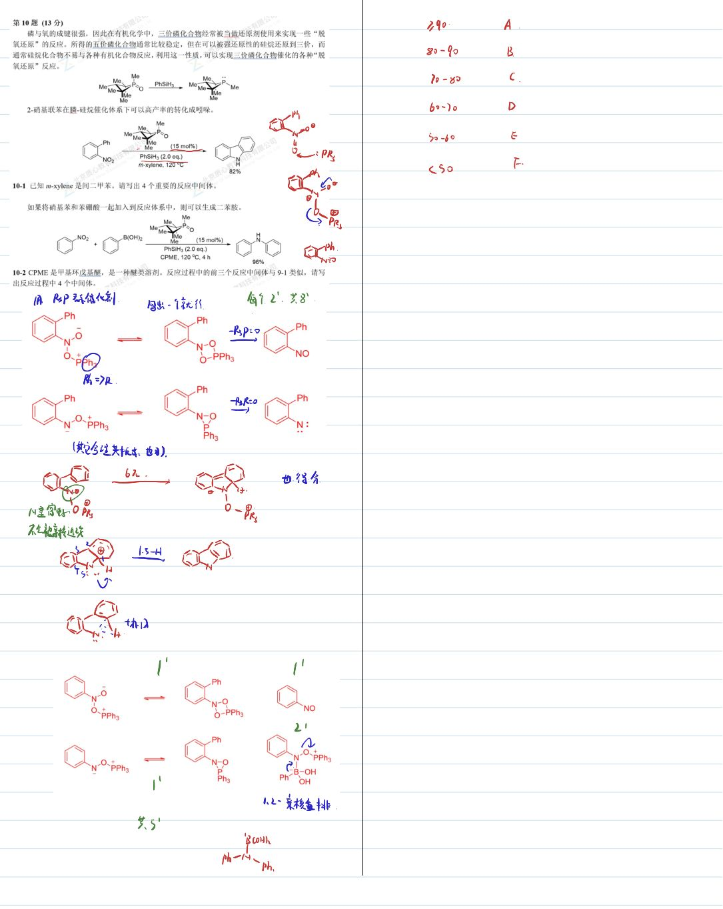

# 题-GChO-23-10-磷与氧的成键很强因此在有机化

## 题目

### 第 10 题 (13分)

磷与氧的成键很强，因此在有机化学中，三价磷化合物经常被当做还原剂使用来实现一些“脱氧还原”的反应。所得的五价磷化合物通常比较稳定，但在可以被强还原性的硅烷还原到三价，而通常硅烷化合物不易与各种有机化合物反应，利用这一性质，可以实现三价磷化合物催化的各种“脱氧还原”反应。

2-硝基联苯在膦-硅烷催化体系下可以高产率的转化成吲哚。

10-1 已知 m-xylene 是间二甲苯。请写出 4 个重要的反应中间体。

如果将硝基苯和苯硼酸一起加入到反应体系中，则可以生成二苯胺。

10-2 CPME 是甲基环戊基醚，是一种醚类溶剂。反应过程中的前三个反应中间体与 9-1 类似，请写出反应过程中 4 个中间体。

## 参考答案

📎 **答案出处**：源卷**手写解析手稿**全部 5 页已随卡（见下），第 10 题解答在其内；手写笔迹，**文字化需人工转录**。

## 知识点映射

- （待人工校准）

> ⚠️ **自动拆卡标记**：`subject_module`/`difficulty` 为关键词粗判，答案数值与单位**尚未经人工复核**（OCR 原文逐字转录，可能保留原卷笔误）。