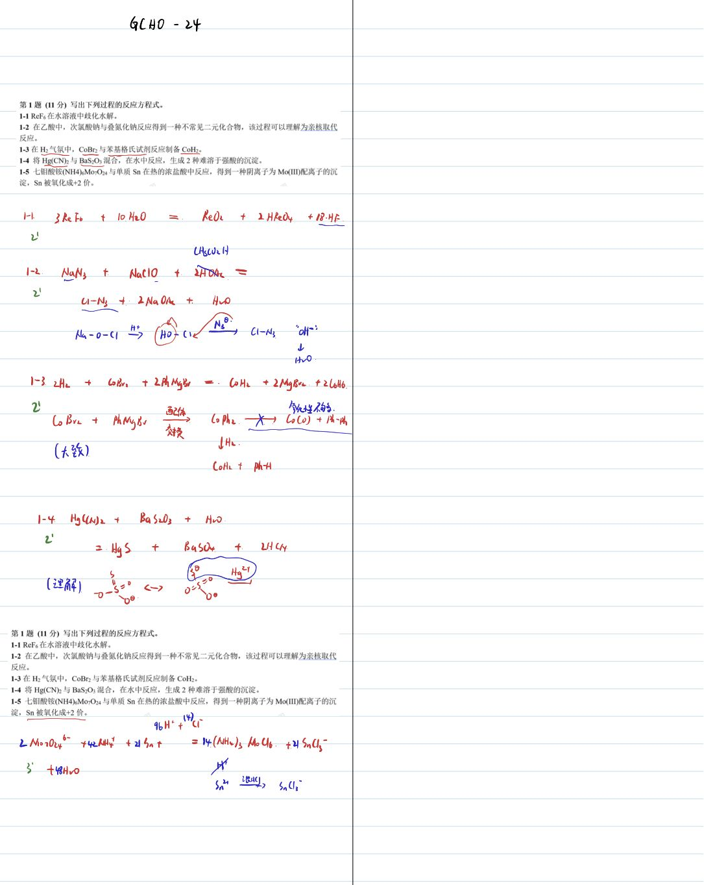
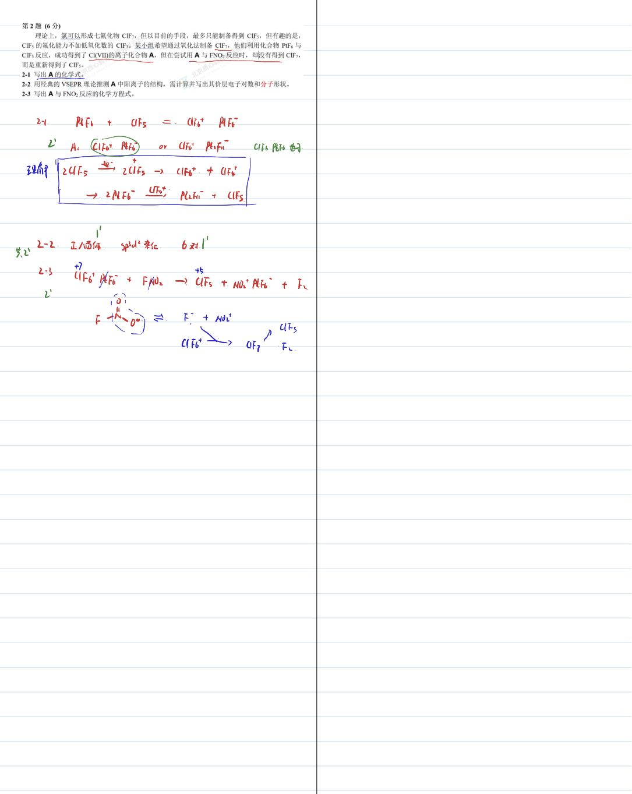
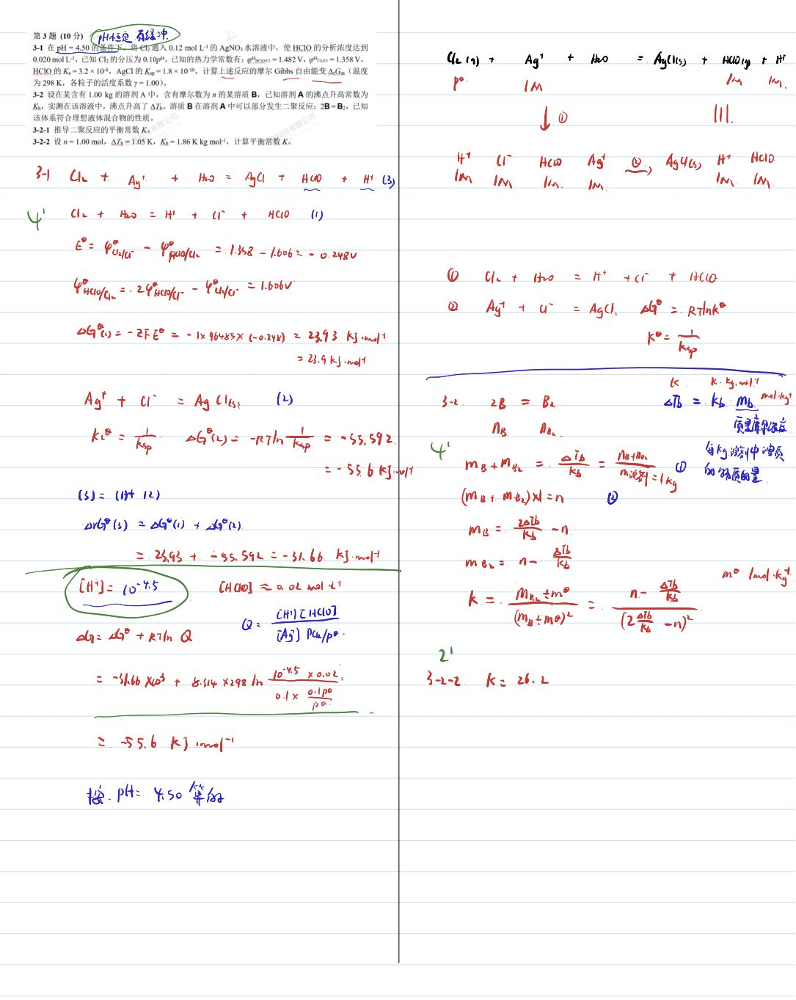
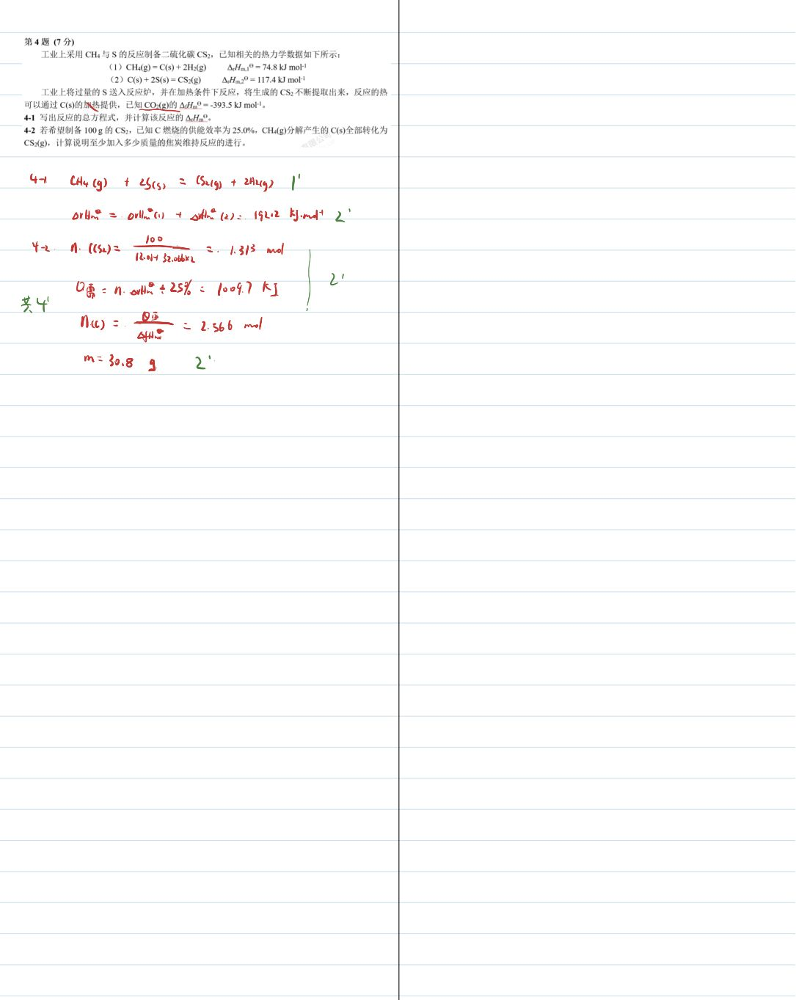
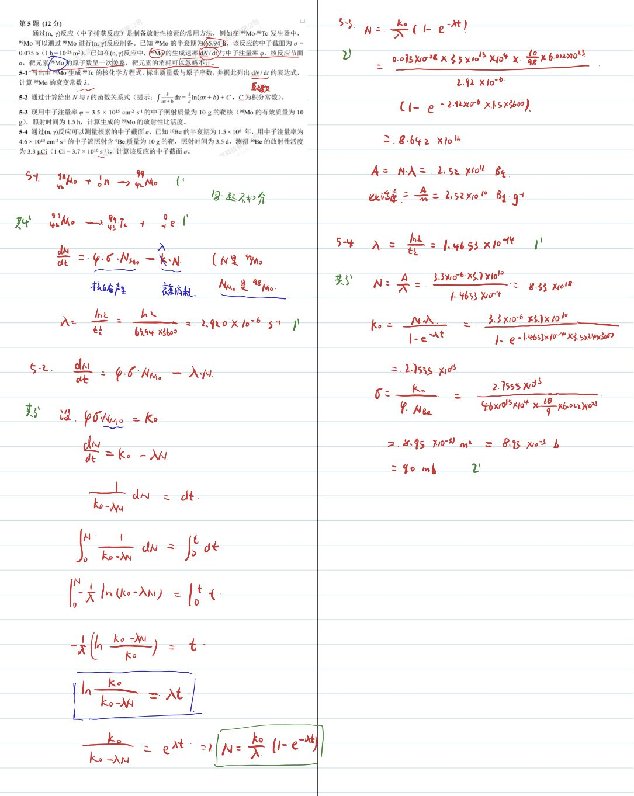
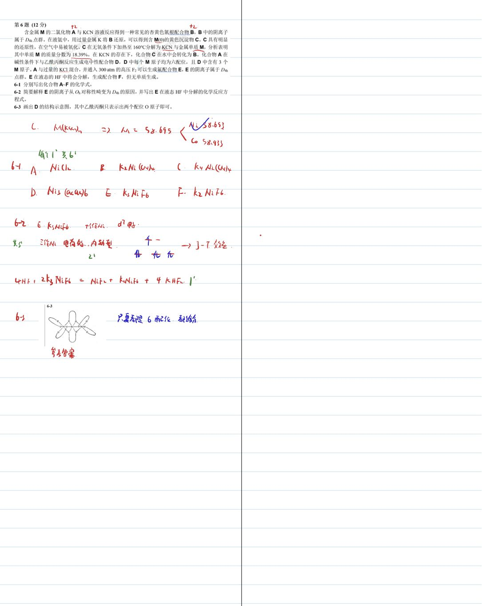
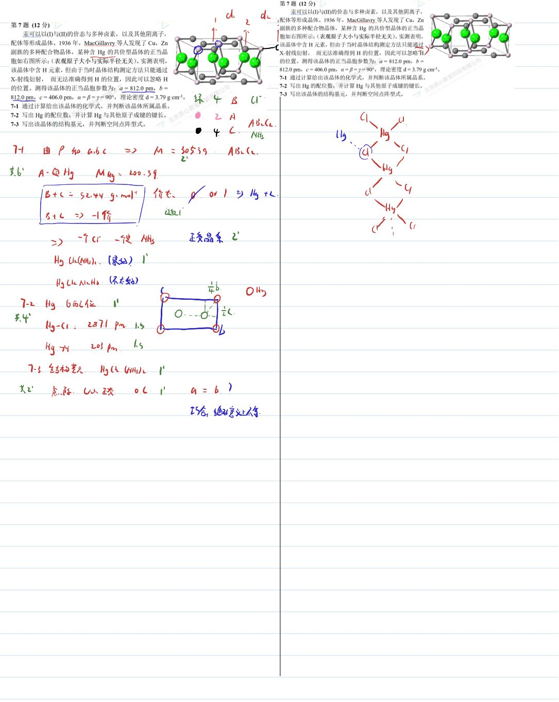
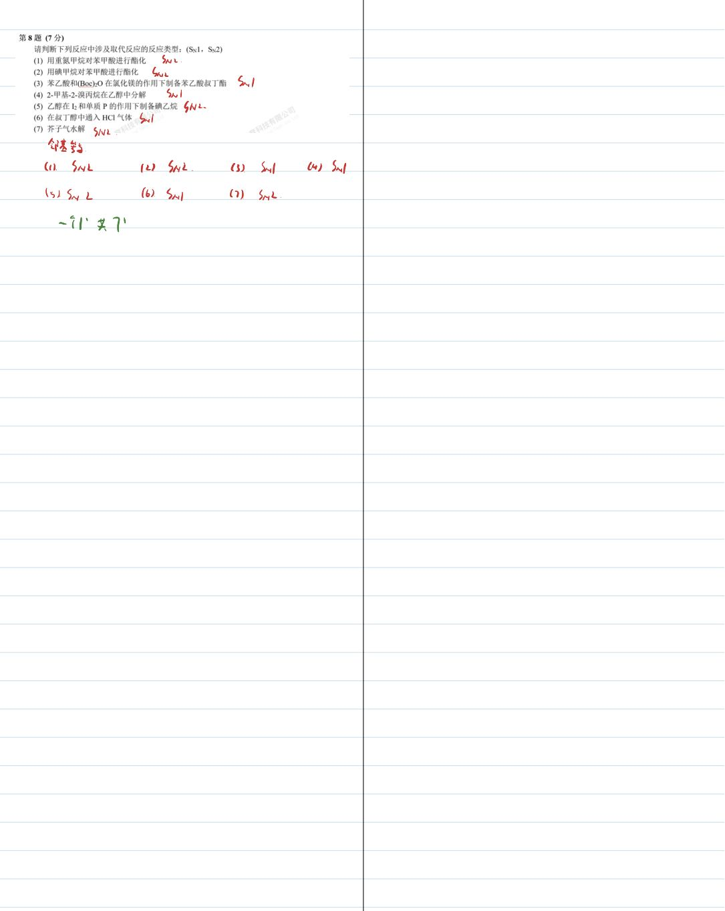
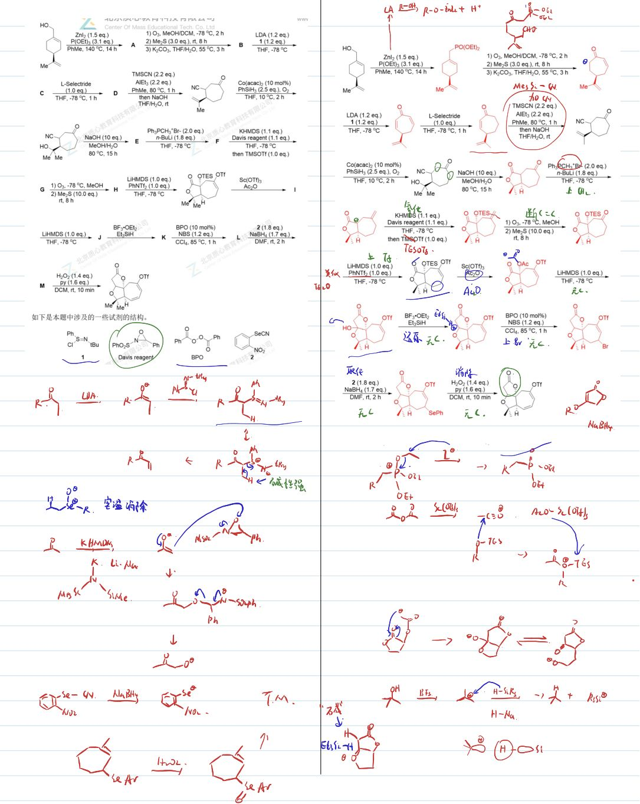
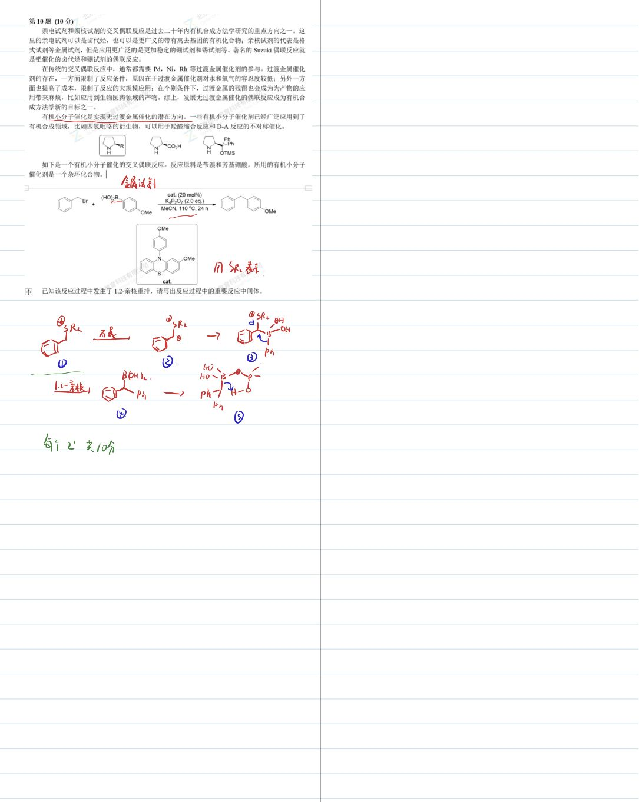

# 题-GChO-24-09-如下是化合物Rubriflo

## 题目

### 第 9 题 (13分)

如下是化合物 Rubriflordilactone B 的全合成路线的一部分。

## 如下是本题中涉及的一些试剂的结构。

## 请推断 $\mathbf{A} \sim \mathbf{M}$ 的结构，注意立体化学。

## 参考答案

📎 **答案出处**：源卷**手写解析手稿**全部 10 页已随卡（见下），第 09 题解答在其内；手写笔迹，**文字化需人工转录**。

## 知识点映射

- （待人工校准）

> ⚠️ **自动拆卡标记**：`subject_module`/`difficulty` 为关键词粗判，答案数值与单位**尚未经人工复核**（OCR 原文逐字转录，可能保留原卷笔误）。