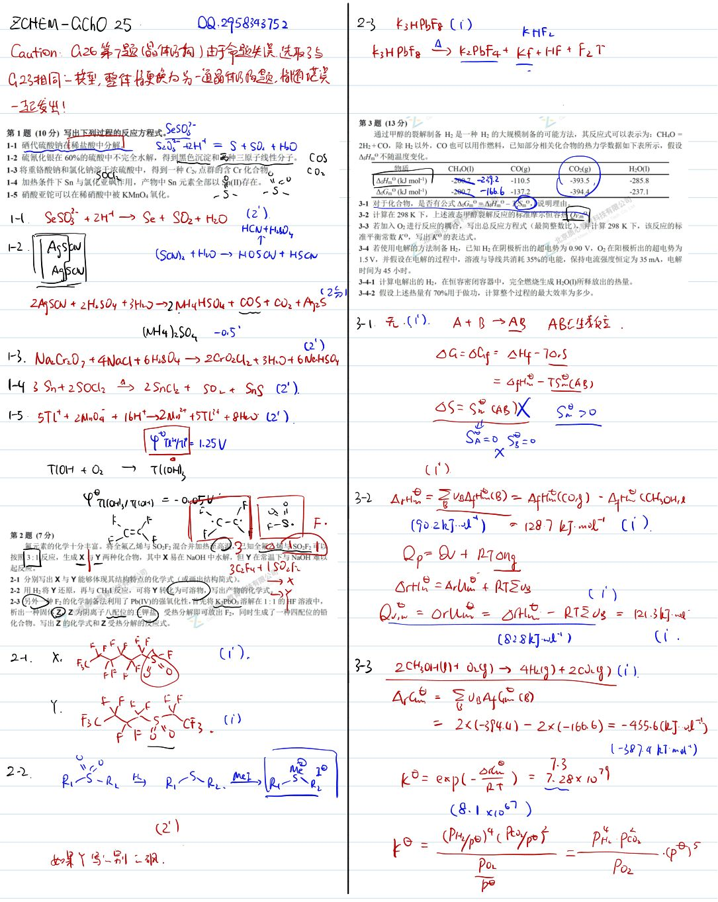
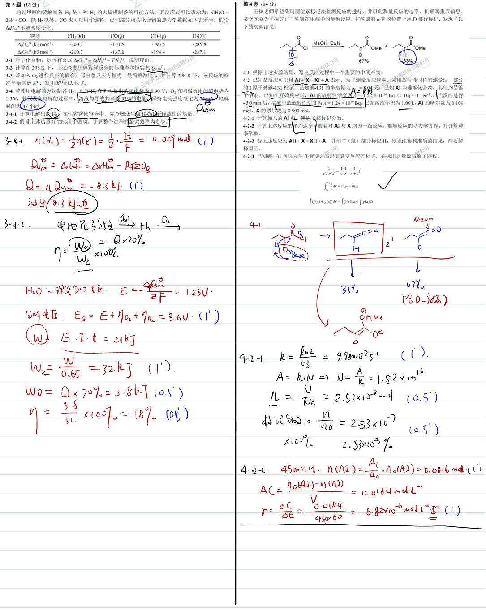
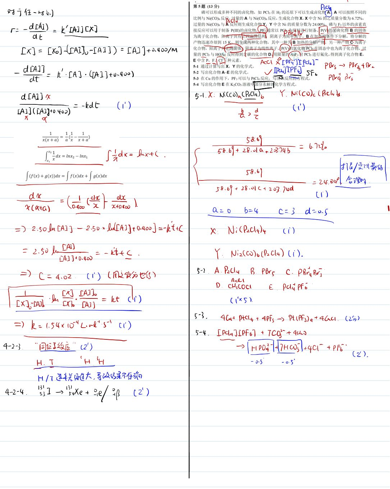
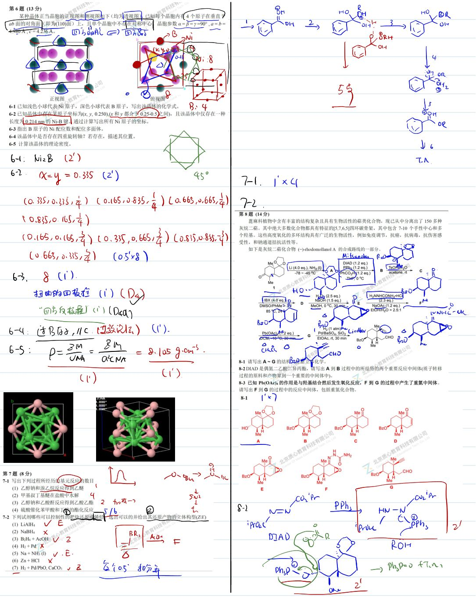
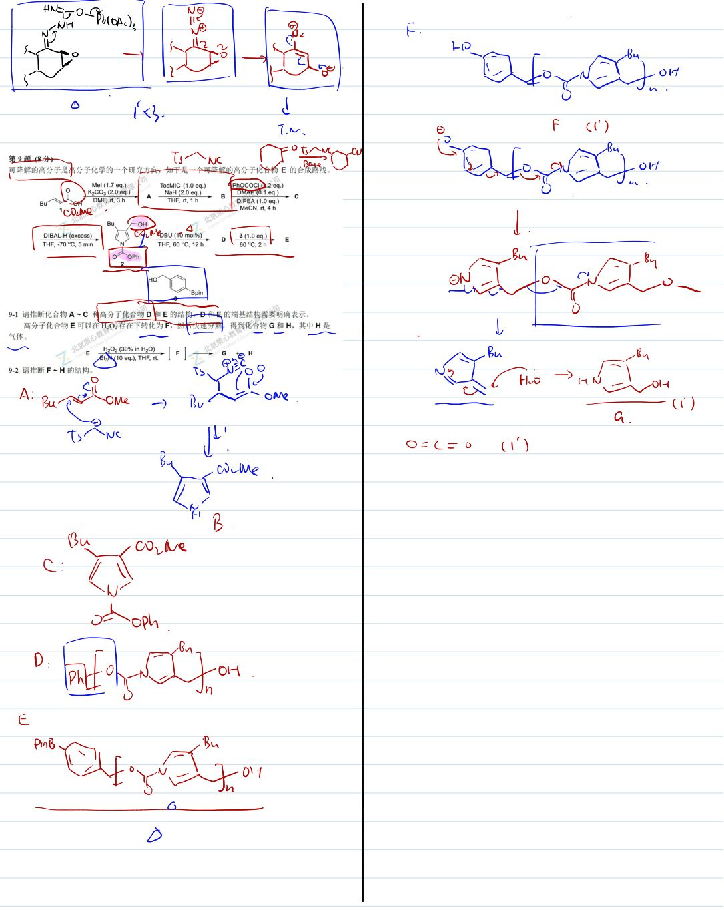

# 题-GChO-25-09-可降解的高分子是高分子化学的

## 题目

### 第 9 题 (8分)

可降解的高分子是高分子化学的一个研究方向，如下是一个可降解的高分子化合物 $\mathbb{E}$ 的合成路线。

9-1 请推断化合物 A\~C 和高分子化合物 D 和 E 的结构，D 和 E 的端基结构需要明确表示。

高分子化合物 $\mathsf{E}$ 可以在 $\mathrm{H}_2\mathrm{O}_2$ 存在下转化为 $\mathsf{F}$ ，然后快速分解，得到化合物 $\mathsf{G}$ 和 $\mathsf{H}$ ，其中 $\mathsf{H}$ 是气体。

$$
E \quad \frac {H _ {2} O _ {2} (30 \% \text { in } H _ {2} O)}{E t _ {3} N (10 \text { eq. }) , T H F , r t .} \rightarrow [ F ] \longrightarrow G + H
$$

9-2 请推断 F \~ H 的结构。

## 参考答案

📎 **答案出处**：源卷**手写解析手稿**全部 5 页已随卡（见下），第 09 题解答在其内；手写笔迹，**文字化需人工转录**。

## 知识点映射

- （待人工校准）

> ⚠️ **自动拆卡标记**：`subject_module`/`difficulty` 为关键词粗判，答案数值与单位**尚未经人工复核**（OCR 原文逐字转录，可能保留原卷笔误）。