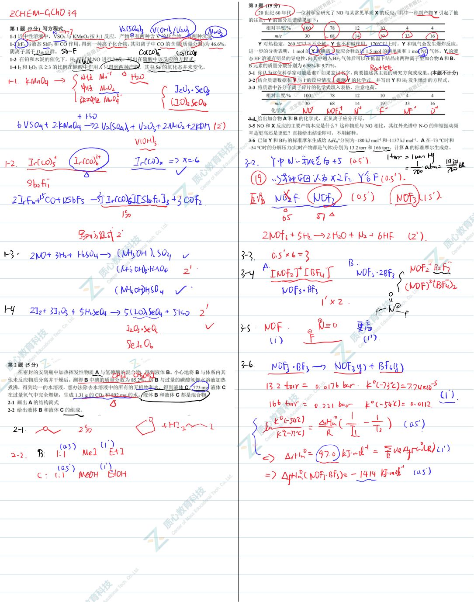
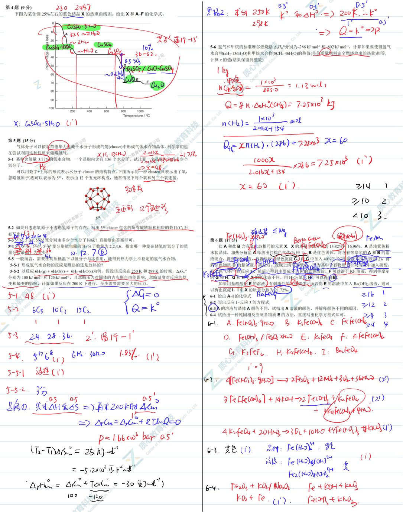
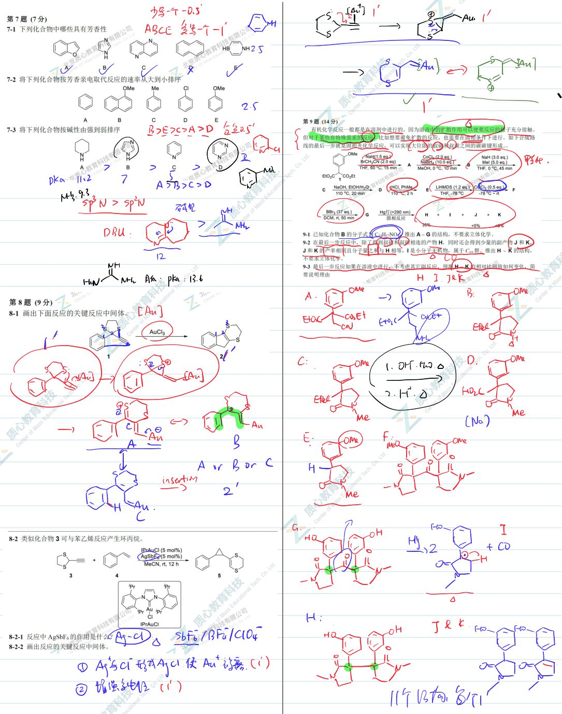
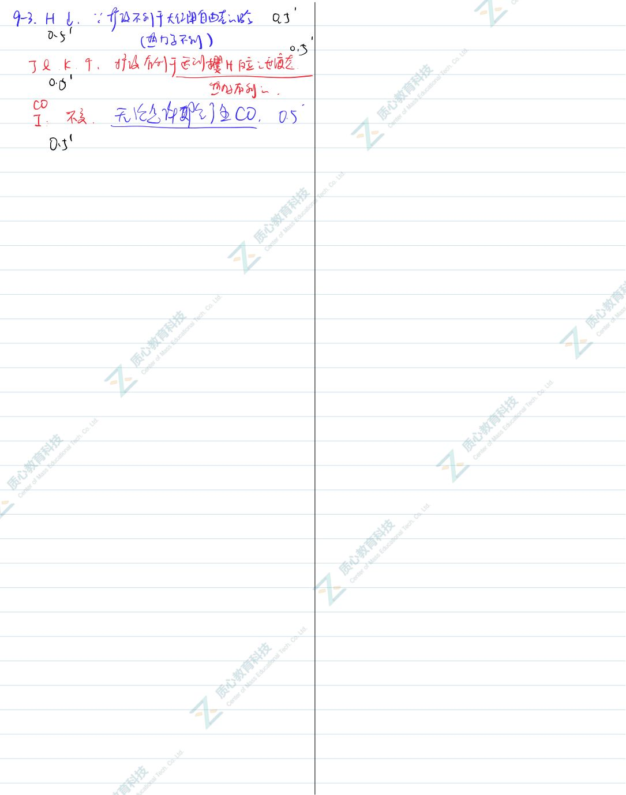

# 题-GChO-34-04-下图为某含铜25左右的蓝色结

## 题目

### 第 4 题(9分)

下图为某含铜 25% 左右的蓝色结晶 X 的热重曲线图。给出 X 和 A\~F 的化学式。

## 参考答案

📎 **答案出处**：源卷**手写解析手稿**全部 4 页已随卡（见下），第 04 题解答在其内；手写笔迹，**文字化需人工转录**。

## 知识点映射

- （待人工校准）

> ⚠️ **自动拆卡标记**：`subject_module`/`difficulty` 为关键词粗判，答案数值与单位**尚未经人工复核**（OCR 原文逐字转录，可能保留原卷笔误）。