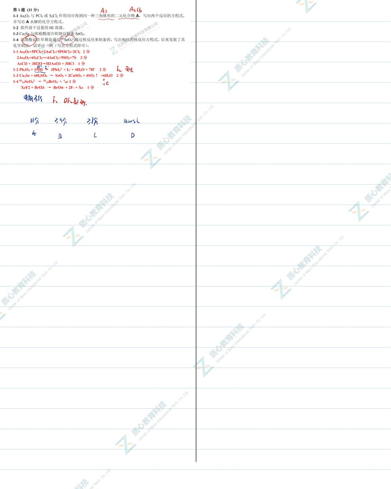
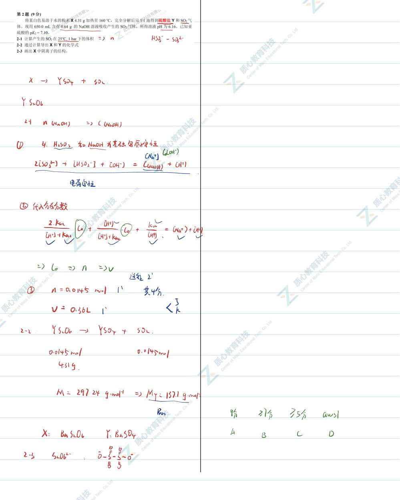
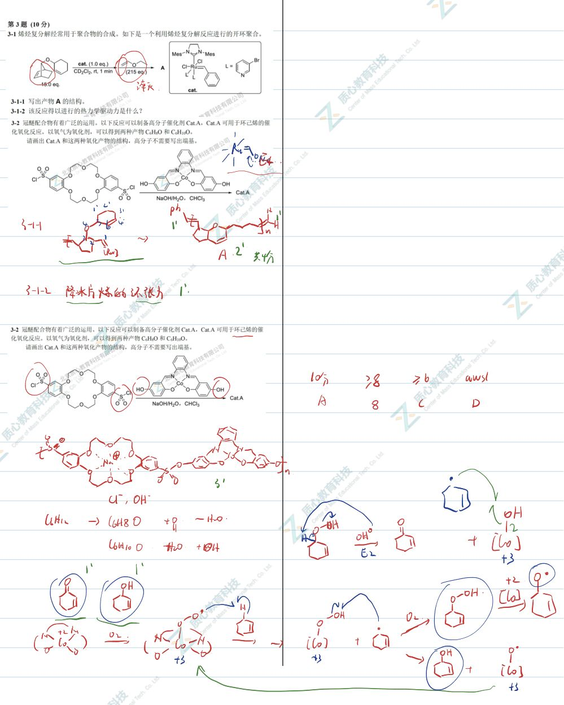
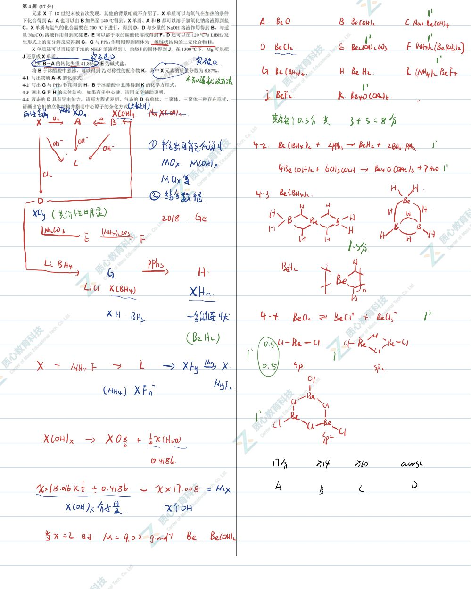
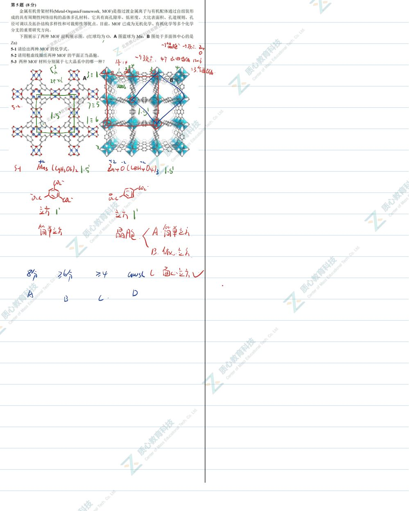
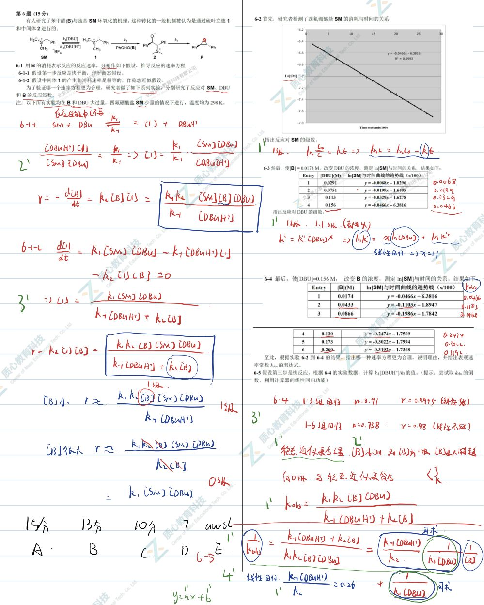
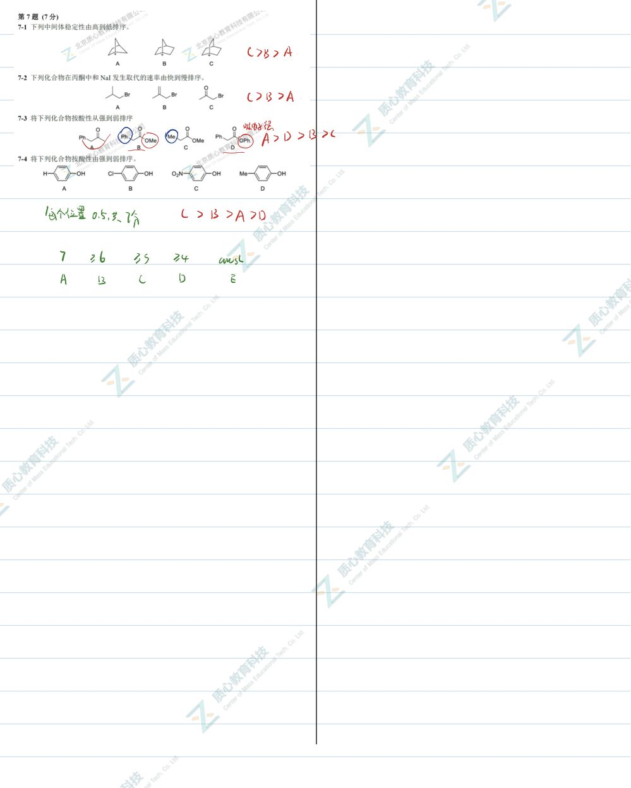
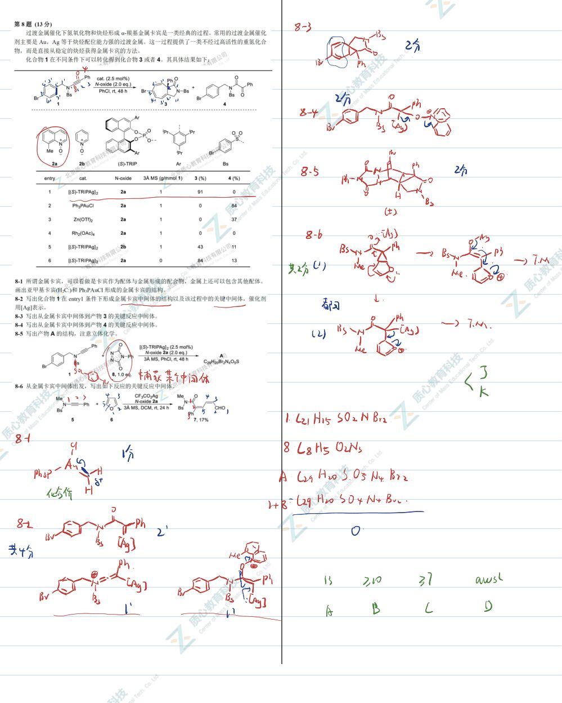
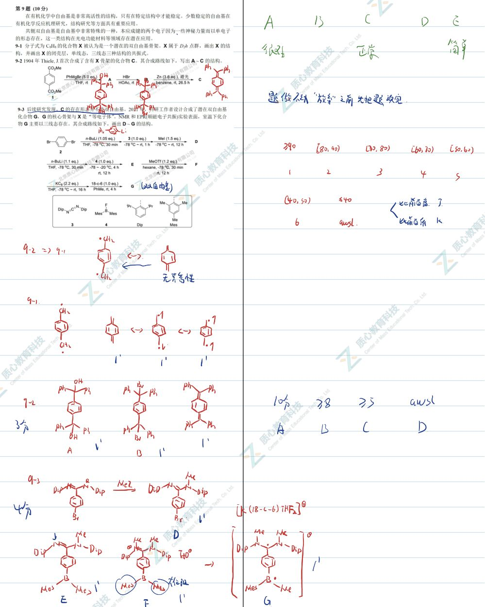

# 题-GChO-36-03-31烯烃复分解经常用于聚合物

## 题目

### 第 3 题 (10分)

3-1 烯烃复分解经常用于聚合物的合成。如下是一个利用烯烃复分解反应进行的开环聚合。

3-1-1 写出产物 A 的结构。

3-1-2 该反应得以进行的热力学驱动力是什么？

3-2 冠醚配合物有着广泛的运用。以下反应可以制备高分子催化剂 Cat.A，Cat.A 可用于环己烯的催化氧化反应。以氧气为氧化剂，可以得到两种产物 $C_{6}H_{8}O$ 和 $C_{6}H_{10}O$ 。

请画出 Cat.A 和这两种氧化产物的结构，高分子不需要写出端基。

## 参考答案

📎 **答案出处**：源卷**手写解析手稿**全部 9 页已随卡（见下），第 03 题解答在其内；手写笔迹，**文字化需人工转录**。

## 知识点映射

- （待人工校准）

> ⚠️ **自动拆卡标记**：`subject_module`/`difficulty` 为关键词粗判，答案数值与单位**尚未经人工复核**（OCR 原文逐字转录，可能保留原卷笔误）。