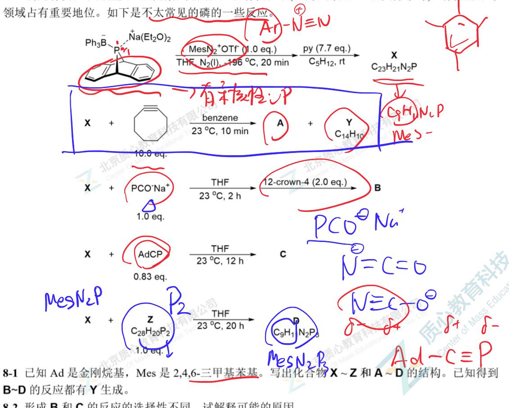
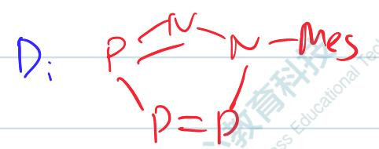
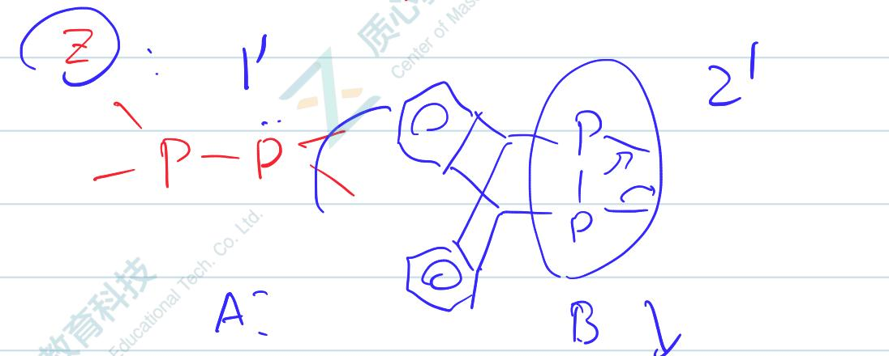
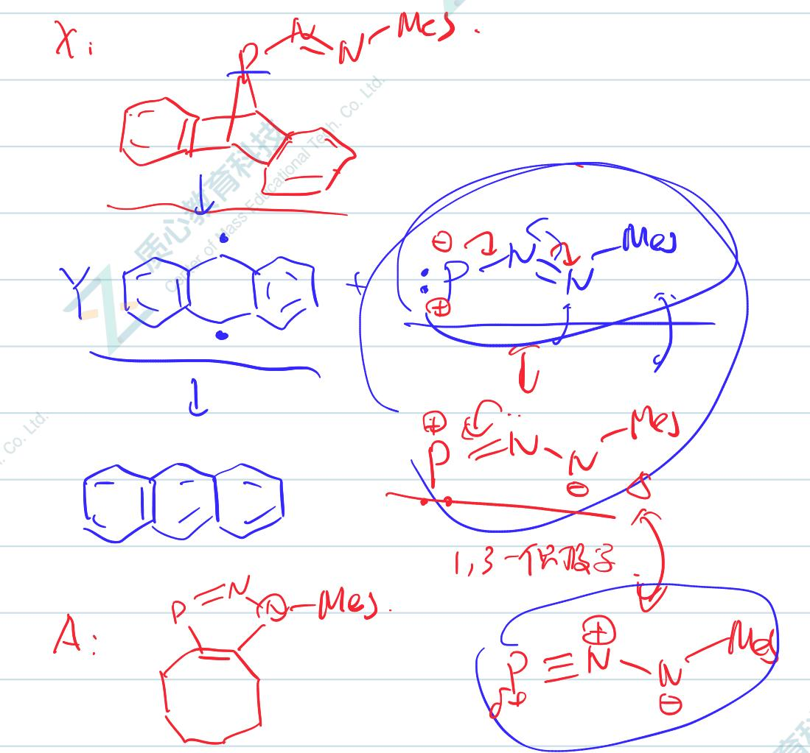
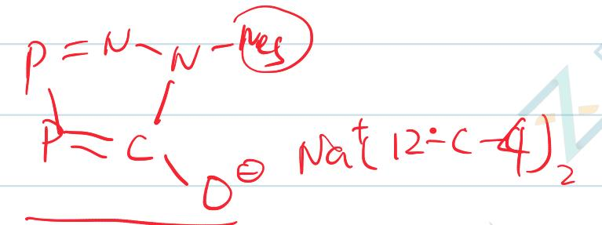
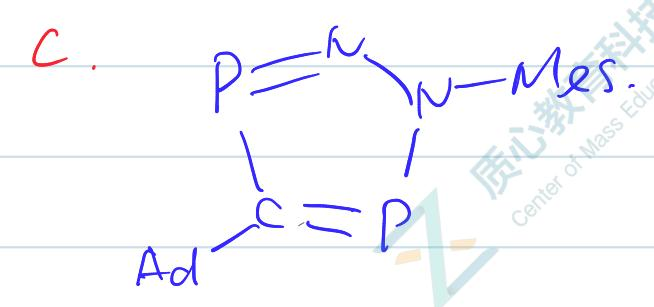

# 题-GChO-40-08-磷是有机化学的重要组成元素尤

## 题目

### 第 8 题 (15分)

磷是有机化学的重要组成元素，尤其在生物有机化学(农药，药物，生物大分子等)，有机配体等领域占有重要地位。如下是不太常见的磷的一些反应。

$$
\mathrm{Ph} _ {3} \stackrel {-} {\mathrm{B}} \stackrel {+} {\mathrm{P}} \stackrel {+} {\mathrm{Na(Et} _ {2} \mathrm{O)} _ {2}} \xrightarrow [ \text {THF, N } _ {2} (\mathrm{I}) , - 196 ^ {\circ} \mathrm{C} , 20 \text {min} ]{\text {MesN} _ {2} ^ {+} \text {OTf (1.0 eq.)}} \xrightarrow [ \text {C} _ {5} \mathrm{H} _ {12} , \text {rt} ]{\text {py (7.7 eq.)}} \underset {\mathrm{C} _ {23} \mathrm{H} _ {21} \mathrm{N} _ {2} \mathrm{P}} {\mathrm{X}}
$$

$$
\begin{array}{l} \text {X} + \quad \mathrm{PCO} ^ {-} \mathrm{Na} ^ {+} \quad \xrightarrow [ 23 ^ {\circ} \mathrm{C} , 2 \mathrm{h} ]{\text {THF}} \xrightarrow [ 12 - \text {crown-4 (2.0 eq.)} ]{\text {B}} \\ 1.0 \text {eq.} \end{array}
$$

$$
\begin{array}{c c c} \mathbf {X} & + & \text { AdCP } \\ & & 0.83 \text { eq. } \end{array} \quad \xrightarrow [ 23 ^ {\circ} \mathrm{C} , 12 \mathrm{h} ]{\text { THF }} \quad \mathbf {C}
$$

$$
\begin{array}{r l r} \mathbf {X} & + & \underset {\mathrm{C} _ {28} \mathrm{H} _ {20} \mathrm{P} _ {2}} {\mathbf {Z}} \xrightarrow [ 23 ^ {\circ} \mathrm{C} , 20 \mathrm{h} ]{\text {THF}} \\ & & \mathbf {D} \\ & & 1.0 \text {eq.} \end{array}
$$

8-1 已知 Ad 是金刚烷基，Mes 是 2,4,6-三甲基苯基。写出化合物 X\~Z 和 A\~D 的结构。已知得到 B\~D 的反应都有 Y 生成。

8-2 形成 B 和 C 的反应的选择性不同，试解释可能的原因。

## 参考答案

磷是有机化学的重要组成元素，尤其在生物有机化学(农药，药物，生物大分子等)，有机配体等

$$
(r e t r o - i n s e r l o r)
$$

$$
r e t r o - c y c l o a d d i t m
$$

(每个13场1', )

Z: 弯式左(A) - 1'

8-2. (红阳): P 碳蓝鱼电比

IS: A 6 E

<6 f

0:G

## 知识点映射

- （待人工校准）

> ⚠️ **自动拆卡标记**：`subject_module`/`difficulty` 为关键词粗判，答案数值与单位**尚未经人工复核**（OCR 原文逐字转录，可能保留原卷笔误）。