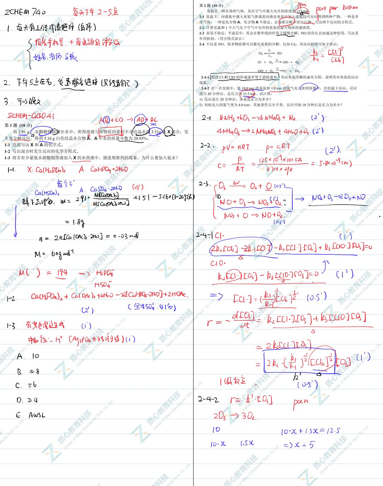
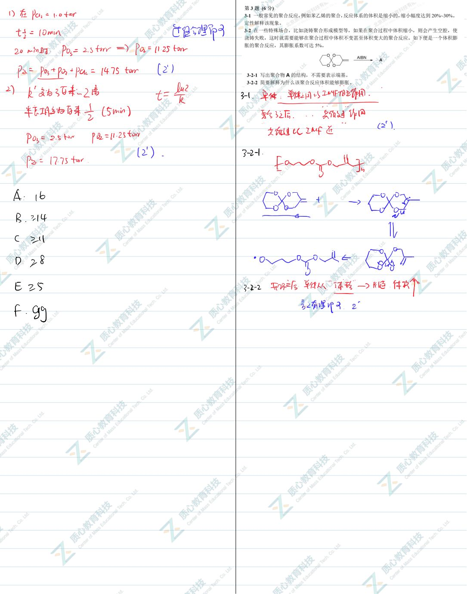
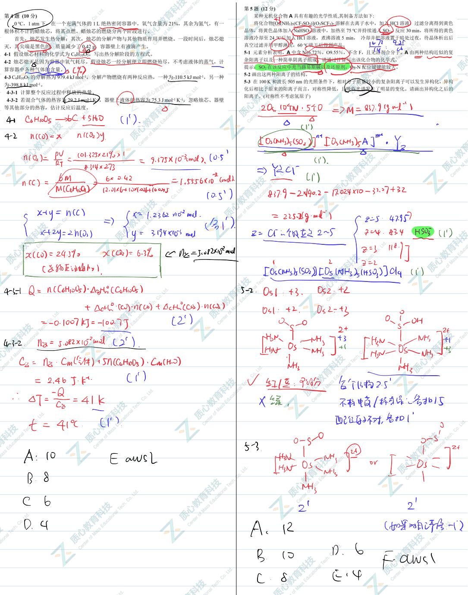
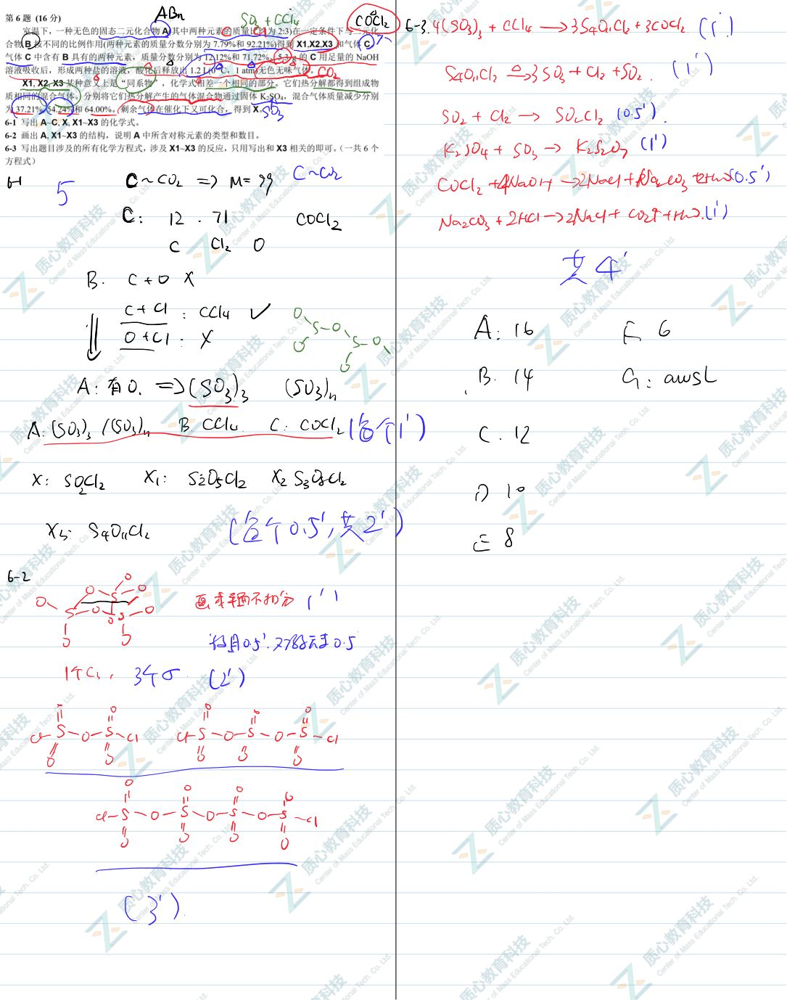
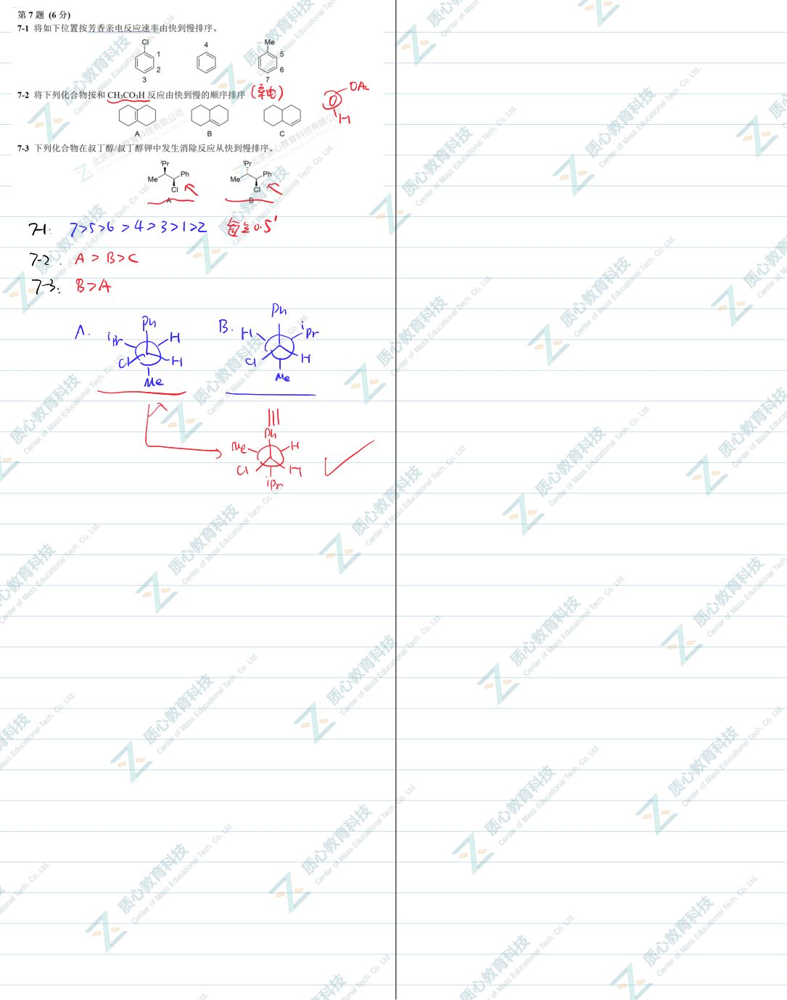
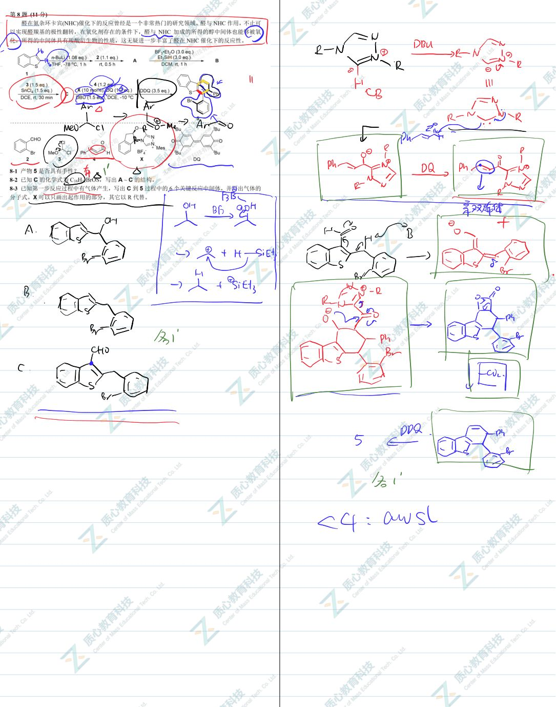
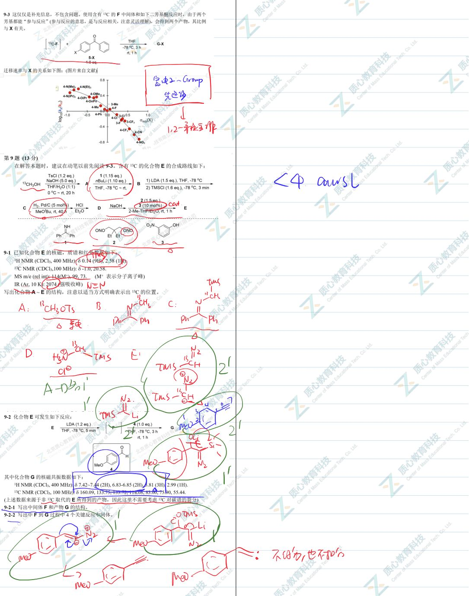

# 题-GChO-43-08-醛在氮杂环卡宾NHC催化下的

## 题目

### 第 8 题 (11分)

醛在氮杂环卡宾(NHC)催化下的反应曾经是一个非常热门的研究领域。醛与NHC作用，不止可以实现醛羰基的极性翻转，在氧化剂存在的条件下，醛与NHC加成的所得的醇中间体也能够被氧化，所得的中间体具有羧酸衍生物的性质，这无疑进一步丰富了醛在NHC催化下的反应性。

8-1 产物5是否具有手性？

<table><tr><td></td></tr><tr><td>8-2 已知C的化学式为 $C_{16}H_{11}BrOS$ ,写出A~C的结构。</td></tr><tr><td>8-3 已知第一步反应过程中有气体产生,写出C到5过程中的6个关键反应中间体,并写出气体的分子式。X可以只画出起作用的部分,其它以R代替。</td></tr></table>

## 参考答案

📎 **答案出处**：源卷**手写解析手稿**全部 7 页已随卡（见下），第 08 题解答在其内；手写笔迹，**文字化需人工转录**。

## 知识点映射

- （待人工校准）

> ⚠️ **自动拆卡标记**：`subject_module`/`difficulty` 为关键词粗判，答案数值与单位**尚未经人工复核**（OCR 原文逐字转录，可能保留原卷笔误）。