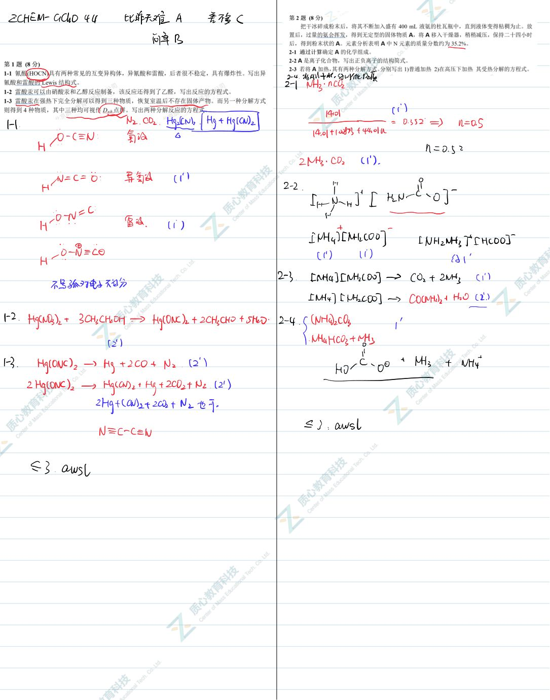
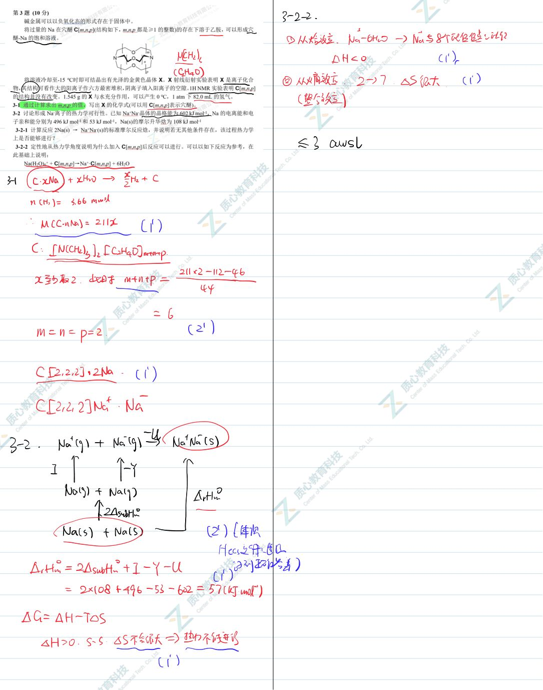
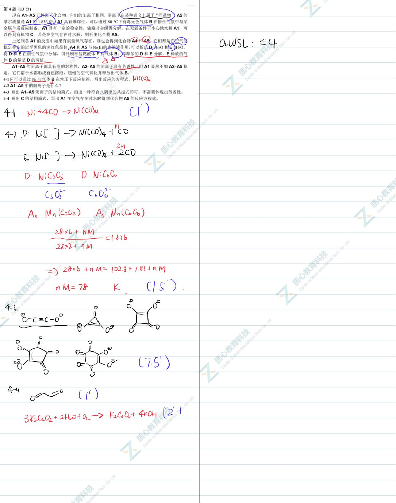
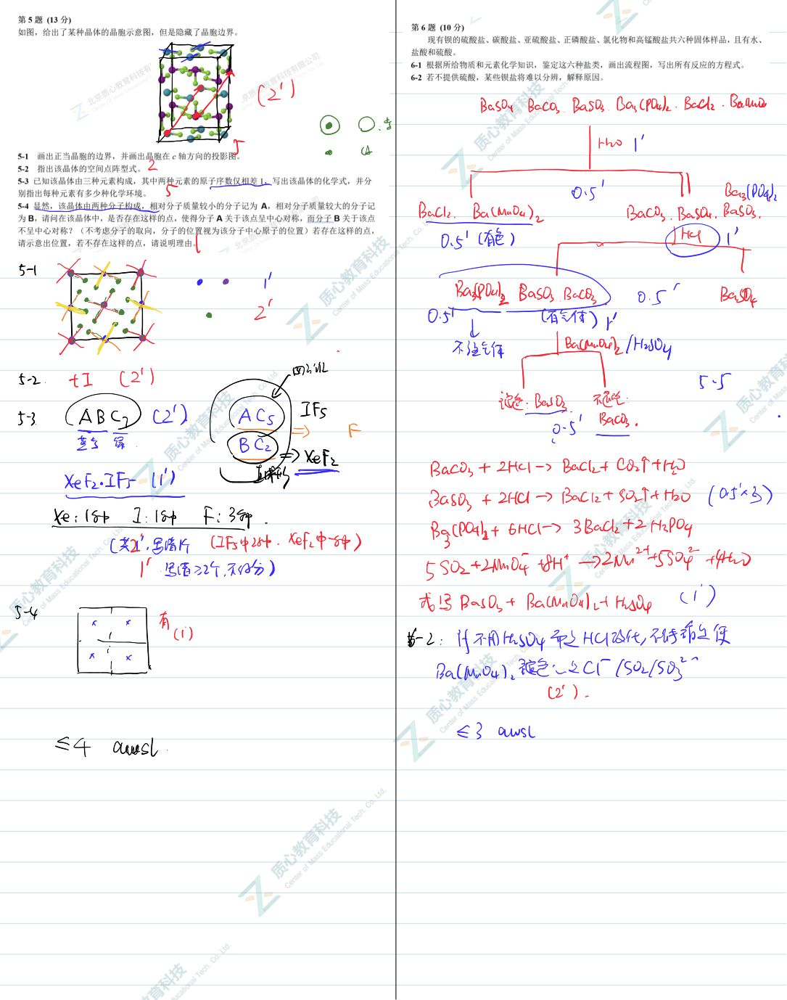
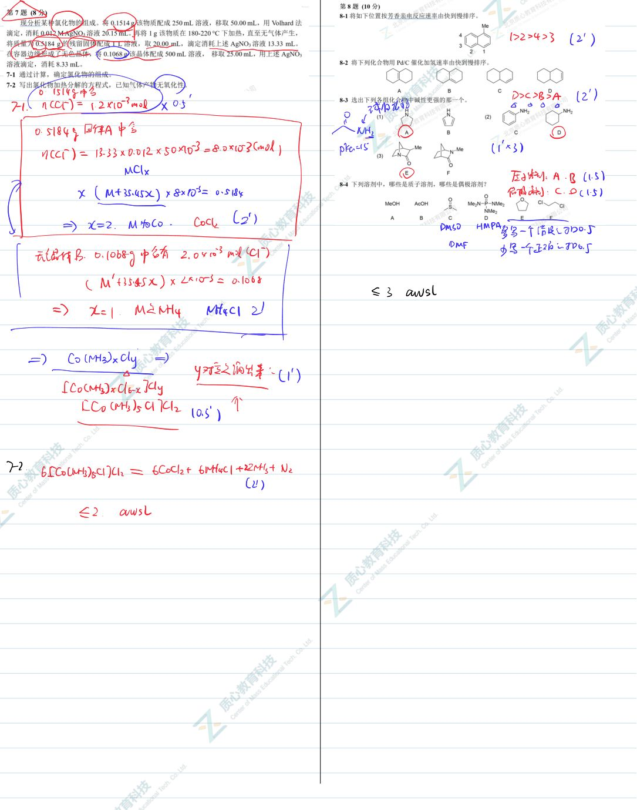
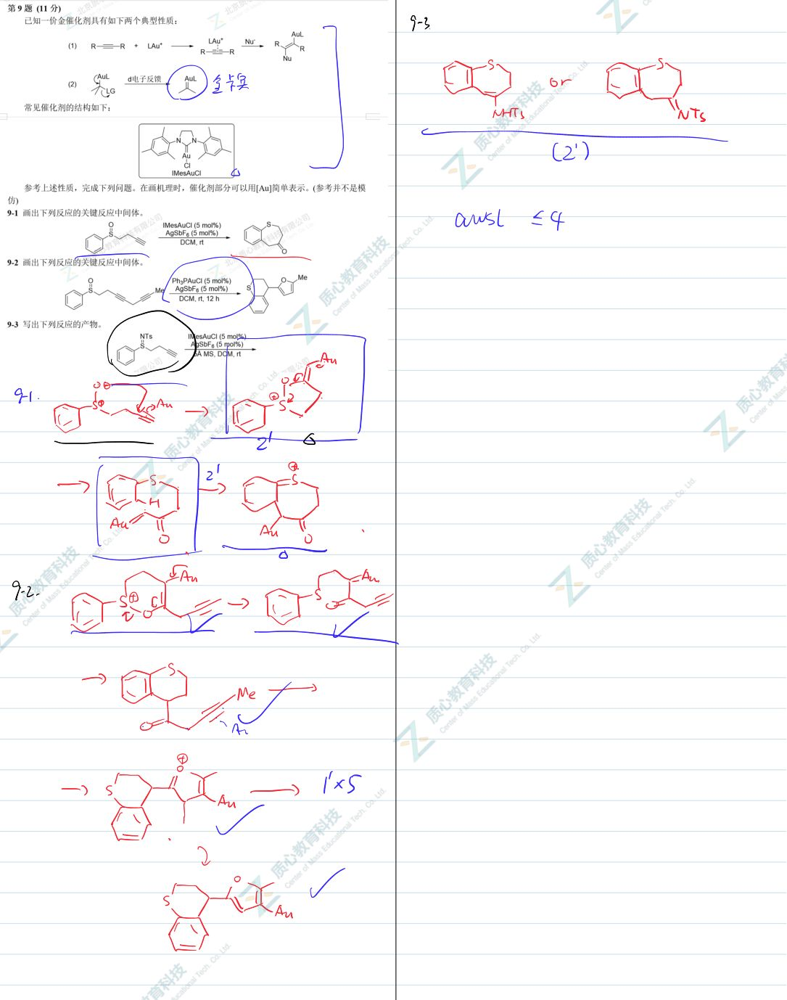
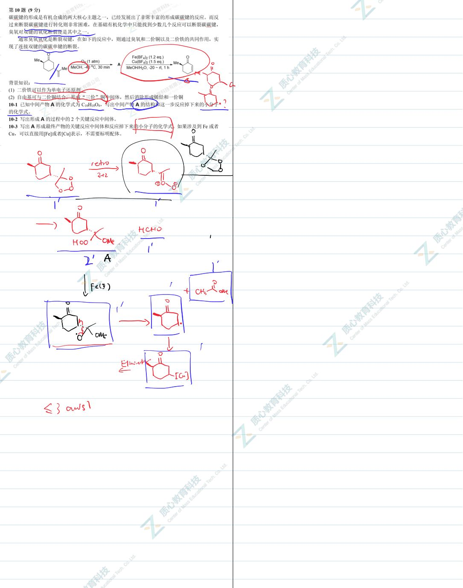

# 题-GChO-44-09-已知一价金催化剂具有如下两个

## 题目

### 第 9 题 (11分)

已知一价金催化剂具有如下两个典型性质：

(1)

(2)

d电子反馈

常见催化剂的结构如下：

参考上述性质，完成下列问题。在画机理时，催化剂部分可以用[Au]简单表示。(参考并不是模仿)

9-1 画出下列反应的关键反应中间体。

<table><tr><td></td><td>15</td></tr></table>

9-2 画出下列反应的关键反应中间体。

## 9-3 写出下列反应的产物。

## 参考答案

📎 **答案出处**：源卷**手写解析手稿**全部 7 页已随卡（见下），第 09 题解答在其内；手写笔迹，**文字化需人工转录**。

## 知识点映射

- （待人工校准）

> ⚠️ **自动拆卡标记**：`subject_module`/`difficulty` 为关键词粗判，答案数值与单位**尚未经人工复核**（OCR 原文逐字转录，可能保留原卷笔误）。