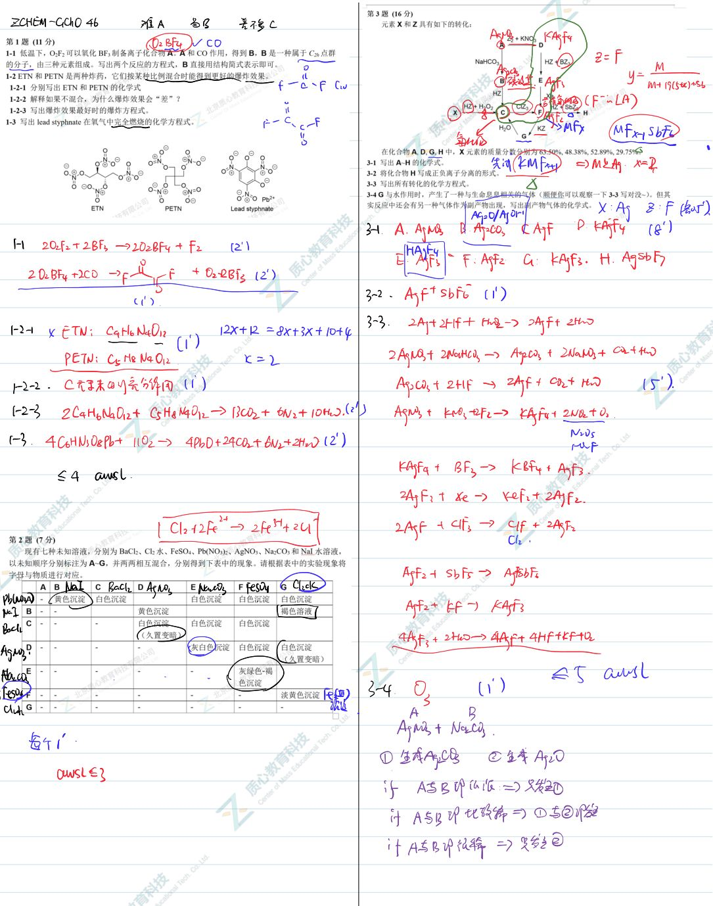
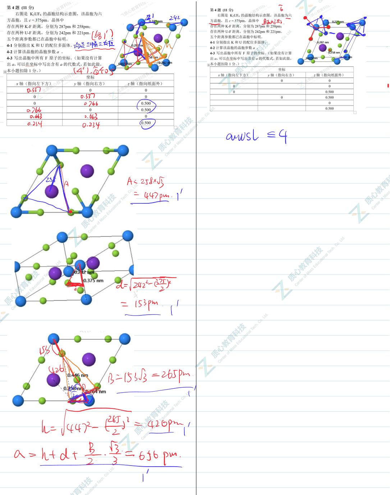
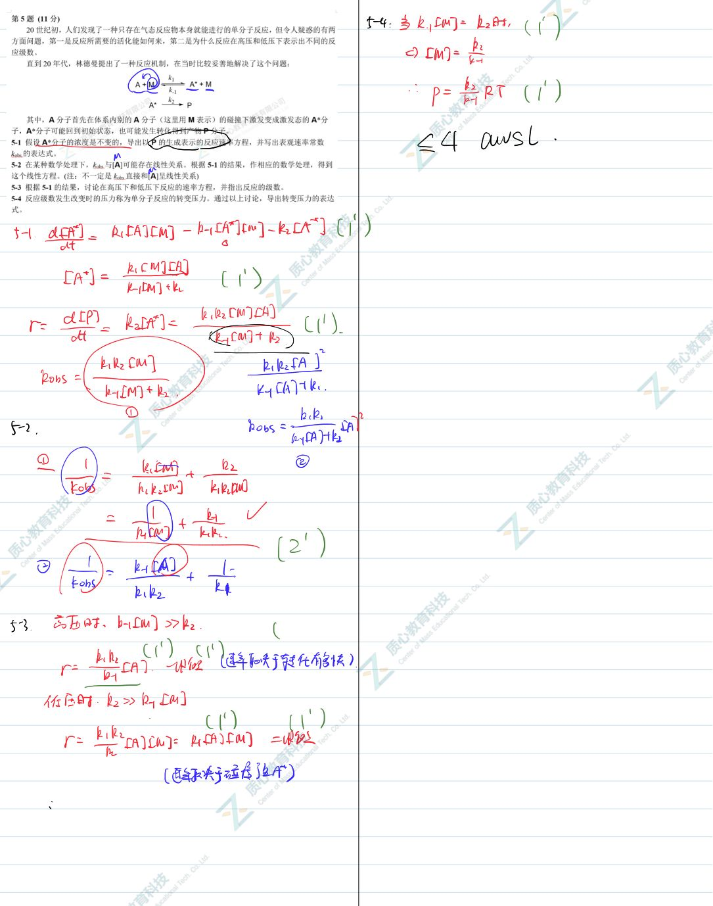
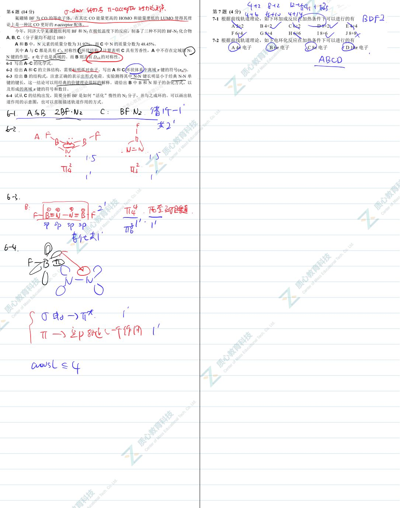
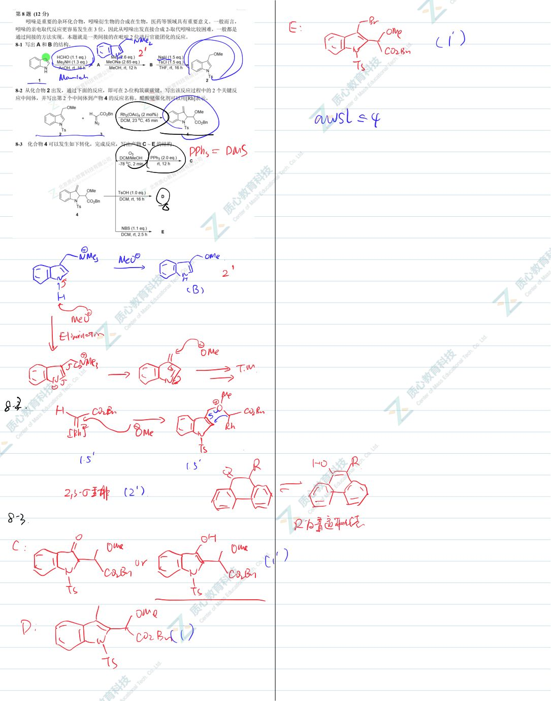
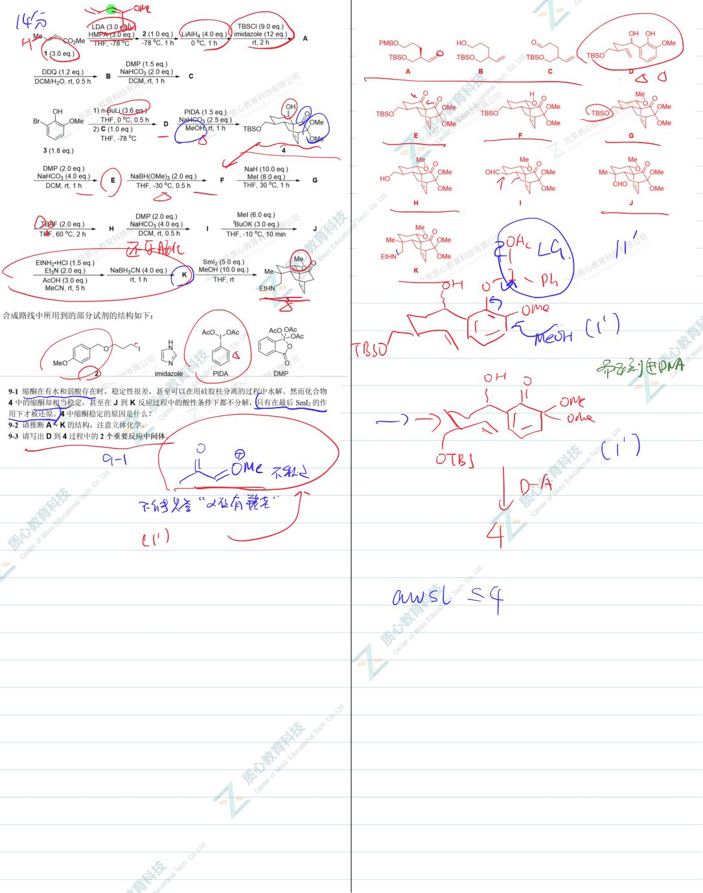

# 题-GChO-46-09-2020年二萜生物碱Lian

## 题目

### 第 9 题 (14分)

2020 年，二萜生物碱 Liangshanone 的全合成工作由中国科研工作者率先完成。如下是其合成路线的一部分。

合成路线中所用到的部分试剂的结构如下:

9-1 缩酮在有水和弱酸存在时，稳定性很差，甚至可以在用硅胶柱分离的过程中水解。然而化合物4中的缩酮却相当稳定，甚至在J到K反应过程中的酸性条件下都不分解，只有在最后 $\mathrm{SmI}_2$ 的作用下才被还原。4中缩酮稳定的原因是什么？

9-2 请推断 $\mathbf{A} \sim \mathbf{K}$ 的结构，注意立体化学。

9-3 请写出 D 到 4 过程中的 2 个重要反应中间体。

## 参考答案

📎 **答案出处**：源卷**手写解析手稿**全部 6 页已随卡（见下），第 09 题解答在其内；手写笔迹，**文字化需人工转录**。

## 知识点映射

- （待人工校准）

> ⚠️ **自动拆卡标记**：`subject_module`/`difficulty` 为关键词粗判，答案数值与单位**尚未经人工复核**（OCR 原文逐字转录，可能保留原卷笔误）。